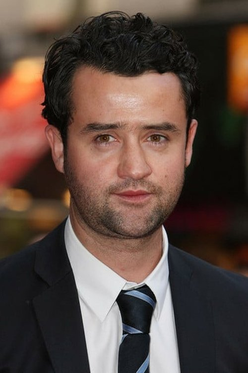



<nav class="films">
  

    <a href="../uncut-gems-2019"><i class="fa-solid fa-chevron-left fa-xs"></i> Previous</a>
  

  

    <a class="simple" href="../">72 / 100</a>
  

  

    <a href="../eternal-beauty-2020">Next <i class="fa-solid fa-chevron-right fa-xs"></i></a>
  

  

    
      Previous film:
      Uncut Gems
    
    
      Next film:
      Eternal Beauty
    
  

</nav>

<article class="film slug-1917-2019">
  

    
    
  

  <h1>{{ film.title }} ({{ film | filmYear }})</h1>

  

    Language: {{ film.language }}.
    
  

  

    Directed by <strong>{{ film | directors }}</strong>
  

  
    <blockquote>
      {{ films.reviews[slug] | safe }} <em>—&nbsp;<a href="/bill">Bill</a></em>
    </blockquote>
  

  <section class="cast-grid">
  

    

  
  

    George MacKay
    Lance Corporal Schofield
  

    

  
  

    Dean-Charles Chapman
    Lance Corporal Blake
  

    

  
  

    Mark Strong
    Captain Smith
  

    

  
  

    Andrew Scott
    Lieutenant Leslie
  

    

  
  

    Richard Madden
    Lieutenant Blake
  

    

  
  

    Claire Duburcq
    Lauri
  

    

  
  

    Colin Firth
    General Erinmore
  

    

  
  

    Benedict Cumberbatch
    Colonel MacKenzie
  

    

  
  

    Daniel Mays
    Sergeant Sanders
  

    

  
  

    Adrian Scarborough
    Major Hepburn
  

    

  
  

    Chris Walley
    Private Bullen
  

    

  
  

    Nabhaan Rizwan
    Sepoy Jondalar
  

  

</section>

  <section class="film-detail">
    

      

        

          <i class="fa-solid fa-masks-theater"></i>
          Cast
        

        <ul>
          
            <li>
              {{ cast.name }} as <em>{{ cast.character }}</em>
            </li>
          
        </ul>
      

      

        

          <i class="fa-solid fa-clapperboard"></i>
          Crew
        

        <ul>
          
            <li>
              {{ crew.name }} &mdash; <em>{{ crew.job }}</em>
            </li>
          
        </ul>
      

    

  </section>

  <section class="related-films">
  <h2>Related films</h2>
  <ul>
    <li><a href="../all-of-us-strangers-2023">All of Us Strangers</a> because of Andrew Scott</li>
<li><a href="../empire-of-light-2022">Empire of Light</a> because of Colin Firth, Justin Edwards, Spike Leighton and Sam Mendes</li>
<li><a href="../the-power-of-the-dog-2021">The Power of the Dog</a> because of Benedict Cumberbatch</li>
  </ul>
</section>

</article>
