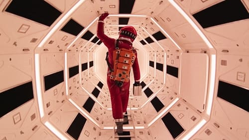



<nav class="films">
  <a class="prev" href="../in-the-heat-of-the-night-1967">Previous</a>
  <a href="../">Film list</a>
  <a class="next" href="../bullitt-1968">Next</a>
</nav>

11 / 100

<article class="film">
  

    
    
  

  <h1>2001: A Space Odyssey ({{ film | filmYear }})</h1>

  

    Directed by <strong>{{ film | directors }}</strong>
  

  <h2>
    Cast
  </h2>
  <ul>
            <li><strong>Keir Dullea</strong> as <em>Dr. David Bowman</em></li>
        <li><strong>Gary Lockwood</strong> as <em>Dr. Frank Poole</em></li>
        <li><strong>William Sylvester</strong> as <em>Dr. Heywood Floyd</em></li>
        <li><strong>Douglas Rain</strong> as <em>HAL 9000 (voice)</em></li>
        <li><strong>Daniel Richter</strong> as <em>Moonwatcher</em></li>
        <li><strong>Leonard Rossiter</strong> as <em>Dr. Andrei Smyslov</em></li>
        <li><strong>Margaret Tyzack</strong> as <em>Elena</em></li>
        <li><strong>Robert Beatty</strong> as <em>Dr. Ralph Halvorsen</em></li>
        <li><strong>Sean Sullivan</strong> as <em>Dr. Roy Michaels</em></li>
        <li><strong>Frank W. Miller</strong> as <em>Mission Controller (voice)</em></li>
        <li><strong>Bill Weston</strong> as <em>Astronaut</em></li>
        <li><strong>Ed Bishop</strong> as <em>Aries-1B Lunar Shuttle Captain</em></li>
        <li><strong>Glenn Beck</strong> as <em>Astronaut</em></li>
        <li><strong>Alan Gifford</strong> as <em>Poole's Father</em></li>
        <li><strong>Ann Gillis</strong> as <em>Poole's Mother</em></li>
        <li><strong>Edwina Carroll</strong> as <em>Aries-1B Stewardess</em></li>
        <li><strong>Penny Brahms</strong> as <em>Stewardess</em></li>
        <li><strong>Heather Downham</strong> as <em>Stewardess</em></li>
        <li><strong>Mike Lovell</strong> as <em>Astronaut</em></li>
        <li><strong>John Ashley</strong> as <em>Ape</em></li>
        <li><strong>Jimmy Bell</strong> as <em>Ape</em></li>
        <li><strong>David Charkham</strong> as <em>Ape</em></li>
        <li><strong>Keith Denny</strong> as <em>Ape</em></li>
        <li><strong>Jonathan Daw</strong> as <em>Ape</em></li>
        <li><strong>Péter Delmár</strong> as <em>Ape</em></li>
        <li><strong>Terry Duggan</strong> as <em>Ape Attacked by Leopard</em></li>
        <li><strong>David Fleetwood</strong> as <em>Ape</em></li>
        <li><strong>Danny Grover</strong> as <em>Ape</em></li>
        <li><strong>Brian Hawley</strong> as <em>Ape</em></li>
        <li><strong>David Hines</strong> as <em>Ape</em></li>
        <li><strong>Anthony Jackson</strong> as <em>Ape</em></li>
        <li><strong>John Jordan</strong> as <em>Ape</em></li>
        <li><strong>Scott MacKee</strong> as <em>Ape</em></li>
        <li><strong>Laurence Marchant</strong> as <em>Ape</em></li>
        <li><strong>Darryl Paes</strong> as <em>Ape</em></li>
        <li><strong>Joe Refalo</strong> as <em>Ape</em></li>
        <li><strong>Andy Wallace</strong> as <em>Ape</em></li>
        <li><strong>Bob Wilyman</strong> as <em>Ape</em></li>
        <li><strong>Richard Woods</strong> as <em>Ape Killed by Moon-Watcher</em></li>
        <li><strong>Maggie London</strong> as <em>Hostess in Elevator (uncredited)</em></li>
        <li><strong>Chela Matthison</strong> as <em>Receptionist (uncredited)</em></li>
        <li><strong>Judy Keirn</strong> as <em>Voice Print Identification Girl (uncredited)</em></li>
        <li><strong>Vivian Kubrick</strong> as <em>Floyd's Daughter (uncredited)</em></li>
        <li><strong>Kenneth Kendall</strong> as <em>BBC-12 Announcer (uncredited)</em></li>
        <li><strong>Kevin Scott</strong> as <em>Miller (uncredited)</em></li>
        <li><strong>Martin Amor</strong> as <em>Interviewer (uncredited)</em></li>
        <li><strong>S. Newton Anderson</strong> as <em>Young Man (uncredited)</em></li>
        <li><strong>Sheraton Blount</strong> as <em>(uncredited)</em></li>
        <li><strong>Ann Bormann</strong> as <em>(uncredited)</em></li>
        <li><strong>Julie Croft</strong> as <em>(uncredited)</em></li>
        <li><strong>Penny Francis</strong> as <em>(uncredited)</em></li>
        <li><strong>Marcella Markham</strong> as <em>(uncredited)</em></li>
        <li><strong>Irena Marr</strong> as <em>Russian Scientist (uncredited)</em></li>
        <li><strong>Krystyna Marr</strong> as <em>Russian Scientist (uncredited)</em></li>
        <li><strong>Kim Neil</strong> as <em>(uncredited)</em></li>
        <li><strong>Jane Pearl</strong> as <em>(uncredited)</em></li>
        <li><strong>Penny Pearl</strong> as <em>(uncredited)</em></li>
        <li><strong>Burnell Tucker</strong> as <em>TMA-1 Site Photographer (uncredited)</em></li>
        <li><strong>John Swindells</strong> as <em>TMA-1 Site Technician #1 (uncredited)</em></li>
        <li><strong>John Clifford</strong> as <em>TMA-1 Site Technician #2 (uncredited)</em></li>
        <li><strong>Stanley Kubrick</strong> as <em>Astronaut Breathing (voice) (uncredited)</em></li>
        <li><strong>Harry Fielder</strong> as <em>Moonwalker (uncredited)</em></li>
  </ul>
</article>
<footer>
  <a href="../about">About this list</a>
</footer>
