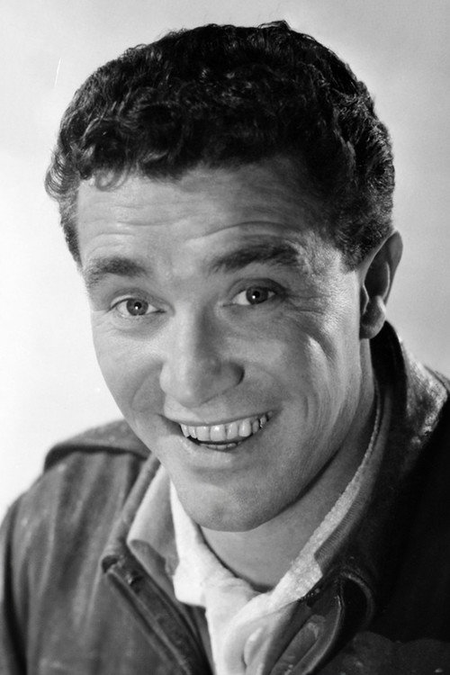
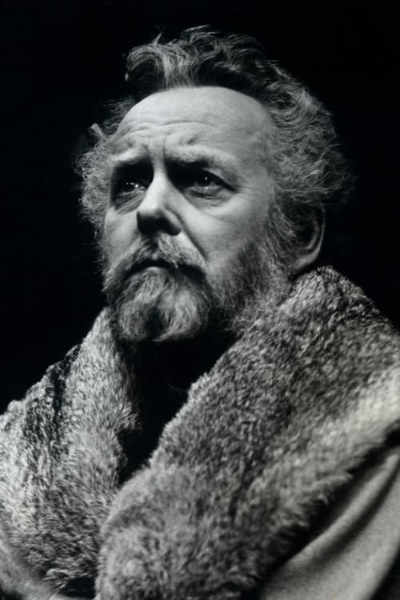
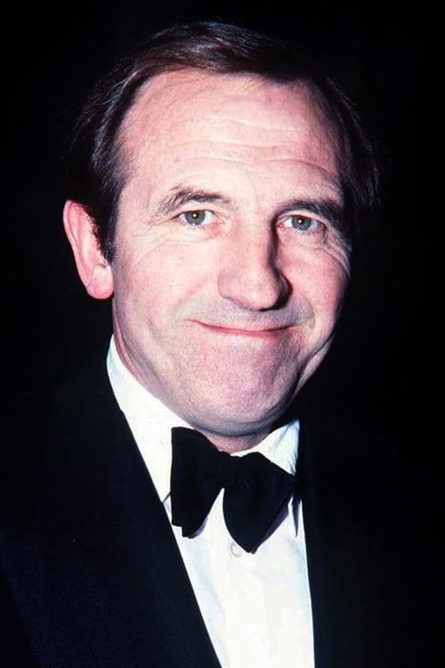
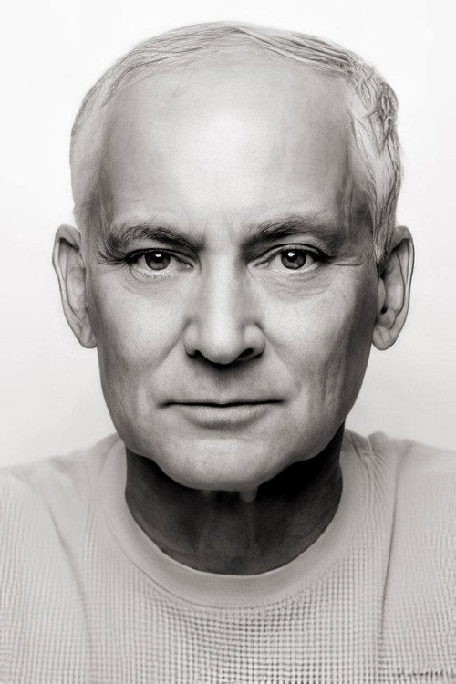



<nav class="films">
  

    <a href="../in-the-heat-of-the-night-1967"><i class="fa-solid fa-chevron-left fa-xs"></i> Previous</a>
  

  

    <a class="simple" href="../">8 / 100</a>
  

  

    <a href="../bullitt-1968">Next <i class="fa-solid fa-chevron-right fa-xs"></i></a>
  

  

    
      Previous film:
      In the Heat of the Night
    
    
      Next film:
      Bullitt
    
  

</nav>

<article class="film slug-2001-a-space-odyssey-1968">
  

    
    
  

  <h1>{{ film.title }} ({{ film | filmYear }})</h1>

  

    Language: {{ film.language }}.
    
  

  

    Directed by <strong>{{ film | directors }}</strong>
  

  
    <blockquote>
      {{ films.reviews[slug] | safe }} <em>—&nbsp;<a href="/bill">Bill</a></em>
    </blockquote>
  

  <section class="cast-grid">
  

    

  
  

    Keir Dullea
    Dr. David Bowman
  

    

  
  

    Gary Lockwood
    Dr. Frank Poole
  

    

  
  

    William Sylvester
    Dr. Heywood Floyd
  

    

  
  

    Douglas Rain
    HAL 9000 (voice)
  

    

  
  

    Daniel Richter
    Moonwatcher
  

    

  
  

    Leonard Rossiter
    Dr. Andrei Smyslov
  

    

  
  

    Margaret Tyzack
    Elena
  

    

  
  

    Robert Beatty
    Dr. Ralph Halvorsen
  

    

  
  

    Sean Sullivan
    Dr. Roy Michaels
  

    

  
<i class="fa-solid fa-user"></i>

  

    Frank W. Miller
    Mission Controller (voice)
  

    

  
<i class="fa-solid fa-user"></i>

  

    Bill Weston
    Astronaut
  

    

  
  

    Ed Bishop
    Aries-1B Lunar Shuttle Captain
  

  

</section>

  <section class="film-detail">
    

      

        

          <i class="fa-solid fa-masks-theater"></i>
          Cast
        

        <ul>
          
            <li>
              {{ cast.name }} as <em>{{ cast.character }}</em>
            </li>
          
        </ul>
      

      

        

          <i class="fa-solid fa-clapperboard"></i>
          Crew
        

        <ul>
          
            <li>
              {{ crew.name }} &mdash; <em>{{ crew.job }}</em>
            </li>
          
        </ul>
      

    

  </section>

  
</article>
