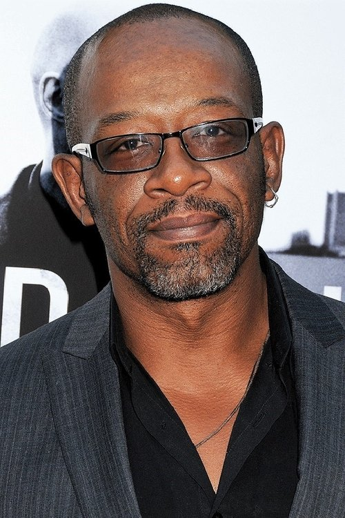
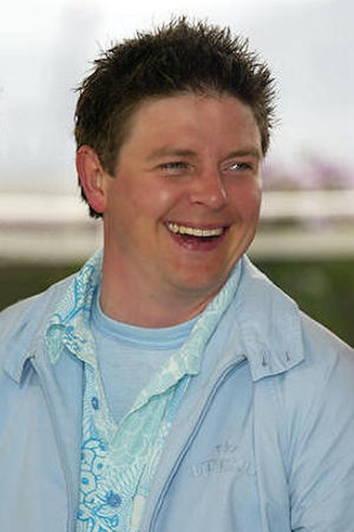
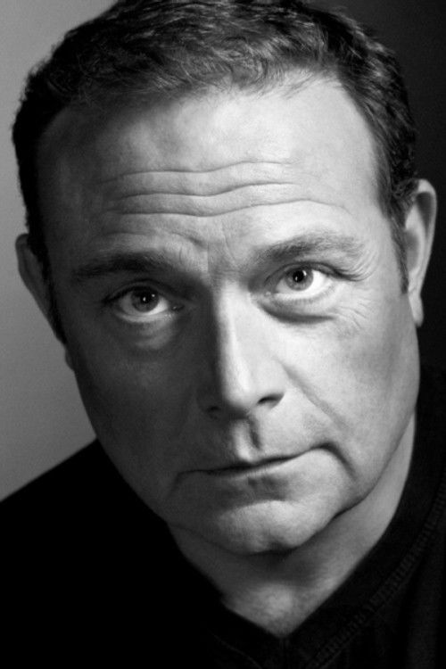
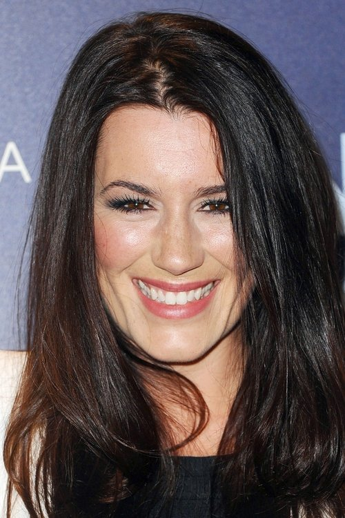



<nav class="films">
  

    <a href="../black-hawk-down-2001"><i class="fa-solid fa-chevron-left fa-xs"></i> Previous</a>
  

  

    <a class="simple" href="../">40 / 100</a>
  

  

    <a href="../man-on-the-train-2002">Next <i class="fa-solid fa-chevron-right fa-xs"></i></a>
  

  

    
      Previous film:
      Black Hawk Down
    
    
      Next film:
      Man on the Train
    
  

</nav>

<article class="film slug-24-hour-party-people-2002">
  

    
    
  

  <h1>{{ film.title }} ({{ film | filmYear }})</h1>

  

    Language: {{ film.language }}.
    
  

  

    Directed by <strong>{{ film | directors }}</strong>
  

  
    <blockquote>
      {{ films.reviews[slug] | safe }} <em>—&nbsp;<a href="/bill">Bill</a></em>
    </blockquote>
  

  <section class="cast-grid">
  

    

  
  

    Steve Coogan
    Tony Wilson
  

    

  
  

    Paddy Considine
    Rob Gretton
  

    

  
  

    Sean Harris
    Ian Curtis
  

    

  
  

    Lennie James
    Alan Erasmus
  

    

  
  

    Shirley Henderson
    Lindsay Wilson
  

    

  
  

    Andy Serkis
    Martin Hannett
  

    

  
  

    John Simm
    Bernard Sumner
  

    

  
  

    Ralf Little
    Hooky
  

    

  
  

    Danny Cunningham
    Shaun Ryder
  

    

  
  

    Peter Kay
    Don Tonay
  

    

  
  

    John Thomson
    Charles
  

    

  
  

    Kate Magowan
    Yvette Livesay
  

  

</section>

  <section class="film-detail">
    

      

        

          <i class="fa-solid fa-masks-theater"></i>
          Cast
        

        <ul>
          
            <li>
              {{ cast.name }} as <em>{{ cast.character }}</em>
            </li>
          
        </ul>
      

      

        

          <i class="fa-solid fa-clapperboard"></i>
          Crew
        

        <ul>
          
            <li>
              {{ crew.name }} &mdash; <em>{{ crew.job }}</em>
            </li>
          
        </ul>
      

    

  </section>

  <section class="related-films">
  <h2>Related films</h2>
  <ul>
    <li><a href="../shallow-grave-1994">Shallow Grave</a> because of Christopher Eccleston and Keith Allen</li>
<li><a href="../trainspotting-1996">Trainspotting</a> because of Keith Allen and Shirley Henderson</li>
<li><a href="../hot-fuzz-2007">Hot Fuzz</a> because of Steve Coogan, Paddy Considine, Simon Pegg and Ron Cook</li>
<li><a href="../empire-of-light-2022">Empire of Light</a> because of Ron Cook</li>
<li><a href="../dune-2021">Dune</a> because of Neil Bell</li>
  </ul>
</section>

</article>
