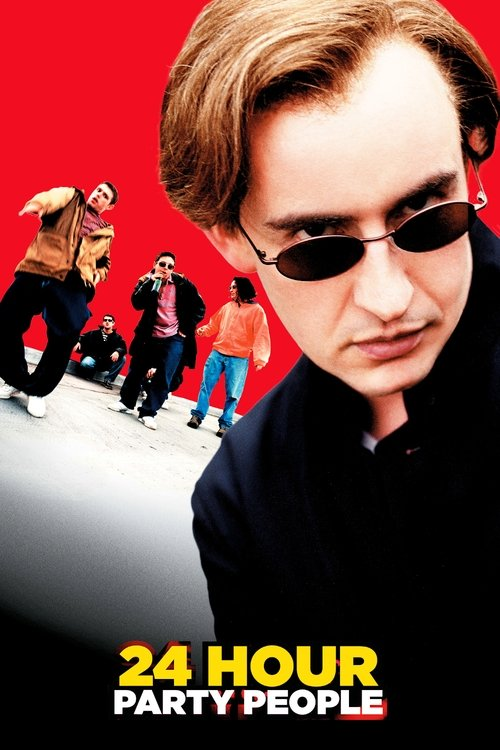
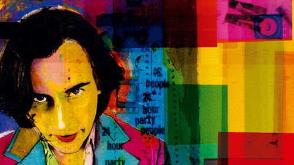

<nav class="films">
  <a class="prev" href="../black-hawk-down">Previous</a>
  <a href="../">Film list</a>
  <a class="next" href="../the-bourne-identity">Next</a>
</nav>

47 / 100

<article class="film">
  

    
    
  

  <h1>24 Hour Party People (2002)</h1>

  

    Directed by <strong>Michael Winterbottom</strong>
  

  <h2>
    Cast
  </h2>
  <ul>
    <li><strong>Steve Coogan</strong> as <em>Tony Wilson</em></li>
<li><strong>Paddy Considine</strong> as <em>Rob Gretton</em></li>
<li><strong>Sean Harris</strong> as <em>Ian Curtis</em></li>
<li><strong>Lennie James</strong> as <em>Alan Erasmus</em></li>
<li><strong>Shirley Henderson</strong> as <em>Lindsay Wilson</em></li>
<li><strong>Andy Serkis</strong> as <em>Martin Hannett</em></li>
<li><strong>John Simm</strong> as <em>Bernard Sumner</em></li>
<li><strong>Ralf Little</strong> as <em>Hooky</em></li>
<li><strong>Danny Cunningham</strong> as <em>Shaun Ryder</em></li>
<li><strong>Peter Kay</strong> as <em>Don Tonay</em></li>
<li><strong>John Thomson</strong> as <em>Charles</em></li>
<li><strong>Kate Magowan</strong> as <em>Yvette Livesay</em></li>
<li><strong>Martin Hancock</strong> as <em>Howard DeVoto</em></li>
<li><strong>Dave Gorman</strong> as <em>John the Postman</em></li>
<li><strong>Enzo Cilenti</strong> as <em>Peter Saville</em></li>
<li><strong>Tony Wilson</strong> as <em>Wheel of Fortune Director</em></li>
<li><strong>Simon Pegg</strong> as <em>Journalist</em></li>
<li><strong>Rob Brydon</strong> as <em>Ryan Letts</em></li>
<li><strong>Chris Coghill</strong> as <em>Bez</em></li>
<li><strong>Kieran O'Brien</strong> as <em>Nathan</em></li>
<li><strong>Keith Allen</strong> as <em>Roger Ames</em></li>
<li><strong>Paul Popplewell</strong> as <em>Paul Ryder</em></li>
<li><strong>Rowetta</strong> as <em>Herself</em></li>
<li><strong>Ron Cook</strong> as <em>Derek Ryder</em></li>
<li><strong>Raymond Waring</strong> as <em>Vini Reilly</em></li>
<li><strong>Christopher Eccleston</strong> as <em>Boethius</em></li>
<li><strong>Smug Roberts</strong> as <em>Rail Guard</em></li>
<li><strong>Clint Boon</strong> as <em>Rail Guard</em></li>
<li><strong>Terri Seymour</strong> as <em>Wheel of Fortune Hostess</em></li>
<li><strong>Naomi Radcliffe</strong> as <em>Twitchy Girl</em></li>
<li><strong>Mark E. Smith</strong> as <em>Punter</em></li>
<li><strong>Howard DeVoto</strong> as <em>Cleaner</em></li>
<li><strong>Nigel Pivaro</strong> as <em>Actor</em></li>
<li><strong>Margi Clarke</strong> as <em>Singing Actress</em></li>
<li><strong>Peter Gunn</strong> as <em>Farmer</em></li>
<li><strong>Kenny Baker</strong> as <em>Elephant Cleaner at Chester Zoo</em></li>
<li><strong>Neil Bell</strong> as <em>Aspiring Singer</em></li>
<li><strong>Fiona Allen</strong> as <em>Cloakroom Girl</em></li>
<li><strong>Tim Horrocks</strong> as <em>Steve</em></li>
<li><strong>Collette Cooper</strong> as <em>Sadie</em></li>
<li><strong>Tracy Cunliffe</strong> as <em>Nosh Van Girl</em></li>
<li><strong>Elizabeth Kelly</strong> as <em>Ian's Gran</em></li>
<li><strong>Darren Tighe</strong> as <em>Mike Pickering</em></li>
<li><strong>Mike Pickering</strong> as <em>DJ</em></li>
<li><strong>Anna Tyborczyk</strong> as <em>Gillian</em></li>
<li><strong>Paul Ryder</strong> as <em>Pel</em></li>
<li><strong>Sean Cernow</strong> as <em>Little Pel</em></li>
<li><strong>Toby Salaman</strong> as <em>Sir Keith Joseph</em></li>
<li><strong>Martin Coogan</strong> as <em>Chris Nagle</em></li>
<li><strong>Helen Schlesinger</strong> as <em>Hilary</em></li>
<li><strong>Daniel Lestuzzi</strong> as <em>Football Thug</em></li>
<li><strong>Mark Windows</strong> as <em>Johnny Rotten</em></li>
<li><strong>Duncan Whitworth</strong> as <em>Jez</em></li>
<li><strong>Joshua McNicholas</strong> as <em>Oliver</em></li>
<li><strong>Simon Ding Archer</strong> as <em>Glen Matlock</em></li>
<li><strong>Kenny Baker</strong> as <em>Zookeeper</em></li>
  </ul>
</article>
<footer>
  <a href="../about">About this list</a>
</footer>
