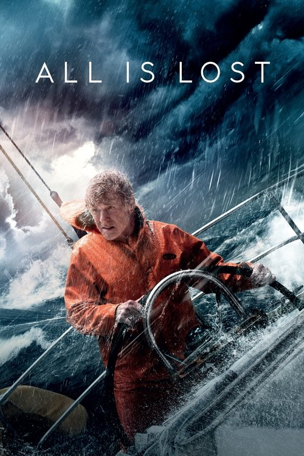



<nav class="films">
  <a class="prev" href="../le-havre-2011">Previous</a>
  <a href="../">Film list</a>
  <a class="next" href="../dallas-buyers-club-2013">Next</a>
</nav>

61 / 100

<article class="film">
  

    
    
  

  <h1>All Is Lost ({{ film | filmYear }})</h1>

  

    Directed by <strong>{{ film | directors }}</strong>
  

  <h2>
    Cast
  </h2>
  <ul>
            <li><strong>Robert Redford</strong> as <em>Our Man</em></li>
  </ul>
</article>
<footer>
  <a href="../about">About this list</a>
</footer>
