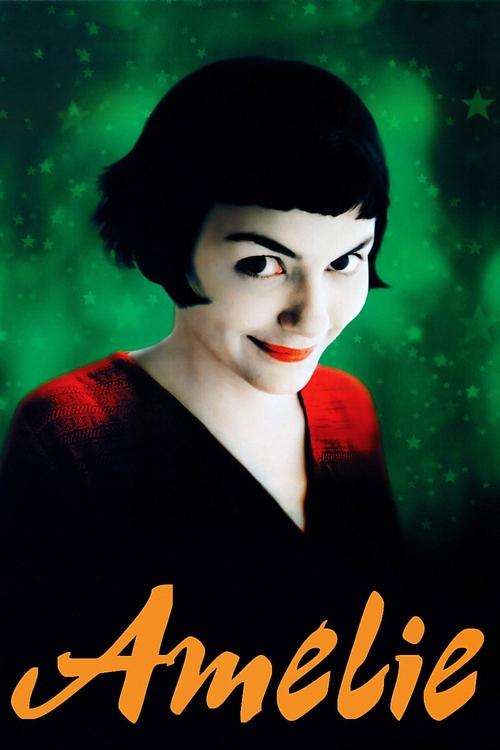

<a href="../">Back to all films</a>

<article class="film">
  <h1>Amélie (2001)</h1>

  

    Directed by <strong>Jean-Pierre Jeunet</strong>
  

  

  <h2>
    Cast
  </h2>
  <ul>
    <li><strong>Audrey Tautou</strong> as <em>Amélie Poulain</em></li>
<li><strong>Mathieu Kassovitz</strong> as <em>Nino Quincampoix</em></li>
<li><strong>Rufus</strong> as <em>Raphaël Poulain</em></li>
<li><strong>Serge Merlin</strong> as <em>Raymond Dufayel</em></li>
<li><strong>Jamel Debbouze</strong> as <em>Lucien</em></li>
<li><strong>Clotilde Mollet</strong> as <em>Gina</em></li>
<li><strong>Claire Maurier</strong> as <em>Suzanne</em></li>
<li><strong>Isabelle Nanty</strong> as <em>Georgette</em></li>
<li><strong>Dominique Pinon</strong> as <em>Joseph</em></li>
<li><strong>Artus de Penguern</strong> as <em>Hipolito</em></li>
<li><strong>Yolande Moreau</strong> as <em>Madeleine Wallace</em></li>
<li><strong>Urbain Cancelier</strong> as <em>Collignon</em></li>
<li><strong>Lorella Cravotta</strong> as <em>Amandine Poulain</em></li>
<li><strong>Maurice Bénichou</strong> as <em>Dominique Bretodeau</em></li>
<li><strong>Michel Robin</strong> as <em>Mr. Collignon</em></li>
<li><strong>Andrée Damant</strong> as <em>Mrs. Collignon</em></li>
<li><strong>Claude Perron</strong> as <em>Eva</em></li>
<li><strong>Armelle</strong> as <em>Philomène</em></li>
<li><strong>Ticky Holgado</strong> as <em>Man in Photo</em></li>
<li><strong>André Dussollier</strong> as <em>Narrator (voice)</em></li>
<li><strong>Eugène Berthier</strong> as <em>Eugène Koler</em></li>
<li><strong>Charles-Roger Bour</strong> as <em>Man with Pissoir</em></li>
<li><strong>Kevin Dias</strong> as <em>Young Dominique</em></li>
<li><strong>Flora Guiet</strong> as <em>Young Amélie</em></li>
<li><strong>Amaury Babault</strong> as <em>Young Nino</em></li>
<li><strong>Marion Pressburger</strong> as <em>Small Hands</em></li>
<li><strong>Luc Palun</strong> as <em>Amandine's Grocer</em></li>
<li><strong>Fabienne Chaudat</strong> as <em>Woman in Coma</em></li>
<li><strong>Dominique Bettenfeld</strong> as <em>Amélie's Neighbor</em></li>
<li><strong>Jacques Viala</strong> as <em>Client Humiliating Friend</em></li>
<li><strong>Fabien Béhar</strong> as <em>Humiliated Friend</em></li>
<li><strong>Jonathan Joss</strong> as <em>Humiliated Friend's Son</em></li>
<li><strong>Jean-Pierre Becker</strong> as <em>Homeless Man</em></li>
<li><strong>Jean Darie</strong> as <em>Blind Man</em></li>
<li><strong>Thierry Gibault</strong> as <em>Endive Client</em></li>
<li><strong>François Bercovici</strong> as <em>Endive Client's Friend</em></li>
<li><strong>Franck Monier</strong> as <em>Young Dominique</em></li>
<li><strong>Guillaume Viry</strong> as <em>SDF</em></li>
<li><strong>Valérie Zarrouk</strong> as <em>Dominique's Wife</em></li>
<li><strong>Marie-Laure Descoureaux</strong> as <em>Concierge of the Dead</em></li>
<li><strong>Sophie Tellier</strong> as <em>Aunt Josette</em></li>
<li><strong>Gérald Weingand</strong> as <em>Teacher</em></li>
<li><strong>François Viaur</strong> as <em>Bistro Owner</em></li>
<li><strong>Paule Daré</strong> as <em>Bistro Employee</em></li>
<li><strong>Marc Amyot</strong> as <em>Unknown at Photo Booth</em></li>
<li><strong>Myriam Labbé</strong> as <em>Tobacco Store Costumer</em></li>
<li><strong>Jean Rupert</strong> as <em>Operated on the Nasal Septa</em></li>
<li><strong>Frankie Pain</strong> as <em>Newspaper Seller</em></li>
<li><strong>Julianna Kovacs</strong> as <em>Grocery Customer</em></li>
<li><strong>Philippe Paimblanc</strong> as <em>Train Controller</em></li>
<li><strong>Mady Malroux</strong> as <em>Twin #1</em></li>
<li><strong>Monette Malroux</strong> as <em>Twin #2</em></li>
<li><strong>Robert Gendreu</strong> as <em>Café Customer</em></li>
<li><strong>Valériane de Villeneuve</strong> as <em>Laughing Woman</em></li>
<li><strong>Isis Peyrade</strong> as <em>Samantha</em></li>
<li><strong>Raymonde Heudeline</strong> as <em>Ghost Train Cashier</em></li>
<li><strong>Christiane Bopp</strong> as <em>Woman Near Merry-Go-Round</em></li>
<li><strong>Thierry Arfeuillères</strong> as <em>Man Statue</em></li>
<li><strong>Jerry Lucas</strong> as <em>Little Boy of Sacré-Coeur</em></li>
<li><strong>Patrick Paroux</strong> as <em>Street Blower</em></li>
<li><strong>François Aubineau</strong> as <em>Concierge's Postman</em></li>
<li><strong>Philippe Beautier</strong> as <em>Poulain's Postman</em></li>
<li><strong>Karine Asure</strong> as <em>Pretty Girl</em></li>
<li><strong>Régis Iacono</strong> as <em>Félix L'Herbier</em></li>
<li><strong>Franck-Olivier Bonnet</strong> as <em>Palace Video (voice)</em></li>
<li><strong>Alain Floret</strong> as <em>Concierge's Husband (voice)</em></li>
<li><strong>Jean-Pol Brissart</strong> as <em>Jacques Grosjean (voice)</em></li>
<li><strong>Frédéric Mitterrand</strong> as <em>Frédéric Mitterrand (voice)</em></li>
<li><strong>Laurent Delpit</strong> as <em>Montmartre Man (uncredited)</em></li>
<li><strong>Manoush</strong> as <em>Nymphomaniac (uncredited)</em></li>
<li><strong>Jacques Thébault</strong> as <em>(voice) (uncredited)</em></li>
<li><strong>Dean Baykan</strong> as <em>(uncredited)</em></li>
<li><strong>Clément Chebli</strong> as <em>(uncredited)</em></li>
<li><strong>Eloïse Labro</strong> as <em>(uncredited)</em></li>
  </ul>
</article>
