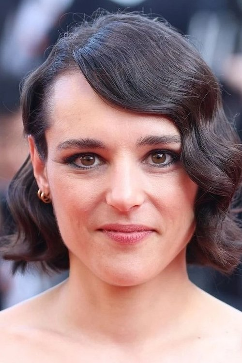



<nav class="films">
  

    <a href="../the-fabelmans-2022"><i class="fa-solid fa-chevron-left fa-xs"></i> Previous</a>
  

  

    <a class="simple" href="../">93 / 100</a>
  

  

    <a href="../all-of-us-strangers-2023">Next <i class="fa-solid fa-chevron-right fa-xs"></i></a>
  

  

    
      Previous film:
      The Fabelmans
    
    
      Next film:
      All of Us Strangers
    
  

</nav>

<article class="film slug-anatomy-of-a-fall-2023">
  

    
    
  

  <h1>{{ film.title }} ({{ film | filmYear }})</h1>

  

    Language: {{ film.language }}.
    Also known as Anatomie d'une chute.
  

  

    Directed by <strong>{{ film | directors }}</strong>
  

  
    <blockquote>
      {{ films.reviews[slug] | safe }} <em>—&nbsp;<a href="/bill">Bill</a></em>
    </blockquote>
  

  <section class="cast-grid">
  

    

  
  

    Sandra Hüller
    Sandra Voyter
  

    

  
  

    Swann Arlaud
    Maître Vincent Renzi
  

    

  
  

    Milo Machado-Graner
    Daniel
  

    

  
  

    Antoine Reinartz
    Advocate General
  

    

  
  

    Samuel Theis
    Samuel Maleski
  

    

  
  

    Jehnny Beth
    Marge Berger
  

    

  
  

    Saadia Bentaïeb
    Maître Nour Boudaoud
  

    

  
  

    Camille Rutherford
    Zoé Solidor
  

    

  
  

    Anne Rotger
    President of the Court
  

    

  
  

    Sophie Fillières
    Monica
  

    

  
<i class="fa-solid fa-user"></i>

  

    Julien Comte
    Forensic Pathologist
  

    

  
  

    Pierre-François Garel
    Judge Janvier
  

  

</section>

  <section class="film-detail">
    

      

        

          <i class="fa-solid fa-masks-theater"></i>
          Cast
        

        <ul>
          
            <li>
              {{ cast.name }} as <em>{{ cast.character }}</em>
            </li>
          
        </ul>
      

      

        

          <i class="fa-solid fa-clapperboard"></i>
          Crew
        

        <ul>
          
            <li>
              {{ crew.name }} &mdash; <em>{{ crew.job }}</em>
            </li>
          
        </ul>
      

    

  </section>

  <section class="related-films">
  <h2>Related films</h2>
  <ul>
    <li><a href="../nouvelle-vague-2025">Nouvelle Vague</a> because of Pierre-François Garel</li>
  </ul>
</section>

</article>
