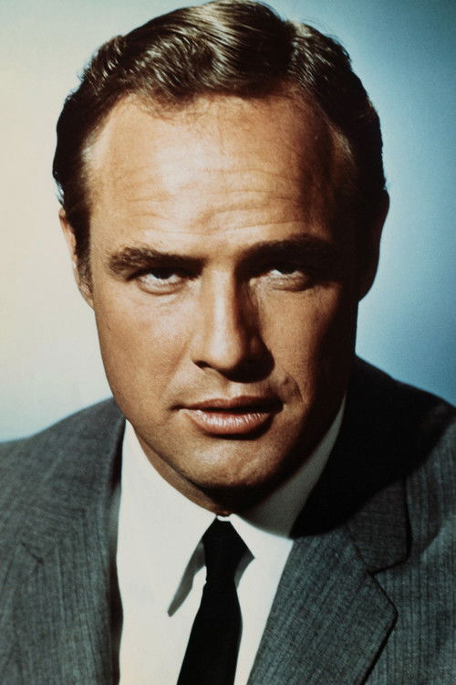



<nav class="films">
  

    <a href="../the-deer-hunter-1978"><i class="fa-solid fa-chevron-left fa-xs"></i> Previous</a>
  

  

    <a class="simple" href="../">17 / 100</a>
  

  

    <a href="../diva-1981">Next <i class="fa-solid fa-chevron-right fa-xs"></i></a>
  

  

    
      Previous film:
      The Deer Hunter
    
    
      Next film:
      Diva
    
  

</nav>

<article class="film slug-apocalypse-now-1979">
  

    
    
  

  <h1>{{ film.title }} ({{ film | filmYear }})</h1>

  

    Language: {{ film.language }}.
    
  

  

    Directed by <strong>{{ film | directors }}</strong>
  

  
    <blockquote>
      {{ films.reviews[slug] | safe }} <em>—&nbsp;<a href="/bill">Bill</a></em>
    </blockquote>
  

  <section class="cast-grid">
  

    

  
  

    Martin Sheen
    Captain Benjamin Willard
  

    

  
  

    Marlon Brando
    Colonel Walter Kurtz
  

    

  
  

    Albert Hall
    Chief Phillips
  

    

  
  

    Frederic Forrest
    Jay 'Chef' Hicks
  

    

  
  

    Laurence Fishburne
    Tyrone 'Clean' Miller
  

    

  
  

    Sam Bottoms
    Lance B. Johnson
  

    

  
  

    Robert Duvall
    Lieutenant Colonel Bill Kilgore
  

    

  
  

    Dennis Hopper
    Photojournalist
  

    

  
  

    G. D. Spradlin
    General Corman
  

    

  
  

    Harrison Ford
    Colonel Lucas
  

    

  
  

    Jerry Ziesmer
    Jerry, Civilian
  

    

  
  

    Scott Glenn
    Lieutenant Richard M. Colby
  

  

</section>

  <section class="film-detail">
    

      

        

          <i class="fa-solid fa-masks-theater"></i>
          Cast
        

        <ul>
          
            <li>
              {{ cast.name }} as <em>{{ cast.character }}</em>
            </li>
          
        </ul>
      

      

        

          <i class="fa-solid fa-clapperboard"></i>
          Crew
        

        <ul>
          
            <li>
              {{ crew.name }} &mdash; <em>{{ crew.job }}</em>
            </li>
          
        </ul>
      

    

  </section>

  <section class="related-films">
  <h2>Related films</h2>
  <ul>
    <li><a href="../bullitt-1968">Bullitt</a> because of Robert Duvall</li>
<li><a href="../three-days-of-the-condor-1975">Three Days of the Condor</a> because of James Keane</li>
<li><a href="../blade-runner-1982">Blade Runner</a> because of Harrison Ford</li>
<li><a href="../paris-texas-1984">Paris, Texas</a> because of Aurore Clément</li>
  </ul>
</section>

</article>
