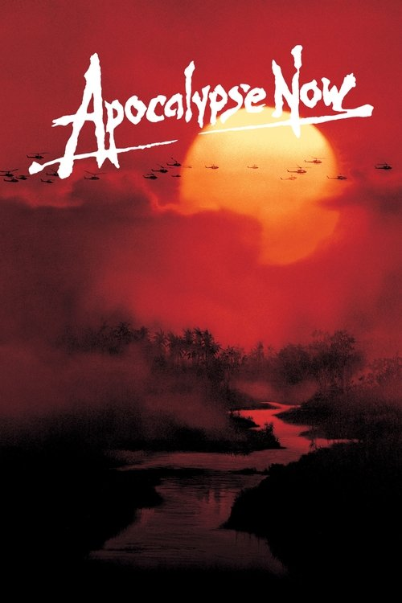
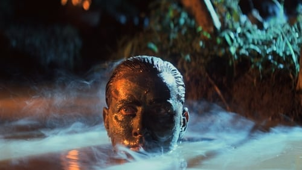

<nav class="films">
  <a class="prev" href="../the-deer-hunter">Previous</a>
  <a href="../">Film list</a>
  <a class="next" href="../being-there">Next</a>
</nav>

21 / 100

<article class="film">
  
  

  <h1>Apocalypse Now (1979)</h1>

  

    Directed by <strong>Francis Ford Coppola</strong>
  

  <h2>
    Cast
  </h2>
  <ul>
    <li><strong>Martin Sheen</strong> as <em>Captain Benjamin Willard</em></li>
<li><strong>Marlon Brando</strong> as <em>Colonel Walter Kurtz</em></li>
<li><strong>Albert Hall</strong> as <em>Chief Phillips</em></li>
<li><strong>Frederic Forrest</strong> as <em>Jay 'Chef' Hicks</em></li>
<li><strong>Laurence Fishburne</strong> as <em>Tyrone 'Clean' Miller</em></li>
<li><strong>Sam Bottoms</strong> as <em>Lance B. Johnson</em></li>
<li><strong>Robert Duvall</strong> as <em>Lieutenant Colonel Bill Kilgore</em></li>
<li><strong>Dennis Hopper</strong> as <em>Photojournalist</em></li>
<li><strong>G. D. Spradlin</strong> as <em>General Corman</em></li>
<li><strong>Harrison Ford</strong> as <em>Colonel Lucas</em></li>
<li><strong>Jerry Ziesmer</strong> as <em>Jerry, Civilian</em></li>
<li><strong>Scott Glenn</strong> as <em>Lieutenant Richard M. Colby</em></li>
<li><strong>James Keane</strong> as <em>Kilgore's Gunner</em></li>
<li><strong>Kerry Rossall</strong> as <em>Mike from San Diego</em></li>
<li><strong>Tom Mason</strong> as <em>Supply Sergeant</em></li>
<li><strong>Cynthia Wood</strong> as <em>Playmate of the Year</em></li>
<li><strong>Colleen Camp</strong> as <em>Miss May</em></li>
<li><strong>Linda Carpenter</strong> as <em>Playmate</em></li>
<li><strong>Aurore Clément</strong> as <em>Roxanne Sarrault</em></li>
<li><strong>Jack Thibeau</strong> as <em>Soldier in Trench</em></li>
<li><strong>Glenn Walken</strong> as <em>Lieutenant Carlsen</em></li>
<li><strong>Damien Leake</strong> as <em>Machine Gunner</em></li>
<li><strong>Marc Coppola</strong> as <em>AFRS Announcer</em></li>
<li><strong>Bill Graham</strong> as <em>Agent</em></li>
<li><strong>Jerry Ross</strong> as <em>Johnny from Malibu / Mike from San Diego</em></li>
<li><strong>Charles Robinson</strong> as <em>Soldier with Colby (uncredited)</em></li>
<li><strong>Nick Nicholson</strong> as <em>Soldier (uncredited)</em></li>
<li><strong>Don Gordon Bell</strong> as <em>Soldier (uncredited)</em></li>
<li><strong>Evan A. Lottman</strong> as <em>Soldier (uncredited)</em></li>
<li><strong>R. Lee Ermey</strong> as <em>Eagle Thrust Seven Helicopter Pilot (uncredited)</em></li>
<li><strong>Jim Gaines</strong> as <em>Extra (uncredited)</em></li>
<li><strong>Vittorio Storaro</strong> as <em>TV Photographer (uncredited)</em></li>
<li><strong>Francis Ford Coppola</strong> as <em>Director of TV Crew (uncredited)</em></li>
<li><strong>Henry Strzalkowski</strong> as <em>Bit Part (uncredited)</em></li>
<li><strong>Herb Rice</strong> as <em>Roach</em></li>
<li><strong>Joe Estevez</strong> as <em>Captain Benjamin L. Willard (voice) (uncredited)</em></li>
<li><strong>Bo Byers</strong> as <em>MP Sergeant #1</em></li>
<li><strong>Frank Villard</strong> as <em>Gaston de Marais (Long Version)</em></li>
  </ul>
</article>
<footer>
  <a href="../about">About this list</a>
</footer>
