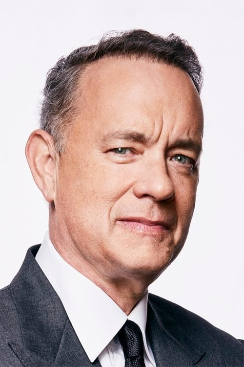
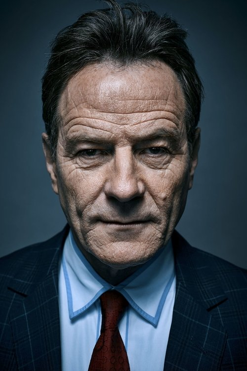
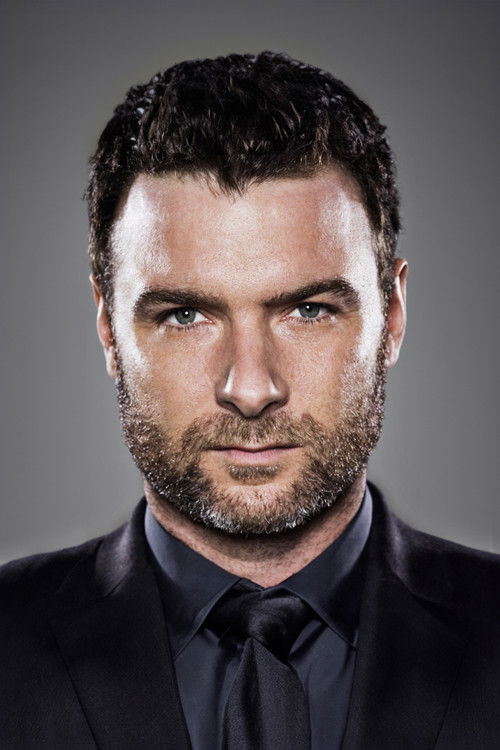
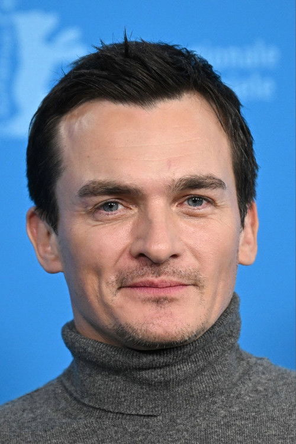



<nav class="films">
  

    <a href="../perfect-days-2023"><i class="fa-solid fa-chevron-left fa-xs"></i> Previous</a>
  

  

    <a class="simple" href="../">96 / 100</a>
  

  

    <a href="../blue-jean-2023">Next <i class="fa-solid fa-chevron-right fa-xs"></i></a>
  

  

    
      Previous film:
      Perfect Days
    
    
      Next film:
      Blue Jean
    
  

</nav>

<article class="film slug-asteroid-city-2023">
  

    
    
  

  <h1>{{ film.title }} ({{ film | filmYear }})</h1>

  

    Language: {{ film.language }}.
    
  

  

    Directed by <strong>{{ film | directors }}</strong>
  

  
    <blockquote>
      {{ films.reviews[slug] | safe }} <em>—&nbsp;<a href="/bill">Bill</a></em>
    </blockquote>
  

  <section class="cast-grid">
  

    

  
  

    Jason Schwartzman
    Augie Steenbeck
  

    

  
  

    Scarlett Johansson
    Midge Campbell
  

    

  
  

    Tom Hanks
    Stanley Zak
  

    

  
  

    Jeffrey Wright
    General Gibson
  

    

  
  

    Tilda Swinton
    Dr. Hickenlooper
  

    

  
  

    Bryan Cranston
    The Host
  

    

  
  

    Edward Norton
    Conrad Earp
  

    

  
  

    Adrien Brody
    Schubert Green
  

    

  
  

    Liev Schreiber
    J.J. Kellogg
  

    

  
  

    Hope Davis
    Sandy Borden
  

    

  
  

    Steve Park
    Roger Cho
  

    

  
  

    Rupert Friend
    Montana
  

  

</section>

  <section class="film-detail">
    

      

        

          <i class="fa-solid fa-masks-theater"></i>
          Cast
        

        <ul>
          
            <li>
              {{ cast.name }} as <em>{{ cast.character }}</em>
            </li>
          
        </ul>
      

      

        

          <i class="fa-solid fa-clapperboard"></i>
          Crew
        

        <ul>
          
            <li>
              {{ crew.name }} &mdash; <em>{{ crew.job }}</em>
            </li>
          
        </ul>
      

    

  </section>

  <section class="related-films">
  <h2>Related films</h2>
  <ul>
    <li><a href="../fargo-1996">Fargo</a> because of Steve Park</li>
<li><a href="../the-french-dispatch-2021">The French Dispatch</a> because of Steve Park, Edward Norton, Jason Schwartzman, Willem Dafoe, Wes Anderson, Jarvis Cocker, Adrien Brody, Tilda Swinton, Tony Revolori, Bob Balaban, Fisher Stevens, Jeffrey Wright, Mohamed Belhadjine, Nicolas Avinée, Rupert Friend, Tom Hudson, Stéphane Bak, Liev Schreiber, Damien Bonnard, Rodolphe Pauly and Eliel Ford</li>
<li><a href="../fight-club-1999">Fight Club</a> because of Edward Norton</li>
<li><a href="../the-grand-budapest-hotel-2014">The Grand Budapest Hotel</a> because of Edward Norton, Jason Schwartzman, Willem Dafoe, Wes Anderson, Adrien Brody, Jeff Goldblum, Tilda Swinton, Tony Revolori, Bob Balaban and Fisher Stevens</li>
<li><a href="../fantastic-mr-fox-2009">Fantastic Mr. Fox</a> because of Jason Schwartzman, Willem Dafoe, Wes Anderson, Jarvis Cocker and Adrien Brody</li>
<li><a href="../the-lighthouse-2019">The Lighthouse</a> because of Willem Dafoe</li>
<li><a href="../uncut-gems-2019">Uncut Gems</a> because of Tilda Swinton and Jake Ryan</li>
  </ul>
</section>

</article>
