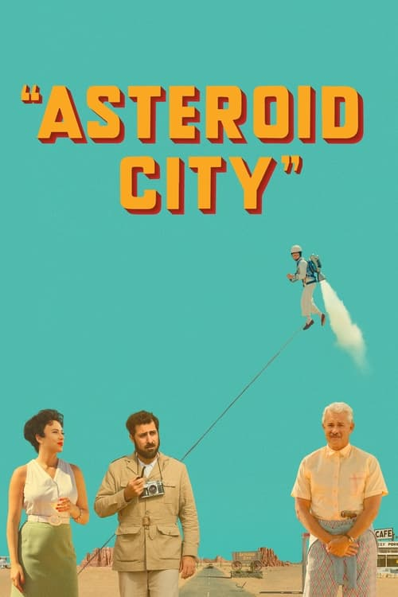
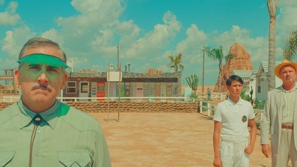

<nav class="films">
  <a class="prev" href="../blue-jean">Previous</a>
  <a href="../">Film list</a>
  <a class="next" href="../killers-of-the-flower-moon">Next</a>
</nav>

98 / 100

<article class="film">
  
  

  <h1>Asteroid City (2023)</h1>

  

    Directed by <strong>Wes Anderson</strong>
  

  <h2>
    Cast
  </h2>
  <ul>
    <li><strong>Jason Schwartzman</strong> as <em>Augie Steenbeck</em></li>
<li><strong>Scarlett Johansson</strong> as <em>Midge Campbell</em></li>
<li><strong>Tom Hanks</strong> as <em>Stanley Zak</em></li>
<li><strong>Jeffrey Wright</strong> as <em>General Gibson</em></li>
<li><strong>Tilda Swinton</strong> as <em>Dr. Hickenlooper</em></li>
<li><strong>Bryan Cranston</strong> as <em>The Host</em></li>
<li><strong>Edward Norton</strong> as <em>Conrad Earp</em></li>
<li><strong>Adrien Brody</strong> as <em>Schubert Green</em></li>
<li><strong>Liev Schreiber</strong> as <em>J.J. Kellogg</em></li>
<li><strong>Hope Davis</strong> as <em>Sandy Borden</em></li>
<li><strong>Steve Park</strong> as <em>Roger Cho</em></li>
<li><strong>Rupert Friend</strong> as <em>Montana</em></li>
<li><strong>Maya Hawke</strong> as <em>June Douglas</em></li>
<li><strong>Steve Carell</strong> as <em>The Motel Manager</em></li>
<li><strong>Matt Dillon</strong> as <em>The Mechanic</em></li>
<li><strong>Willem Dafoe</strong> as <em>Saltzburg Keitel</em></li>
<li><strong>Tony Revolori</strong> as <em>The Aide-de-Camp</em></li>
<li><strong>Jake Ryan</strong> as <em>Woodrow</em></li>
<li><strong>Grace Edwards</strong> as <em>Dinah</em></li>
<li><strong>Aristou Meehan</strong> as <em>Clifford</em></li>
<li><strong>Sophia Lillis</strong> as <em>Shelly</em></li>
<li><strong>Ethan Josh Lee</strong> as <em>Ricky</em></li>
<li><strong>Ella Faris</strong> as <em>Andromeda</em></li>
<li><strong>Gracie Faris</strong> as <em>Pandora</em></li>
<li><strong>Willan Faris</strong> as <em>Cassiopeia</em></li>
<li><strong>Deanna Dunagan</strong> as <em>Waitress</em></li>
<li><strong>Vandi Clark</strong> as <em>Cashier</em></li>
<li><strong>Pedro Placer</strong> as <em>Cook</em></li>
<li><strong>Iván López</strong> as <em>Romulus</em></li>
<li><strong>Aaron Ziobrowski</strong> as <em>Bus Driver</em></li>
<li><strong>Celia Bermejo</strong> as <em>Chaperone</em></li>
<li><strong>Zoe Bernard</strong> as <em>Bernice</em></li>
<li><strong>Brayden Frasure</strong> as <em>Billy</em></li>
<li><strong>Preston Mota</strong> as <em>Dwight</em></li>
<li><strong>Kyleigh Fuller</strong> as <em>Other Pupil</em></li>
<li><strong>Henry Rhoades</strong> as <em>Other Pupil</em></li>
<li><strong>Jack Eyman</strong> as <em>Other Pupil</em></li>
<li><strong>Willa Skye</strong> as <em>Other Pupil</em></li>
<li><strong>Annalise Mackulin</strong> as <em>Other Pupil</em></li>
<li><strong>Calhoun Metcalf</strong> as <em>Other Pupil</em></li>
<li><strong>Seu Jorge</strong> as <em>Other Cowboy</em></li>
<li><strong>Jarvis Cocker</strong> as <em>Other Cowboy</em></li>
<li><strong>Pere Mallén</strong> as <em>Other Cowboy</em></li>
<li><strong>Jean-Yves Lozac'h</strong> as <em>Other Cowboy</em></li>
<li><strong>Damien Bonnard</strong> as <em>Bodyguard/Driver</em></li>
<li><strong>Ramón Ródenas</strong> as <em>Motel Handyman</em></li>
<li><strong>Wendy Nottingham</strong> as <em>Conrad Earp's Secretary</em></li>
<li><strong>Bob Balaban</strong> as <em>Larkings Executive</em></li>
<li><strong>Fisher Stevens</strong> as <em>Detective #1</em></li>
<li><strong>Mike Maggart</strong> as <em>Detective #2</em></li>
<li><strong>Elvira Arce</strong> as <em>Mary</em></li>
<li><strong>Nicolas Avinée</strong> as <em>Military-Science Ensign</em></li>
<li><strong>Mohamed Belhadjine</strong> as <em>Military-Science Ensign</em></li>
<li><strong>Katy Heffernan-Smith</strong> as <em>'Stunt Double'</em></li>
<li><strong>Jeff Goldblum</strong> as <em>The Alien</em></li>
<li><strong>Hong Chau</strong> as <em>Polly</em></li>
<li><strong>Paul Kynman</strong> as <em>Lunky</em></li>
<li><strong>Sam Marra</strong> as <em>Telephone Booth Guard</em></li>
<li><strong>Rita Wilson</strong> as <em>Mrs. Weatherford</em></li>
<li><strong>Ara Hollyday</strong> as <em>Skip Weatherford</em></li>
<li><strong>Kenneth Bate</strong> as <em>Newsboy</em></li>
<li><strong>Christian Bate</strong> as <em>Newsboy</em></li>
<li><strong>Margot Robbie</strong> as <em>The Actress / Wife</em></li>
<li><strong>Sandy Hamilton</strong> as <em>Backstage Sound Man</em></li>
<li><strong>Roberto Moreno de Matias</strong> as <em>Engineer</em></li>
<li><strong>Francisco Serrano</strong> as <em>Pilotman</em></li>
<li><strong>Francisco Javier Gomez</strong> as <em>Brakeman</em></li>
<li><strong>Jacinto Domingo Torija</strong> as <em>Hobo</em></li>
<li><strong>Alvaro Olivas Marques</strong> as <em>Caddy</em></li>
<li><strong>Dominique Fouassier</strong> as <em>Outlaw on the Run</em></li>
<li><strong>Pablo Amoros</strong> as <em>Outlaw on the Run</em></li>
<li><strong>Yann Tremblay</strong> as <em>State Trooper</em></li>
<li><strong>Sébastien Fouassier</strong> as <em>State Trooper</em></li>
<li><strong>Carlos Arimón</strong> as <em>State Trooper</em></li>
<li><strong>Antonio Graziano</strong> as <em>Cameraman</em></li>
<li><strong>Nuria Gigorro</strong> as <em>Motel Guest (at Shower)</em></li>
<li><strong>Raquel Jiménez Martinez</strong> as <em>Motel Guest (at Shower)</em></li>
<li><strong>Jorge Francisco Mena Garcia</strong> as <em>Motel Gardener</em></li>
<li><strong>Ana Isabel Comendador Martínez</strong> as <em>Motel Maid</em></li>
<li><strong>Carlos Saez</strong> as <em>T-Shirt Vendor</em></li>
<li><strong>Karine Niederman</strong> as <em>Bookseller</em></li>
<li><strong>Jesús Olivas Santos</strong> as <em>Man with Soda</em></li>
<li><strong>Jose Luis Figueroa</strong> as <em>Hot Dog Stand</em></li>
<li><strong>Pascale Coppola</strong> as <em>Girl on Blanket</em></li>
<li><strong>Matilda Clarke</strong> as <em>Girl on Blanket</em></li>
<li><strong>Milagros Ahijon</strong> as <em>Souvenir Booth</em></li>
<li><strong>Paula Domingo</strong> as <em>Souvenir Booth</em></li>
<li><strong>Crístian García Jiménez</strong> as <em>Boy in Spacesuit</em></li>
<li><strong>Junior Harris</strong> as <em>Ferris Wheel Crew</em></li>
<li><strong>Robert Tattam</strong> as <em>Ferris Wheel Crew</em></li>
<li><strong>Eusebio Mateo Diaz</strong> as <em>Ferris Wheel Crew</em></li>
<li><strong>Stéphane Bak</strong> as <em>Other Actor / Student</em></li>
<li><strong>Tom Hudson</strong> as <em>Other Actor / Student</em></li>
<li><strong>Rodolphe Pauly</strong> as <em>Other Actor / Student</em></li>
<li><strong>Aimee Mullins</strong> as <em>Other Actor / Student</em></li>
<li><strong>Valérie Sadoun</strong> as <em>Other Actor / Student</em></li>
<li><strong>Erica Dorn</strong> as <em>Other Actor / Student</em></li>
<li><strong>Julia Kruger</strong> as <em>Other Actor / Student</em></li>
<li><strong>Anisse Elias</strong> as <em>Other Actor / Student</em></li>
<li><strong>Rebecca Cornford</strong> as <em>Other Actor / Student</em></li>
<li><strong>Avery Looser</strong> as <em>Other Actor / Student</em></li>
<li><strong>Guy Trevellyan</strong> as <em>Other Actor / Student</em></li>
<li><strong>Truman Hanks</strong> as <em>Other Actor / Student</em></li>
<li><strong>Honor Northridge</strong> as <em>Other Actor / Student</em></li>
<li><strong>Eliel Ford</strong> as <em>Other Actor / Student</em></li>
<li><strong>Caris Yeoman</strong> as <em>Other Actor / Student</em></li>
<li><strong>Yann Pozzoli</strong> as <em>Other Actor / Student</em></li>
<li><strong>Sonia Gascón</strong> as <em>Other Actor / Student</em></li>
<li><strong>Mariam Huélamo</strong> as <em>Other Actor / Student</em></li>
<li><strong>Timothy Cordukes</strong> as <em>Other Actor / Student</em></li>
<li><strong>Carmen Méndez</strong> as <em>Other Actor / Student</em></li>
<li><strong>Ainhoa Aldanondo</strong> as <em>Other Actor / Student</em></li>
<li><strong>Marta Rubio</strong> as <em>Other Actor / Student</em></li>
<li><strong>Marcos Pereiro</strong> as <em>Other Actor / Student</em></li>
<li><strong>Susana Hornos</strong> as <em>Other Actor / Student</em></li>
<li><strong>Alicia San Lorenzo</strong> as <em>Other Actor / Student</em></li>
<li><strong>Palmira Ferrer</strong> as <em>Other Actor / Student</em></li>
<li><strong>Jose Antonio Turiégano Carrasco</strong> as <em>Scientist</em></li>
<li><strong>Pilar Ramírez Escalona</strong> as <em>Scientist</em></li>
<li><strong>Virginia Romano Álvarez</strong> as <em>Scientist</em></li>
<li><strong>Milagros Reyeros Ruiz</strong> as <em>Scientist</em></li>
<li><strong>Jonatan Buitrago Díaz</strong> as <em>Scientist</em></li>
<li><strong>Ricardo Mohedas Tiñana</strong> as <em>Scientist</em></li>
<li><strong>Carlos Arroyo</strong> as <em>Scientist</em></li>
<li><strong>Ismael González Carrasco</strong> as <em>Scientist</em></li>
<li><strong>Celedonio Guijarro Cano</strong> as <em>Scientist / Military-Science Officer</em></li>
<li><strong>Juan Abad Molina</strong> as <em>Train Porter</em></li>
<li><strong>Patricia Colin</strong> as <em>Seamstress</em></li>
<li><strong>Elena Uriz</strong> as <em>Recording Secretary</em></li>
<li><strong>Jose Segovia Ortiz</strong> as <em>Military-Science Officer</em></li>
<li><strong>Enrique Ruiz Granado</strong> as <em>Military-Science Officer</em></li>
<li><strong>Juan Carlos Iglesias Gómez</strong> as <em>Military-Science Officer</em></li>
<li><strong>Oscar Minguez Garcia-Patron</strong> as <em>Military-Science Officer</em></li>
<li><strong>Guillermo García</strong> as <em>Military-Science Officer</em></li>
<li><strong>David Navarro Romero</strong> as <em>Military-Science Guard</em></li>
<li><strong>Javier Gigorro de las Peñas</strong> as <em>Military-Science Guard</em></li>
<li><strong>Alejandro García Aparicio</strong> as <em>Military-Science Guard</em></li>
<li><strong>Diego Maldonado Davila</strong> as <em>Military-Science Guard</em></li>
<li><strong>David Rodríguez Moreno</strong> as <em>Military-Science Guard</em></li>
<li><strong>Mario Perez Lomas</strong> as <em>Military-Science Guard</em></li>
<li><strong>Alejandro Urbina Escalona</strong> as <em>Military-Science Guard</em></li>
<li><strong>David Verdejo Escribano</strong> as <em>Military-Science Guard</em></li>
<li><strong>Adrián Corpa Fernández</strong> as <em>Military-Science Guard</em></li>
<li><strong>Jesús Jiménez Caler</strong> as <em>Military-Science Guard</em></li>
<li><strong>Francisco Corrales Rubio</strong> as <em>Military-Science Guard</em></li>
<li><strong>Sergio Martinez Martinez</strong> as <em>Military-Science Guard</em></li>
<li><strong>Félix Israel Pinilla de la Guia</strong> as <em>Military-Science Guard</em></li>
<li><strong>Jay Lau Kam-Ling</strong> as <em>Military-Science Guard</em></li>
<li><strong>Mario Turiégano Delgado</strong> as <em>Military-Science Guard</em></li>
<li><strong>Pedro Padilla Perez</strong> as <em>Military-Science Guard</em></li>
<li><strong>Randall Poster</strong> as <em>Parent on TV Screen</em></li>
<li><strong>Matthew Frasure</strong> as <em>Parent on TV Screen</em></li>
<li><strong>Chris Faris</strong> as <em>Parent on TV Screen</em></li>
<li><strong>Erika Godwin</strong> as <em>Parent on TV Screen</em></li>
<li><strong>Sara Greisberg</strong> as <em>Parent on TV Screen</em></li>
<li><strong>Manuela Martinez Zafra</strong> as <em>Parent on TV Screen</em></li>
<li><strong>Juana Andueza</strong> as <em>Chaperone 2 (uncredited)</em></li>
  </ul>
</article>
<footer>
  <a href="../about">About this list</a>
</footer>
