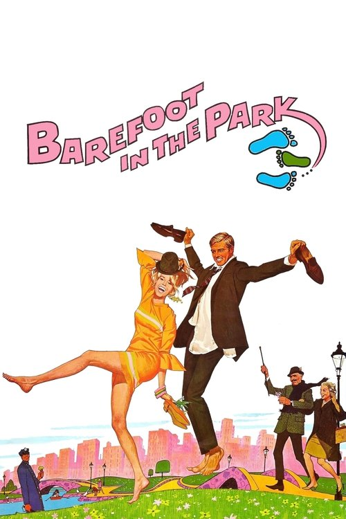

<a href="../">Back to all films</a>

<article class="film">
  <h1>Barefoot in the Park (1967)</h1>

  

    Directed by <strong>Gene Saks</strong>
  

  

  <h2>
    Cast
  </h2>
  <ul>
    <li><strong>Robert Redford</strong> as <em>Paul Bratter</em></li>
<li><strong>Jane Fonda</strong> as <em>Corie Bratter</em></li>
<li><strong>Charles Boyer</strong> as <em>Victor Velasco</em></li>
<li><strong>Mildred Natwick</strong> as <em>Ethel Banks</em></li>
<li><strong>Herb Edelman</strong> as <em>Harry Pepper</em></li>
<li><strong>Mabel Albertson</strong> as <em>Harriet</em></li>
<li><strong>Fritz Feld</strong> as <em>Restaurant Proprietor</em></li>
<li><strong>James Stone</strong> as <em>Delivery Man</em></li>
<li><strong>Ted Hartley</strong> as <em>Frank</em></li>
<li><strong>Doris Roberts</strong> as <em>Hotel Maid (uncredited)</em></li>
<li><strong>Billie Bird</strong> as <em>Drunken Neighbor (uncredited)</em></li>
<li><strong>Paul E. Burns</strong> as <em>Bum in Park (uncredited)</em></li>
<li><strong>Bill Derringer</strong> as <em>Store Clerk (uncredited)</em></li>
<li><strong>John Indrisano</strong> as <em>Policeman with Drunk (uncredited)</em></li>
  </ul>
</article>
