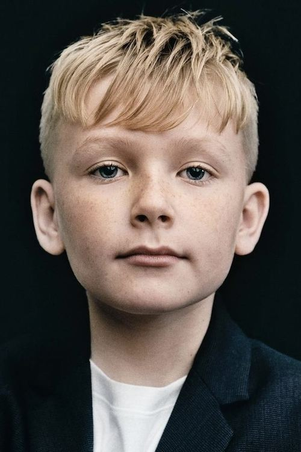
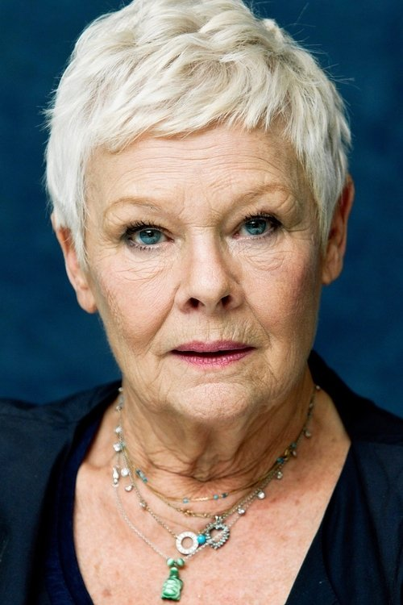



<nav class="films">
  

    <a href="../the-truffle-hunters-2020"><i class="fa-solid fa-chevron-left fa-xs"></i> Previous</a>
  

  

    <a class="simple" href="../">76 / 100</a>
  

  

    <a href="../coda-2021">Next <i class="fa-solid fa-chevron-right fa-xs"></i></a>
  

  

    
      Previous film:
      The Truffle Hunters
    
    
      Next film:
      CODA
    
  

</nav>

<article class="film slug-belfast-2021">
  

    
    
  

  <h1>{{ film.title }} ({{ film | filmYear }})</h1>

  

    Language: {{ film.language }}.
    
  

  

    Directed by <strong>{{ film | directors }}</strong>
  

  
    <blockquote>
      {{ films.reviews[slug] | safe }} <em>—&nbsp;<a href="/bill">Bill</a></em>
    </blockquote>
  

  <section class="cast-grid">
  

    

  
  

    Jude Hill
    Buddy
  

    

  
  

    Jamie Dornan
    Pa
  

    

  
  

    Caitríona Balfe
    Ma
  

    

  
  

    Lewis McAskie
    Will
  

    

  
  

    Judi Dench
    Granny
  

    

  
  

    Ciarán Hinds
    Pop
  

    

  
  

    Lara McDonnell
    Moira
  

    

  
  

    Colin Morgan
    Billy Clanton
  

    

  
  

    Gerard Horan
    Mackie
  

    

  
  

    Josie Walker
    Auntie Violet
  

    

  
  

    Olive Tennant
    Catherine
  

    

  
  

    Michael Maloney
    Frankie West
  

  

</section>

  <section class="film-detail">
    

      

        

          <i class="fa-solid fa-masks-theater"></i>
          Cast
        

        <ul>
          
            <li>
              {{ cast.name }} as <em>{{ cast.character }}</em>
            </li>
          
        </ul>
      

      

        

          <i class="fa-solid fa-clapperboard"></i>
          Crew
        

        <ul>
          
            <li>
              {{ crew.name }} &mdash; <em>{{ crew.job }}</em>
            </li>
          
        </ul>
      

    

  </section>

  <section class="related-films">
  <h2>Related films</h2>
  <ul>
    <li><a href="../in-bruges-2008">In Bruges</a> because of Ciarán Hinds</li>
  </ul>
</section>

</article>
