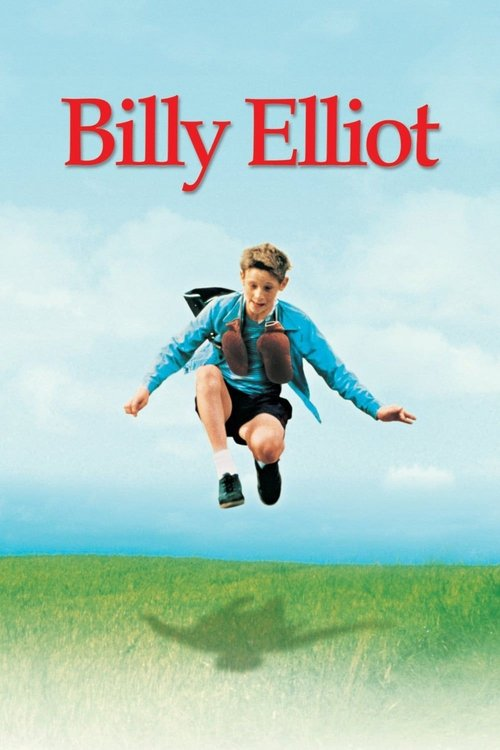
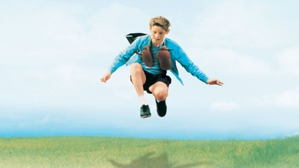



<nav class="films">
  <a class="prev" href="../the-talented-mr-ripley-1999">Previous</a>
  <a href="../">Film list</a>
  <a class="next" href="../amlie-2001">Next</a>
</nav>

44 / 100

<article class="film">
  

    
    
  

  <h1>Billy Elliot ({{ film | filmYear }})</h1>

  

  

    Directed by <strong>{{ film | directors }}</strong>
  

  <h2>
    Cast
  </h2>
  <ul>
            <li><strong>Jamie Bell</strong> as <em>Billy Elliot</em></li>
        <li><strong>Gary Lewis</strong> as <em>Jackie Elliot</em></li>
        <li><strong>Julie Walters</strong> as <em>Mrs Wilkinson</em></li>
        <li><strong>Jean Heywood</strong> as <em>Grandma</em></li>
        <li><strong>Jamie Draven</strong> as <em>Tony Elliot</em></li>
        <li><strong>Stuart Wells</strong> as <em>Michael Caffrey</em></li>
        <li><strong>Mike Elliot</strong> as <em>George Watson</em></li>
        <li><strong>Billy Fane</strong> as <em>Mr Braithwaite</em></li>
        <li><strong>Nicola Blackwell</strong> as <em>Debbie Wilkinson</em></li>
        <li><strong>Carol McGuigan</strong> as <em>Librarian</em></li>
        <li><strong>Joe Renton</strong> as <em>Gary Poulson</em></li>
        <li><strong>Colin MacLachlan</strong> as <em>Mr Tom Wilkinson</em></li>
        <li><strong>Janine Birkett</strong> as <em>Billy's mother</em></li>
        <li><strong>Trevor Fox</strong> as <em>PC Jeff Peverly</em></li>
        <li><strong>Charlie Hardwick</strong> as <em>Sheila Briggs</em></li>
        <li><strong>Denny Ferguson</strong> as <em>Miner</em></li>
        <li><strong>Dennis Lingard</strong> as <em>NCB Official</em></li>
        <li><strong>Matthew James Thomas</strong> as <em>Simon</em></li>
        <li><strong>Stephen Mangan</strong> as <em>Ballet Doctor</em></li>
        <li><strong>Paul Ridley</strong> as <em>Tutor in Medical</em></li>
        <li><strong>Patrick Malahide</strong> as <em>Principal</em></li>
        <li><strong>Barbara Leigh-Hunt</strong> as <em>Vice-Principal</em></li>
        <li><strong>Imogen Claire</strong> as <em>Tutor 1</em></li>
        <li><strong>Diana Kent</strong> as <em>Tutor 2</em></li>
        <li><strong>Neil North</strong> as <em>Tutor 3</em></li>
        <li><strong>Lee Williams</strong> as <em>Tutor 4</em></li>
        <li><strong>Petra Siniawski</strong> as <em>Teacher</em></li>
        <li><strong>Merelina Kendall</strong> as <em>Secretary</em></li>
        <li><strong>Zoë Bell</strong> as <em>Sandra</em></li>
        <li><strong>Tracey Wilkinson</strong> as <em>Geography Teacher</em></li>
        <li><strong>Merryn Owen</strong> as <em>Michael (aged 25)</em></li>
        <li><strong>Adam Cooper</strong> as <em>Billy (aged 25)</em></li>
        <li><strong>Dylan Barnes</strong> as <em>PC White (uncredited)</em></li>
        <li><strong>Liam Elcoat</strong> as <em>Young boy (uncredited)</em></li>
        <li><strong>Adam Galbraith</strong> as <em>Dancer in 'Swan Lake' (uncredited)</em></li>
        <li><strong>Darren Jacobs</strong> as <em>Dancer in 'Swan Lake' (uncredited)</em></li>
        <li><strong>Hendrick January</strong> as <em>Dancer in 'Swan Lake' (uncredited)</em></li>
        <li><strong>Sharon Percy</strong> as <em>Jenny Poulson (uncredited)</em></li>
        <li><strong>Ken Richardson</strong> as <em>Police Officer (uncredited)</em></li>
        <li><strong>Leonard Silver</strong> as <em>Dancer (uncredited)</em></li>
        <li><strong>Lee Smikle</strong> as <em>Dancer in 'Swan Lake' (uncredited)</em></li>
        <li><strong>Catherine Turgoose</strong> as <em>Teenage Party Guest (uncredited)</em></li>
        <li><strong>Damian Winter-Higgins</strong> as <em>Dancer in 'Swan Lake' (uncredited)</em></li>
  </ul>
</article>
<footer>
  <a href="../about">About this list</a>
</footer>
