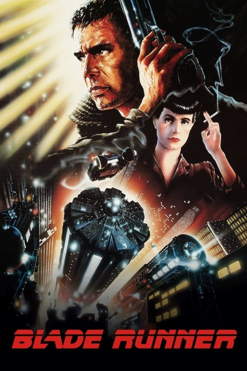
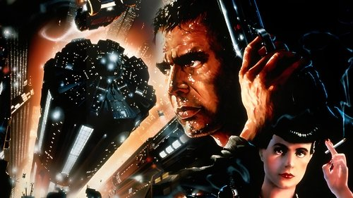

<nav class="films">
  <a class="prev" href="../gregorys-girl">Previous</a>
  <a href="../">Film list</a>
  <a class="next" href="../local-hero">Next</a>
</nav>

25 / 100

<article class="film">
  
  

  <h1>Blade Runner (1982)</h1>

  

    Directed by <strong>Ridley Scott</strong>
  

  <h2>
    Cast
  </h2>
  <ul>
    <li><strong>Harrison Ford</strong> as <em>Deckard</em></li>
<li><strong>Rutger Hauer</strong> as <em>Batty</em></li>
<li><strong>Sean Young</strong> as <em>Rachael</em></li>
<li><strong>Edward James Olmos</strong> as <em>Gaff</em></li>
<li><strong>M. Emmet Walsh</strong> as <em>Bryant</em></li>
<li><strong>Daryl Hannah</strong> as <em>Pris</em></li>
<li><strong>William Sanderson</strong> as <em>Sebastian</em></li>
<li><strong>Brion James</strong> as <em>Leon</em></li>
<li><strong>Joe Turkel</strong> as <em>Tyrell</em></li>
<li><strong>Joanna Cassidy</strong> as <em>Zhora</em></li>
<li><strong>James Hong</strong> as <em>Chew</em></li>
<li><strong>Morgan Paull</strong> as <em>Holden</em></li>
<li><strong>Kevin Thompson</strong> as <em>Bear</em></li>
<li><strong>John Edward Allen</strong> as <em>Kaiser</em></li>
<li><strong>Hy Pyke</strong> as <em>Taffey Lewis</em></li>
<li><strong>Kimiko Hiroshige</strong> as <em>Cambodian Lady</em></li>
<li><strong>Bob Okazaki</strong> as <em>Sushi Master</em></li>
<li><strong>Carolyn DeMirjian</strong> as <em>Saleslady</em></li>
<li><strong>Ben Astar</strong> as <em>Abdul Ben Hassan</em></li>
<li><strong>Dawna Lee Heising</strong> as <em>Showgirl (uncredited)</em></li>
<li><strong>Alexis Rhee</strong> as <em>Geisha #1 (uncredited)</em></li>
<li><strong>Judith Burnett</strong> as <em>Ming-Fa (uncredited)</em></li>
<li><strong>Leo Gorcey Jr.</strong> as <em>Louie - Bartender (uncredited)</em></li>
<li><strong>Sharon Hesky</strong> as <em>Bar Patron (uncredited)</em></li>
<li><strong>Kelly Hine</strong> as <em>Showgirl (uncredited)</em></li>
<li><strong>Tom Hutchinson</strong> as <em>Bartender (uncredited)</em></li>
<li><strong>Charles Knapp</strong> as <em>Bartender (uncredited)</em></li>
<li><strong>Rose Mascari</strong> as <em>Bar Patron (uncredited)</em></li>
<li><strong>Jiro Okazaki</strong> as <em>Policeman (uncredited)</em></li>
<li><strong>Steve Pope</strong> as <em>Policeman (uncredited)</em></li>
<li><strong>Robert Reiter</strong> as <em>Policeman (uncredited)</em></li>
  </ul>
</article>
<footer>
  <a href="../about">About this list</a>
</footer>
