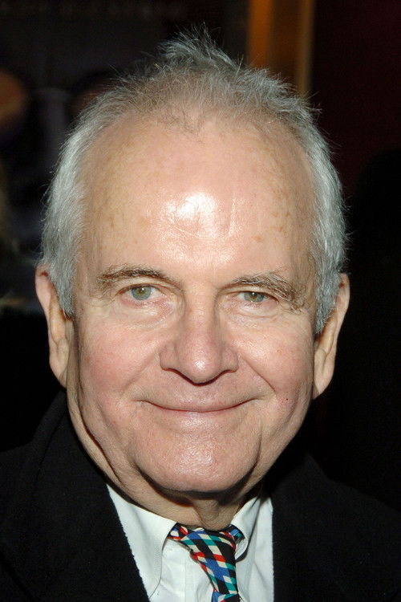
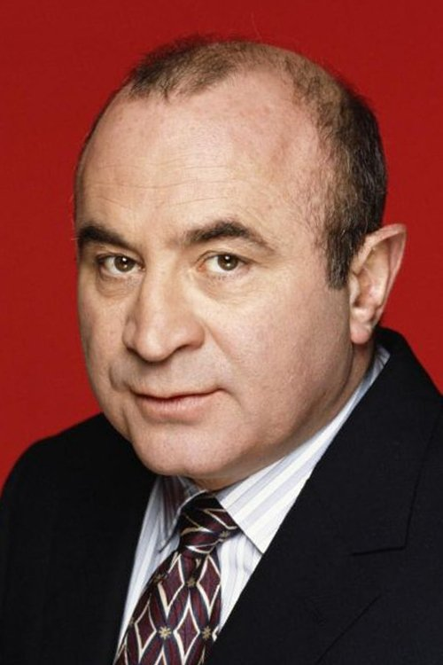
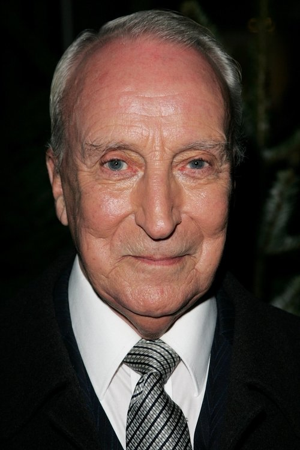
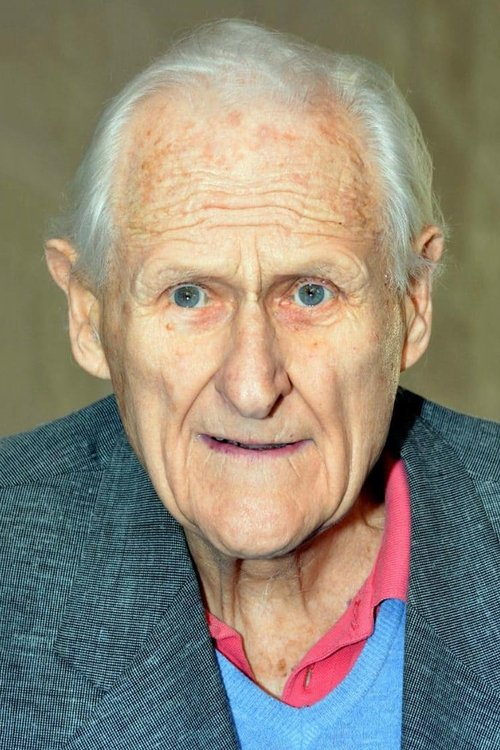



<nav class="films">
  

    <a href="../paris-texas-1984"><i class="fa-solid fa-chevron-left fa-xs"></i> Previous</a>
  

  

    <a class="simple" href="../">22 / 100</a>
  

  

    <a href="../withnail--i-1987">Next <i class="fa-solid fa-chevron-right fa-xs"></i></a>
  

  

    
      Previous film:
      Paris, Texas
    
    
      Next film:
      Withnail & I
    
  

</nav>

<article class="film slug-brazil-1985">
  

    
    
  

  <h1>{{ film.title }} ({{ film | filmYear }})</h1>

  

    Language: {{ film.language }}.
    
  

  

    Directed by <strong>{{ film | directors }}</strong>
  

  
    <blockquote>
      {{ films.reviews[slug] | safe }} <em>—&nbsp;<a href="/bill">Bill</a></em>
    </blockquote>
  

  <section class="cast-grid">
  

    

  
  

    Jonathan Pryce
    Sam Lowry
  

    

  
  

    Robert De Niro
    Harry Tuttle
  

    

  
  

    Katherine Helmond
    Mrs. Ida Lowry
  

    

  
  

    Ian Holm
    Mr. Kurtzmann
  

    

  
  

    Bob Hoskins
    Spoor
  

    

  
  

    Michael Palin
    Jack Lint
  

    

  
  

    Ian Richardson
    Mr. Warrenn
  

    

  
  

    Peter Vaughan
    Mr. Helpmann
  

    

  
  

    Kim Greist
    Jill Layton
  

    

  
  

    Jim Broadbent
    Dr. Jaffe
  

    

  
  

    Barbara Hicks
    Mrs. Alma Terrain
  

    

  
  

    Charles McKeown
    Lime
  

  

</section>

  <section class="film-detail">
    

      

        

          <i class="fa-solid fa-masks-theater"></i>
          Cast
        

        <ul>
          
            <li>
              {{ cast.name }} as <em>{{ cast.character }}</em>
            </li>
          
        </ul>
      

      

        

          <i class="fa-solid fa-clapperboard"></i>
          Crew
        

        <ul>
          
            <li>
              {{ crew.name }} &mdash; <em>{{ crew.job }}</em>
            </li>
          
        </ul>
      

    

  </section>

  <section class="related-films">
  <h2>Related films</h2>
  <ul>
    <li><a href="../the-deer-hunter-1978">The Deer Hunter</a> because of Robert De Niro</li>
<li><a href="../hot-fuzz-2007">Hot Fuzz</a> because of Jim Broadbent</li>
<li><a href="../mr-turner-2014">Mr. Turner</a> because of Roger Ashton-Griffiths</li>
  </ul>
</section>

</article>
