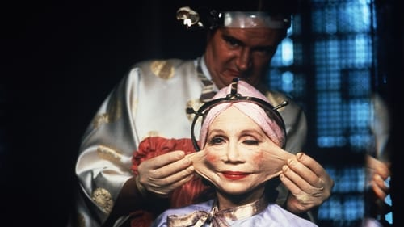

<nav class="films">
  <a class="prev" href="../paris-texas">Previous</a>
  <a href="../">Film list</a>
  <a class="next" href="../withnail--i">Next</a>
</nav>

28 / 100

<article class="film">
  

    
    
  

  <h1>Brazil (1985)</h1>

  

    Directed by <strong>Terry Gilliam</strong>
  

  <h2>
    Cast
  </h2>
  <ul>
    <li><strong>Jonathan Pryce</strong> as <em>Sam Lowry</em></li>
<li><strong>Robert De Niro</strong> as <em>Harry Tuttle</em></li>
<li><strong>Katherine Helmond</strong> as <em>Mrs. Ida Lowry</em></li>
<li><strong>Ian Holm</strong> as <em>Mr. Kurtzmann</em></li>
<li><strong>Bob Hoskins</strong> as <em>Spoor</em></li>
<li><strong>Michael Palin</strong> as <em>Jack Lint</em></li>
<li><strong>Ian Richardson</strong> as <em>Mr. Warrenn</em></li>
<li><strong>Peter Vaughan</strong> as <em>Mr. Helpmann</em></li>
<li><strong>Kim Greist</strong> as <em>Jill Layton</em></li>
<li><strong>Jim Broadbent</strong> as <em>Dr. Jaffe</em></li>
<li><strong>Barbara Hicks</strong> as <em>Mrs. Alma Terrain</em></li>
<li><strong>Charles McKeown</strong> as <em>Lime</em></li>
<li><strong>Derrick O'Connor</strong> as <em>Dowser</em></li>
<li><strong>Kathryn Pogson</strong> as <em>Shirley</em></li>
<li><strong>Bryan Pringle</strong> as <em>Spiro</em></li>
<li><strong>Sheila Reid</strong> as <em>Mrs. Buttle</em></li>
<li><strong>John Flanagan</strong> as <em>T.V. Interviewer / Salesman</em></li>
<li><strong>Roger Ashton-Griffiths</strong> as <em>Priest</em></li>
<li><strong>John Pierce Jones</strong> as <em>Basement Guard</em></li>
<li><strong>Nigel Planer</strong> as <em>Charlie--Dept. of Works</em></li>
<li><strong>Terence Bayler</strong> as <em>T.V. Commercial Presenter</em></li>
<li><strong>Gorden Kaye</strong> as <em>M.O.I. Lobby Porter</em></li>
<li><strong>Jack Purvis</strong> as <em>Dr. Chapman</em></li>
<li><strong>Howard Lew Lewis</strong> as <em>Black Maria Guard</em></li>
<li><strong>Ray Cooper</strong> as <em>Technician</em></li>
<li><strong>Brian Miller</strong> as <em>Mr. Buttle</em></li>
<li><strong>Simon Jones</strong> as <em>Arrest Official</em></li>
<li><strong>Derek Deadman</strong> as <em>Bill - Dept. of Works</em></li>
<li><strong>Bill Wallis</strong> as <em>Bespectacled Lurker</em></li>
<li><strong>Myrtle Devenish</strong> as <em>Typist in Jack's Office</em></li>
<li><strong>Ann Way</strong> as <em>Old Lady with Dog</em></li>
<li><strong>Don Henderson</strong> as <em>First 'Black Maria' Guard</em></li>
<li><strong>Oscar Quitak</strong> as <em>Interview Official</em></li>
<li><strong>Harold Innocent</strong> as <em>Interview Official</em></li>
<li><strong>John Grillo</strong> as <em>Interview Official</em></li>
<li><strong>Ralph Nossek</strong> as <em>Interview Official</em></li>
<li><strong>David Gant</strong> as <em>Interview Official</em></li>
<li><strong>James Coyle</strong> as <em>Interview Official</em></li>
<li><strong>Patrick Connor</strong> as <em>Cell Guard</em></li>
<li><strong>Elizabeth Spender</strong> as <em>Alison / 'Barbara' Lint</em></li>
<li><strong>Russell Keith Grant</strong> as <em>Young  Gallant at Funeral</em></li>
<li><strong>Terry Gilliam</strong> as <em>Smoking Man (uncredited)</em></li>
  </ul>
</article>
<footer>
  <a href="../about">About this list</a>
</footer>
