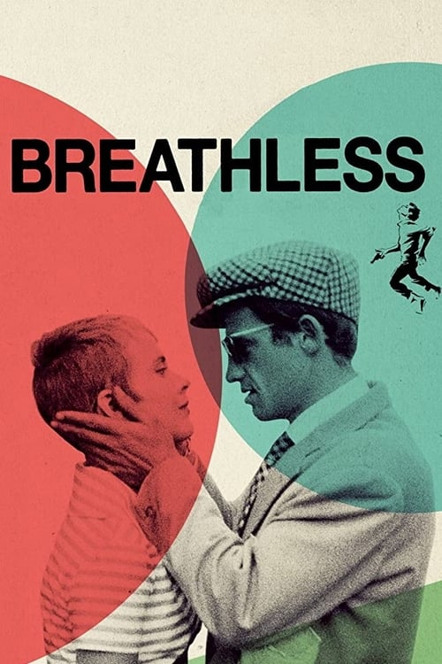
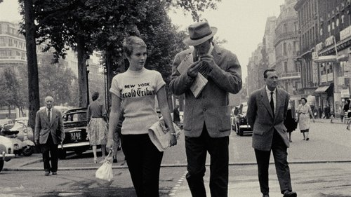



<nav class="films">
  <a class="prev" href="../purple-noon-1960">Previous</a>
  <a href="../">Film list</a>
  <a class="next" href="../barefoot-in-the-park-1967">Next</a>
</nav>

8 / 100

<article class="film">
  

    
    
  

  <h1>Breathless ({{ film | filmYear }})</h1>

  

    Directed by <strong>{{ film | directors }}</strong>
  

  <h2>
    Cast
  </h2>
  <ul>
            <li><strong>Jean-Paul Belmondo</strong> as <em>Michel Poiccard / László Kovács</em></li>
        <li><strong>Jean Seberg</strong> as <em>Patricia Franchini</em></li>
        <li><strong>Daniel Boulanger</strong> as <em>Police Inspector Vital</em></li>
        <li><strong>Henri-Jacques Huet</strong> as <em>Antonio Berrutti</em></li>
        <li><strong>Roger Hanin</strong> as <em>Carl Zubart</em></li>
        <li><strong>Van Doude</strong> as <em>American Journalist, Patricia's Friend</em></li>
        <li><strong>Claude Mansard</strong> as <em>Claudius Mansard</em></li>
        <li><strong>Liliane Dreyfus</strong> as <em>Liliane / Minouche</em></li>
        <li><strong>Michel Fabre</strong> as <em>Police Inspector #2</em></li>
        <li><strong>Jean-Pierre Melville</strong> as <em>Parvulesco the Writer</em></li>
        <li><strong>Jean-Luc Godard</strong> as <em>The Snitch</em></li>
        <li><strong>Richard Balducci</strong> as <em>Tolmatchoff</em></li>
        <li><strong>André S. Labarthe</strong> as <em>Journalist at Orly</em></li>
        <li><strong>François Moreuil</strong> as <em>Journalist at Orly</em></li>
        <li><strong>Jacques Lourcelles</strong> as <em></em></li>
        <li><strong>Liliane Robin</strong> as <em>Minouche</em></li>
        <li><strong>Gérard Brach</strong> as <em>Photographer (uncredited)</em></li>
        <li><strong>Philippe de Broca</strong> as <em>A Journalist (uncredited)</em></li>
        <li><strong>José Bénazéraf</strong> as <em>Man in a White Car (uncredited)</em></li>
        <li><strong>Jean Domarchi</strong> as <em>A Drunk (uncredited)</em></li>
        <li><strong>Jean Douchet</strong> as <em>A Journalist (uncredited)</em></li>
        <li><strong>Raymond Huntley</strong> as <em>A Journalist (uncredited)</em></li>
        <li><strong>Louiguy</strong> as <em>(uncredited)</em></li>
        <li><strong>Michel Mourlet</strong> as <em>Audience in the Movie Theater (uncredited)</em></li>
        <li><strong>Guido Orlando</strong> as <em>(uncredited)</em></li>
        <li><strong>Madame Paul</strong> as <em>(uncredited)</em></li>
        <li><strong>Jean-Louis Richard</strong> as <em>A Journalist (uncredited)</em></li>
        <li><strong>Jacques Serguine</strong> as <em>(uncredited)</em></li>
        <li><strong>Jacques Siclier</strong> as <em>(uncredited)</em></li>
        <li><strong>Virginie Ullmann</strong> as <em>(uncredited)</em></li>
        <li><strong>Emile Villion</strong> as <em>(uncredited)</em></li>
  </ul>
</article>
<footer>
  <a href="../about">About this list</a>
</footer>
