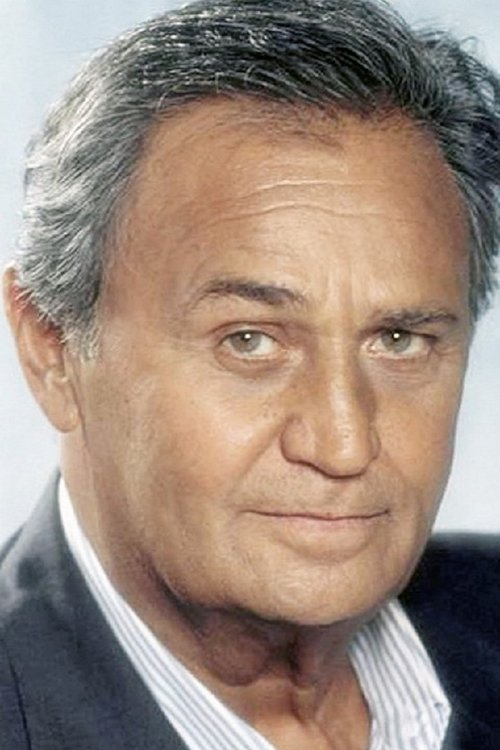
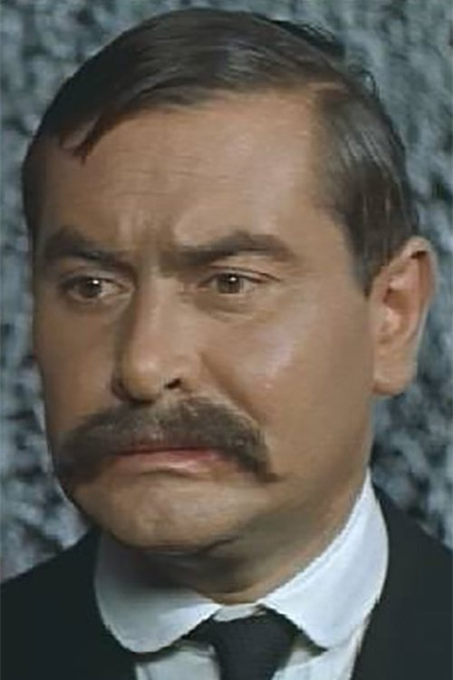
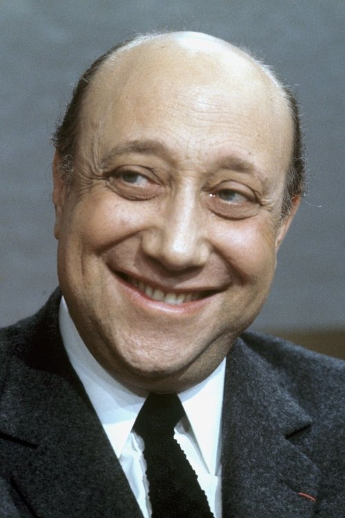



<nav class="films">
  

    <a href="../rear-window-1954"><i class="fa-solid fa-chevron-left fa-xs"></i> Previous</a>
  

  

    <a class="simple" href="../">4 / 100</a>
  

  

    <a href="../la-dolce-vita-1960">Next <i class="fa-solid fa-chevron-right fa-xs"></i></a>
  

  

    
      Previous film:
      Rear Window
    
    
      Next film:
      La Dolce Vita
    
  

</nav>

<article class="film slug-breathless-1960">
  

    
    
  

  <h1>{{ film.title }} ({{ film | filmYear }})</h1>

  

    Language: {{ film.language }}.
    Also known as À bout de souffle.
  

  

    Directed by <strong>{{ film | directors }}</strong>
  

  
    <blockquote>
      {{ films.reviews[slug] | safe }} <em>—&nbsp;<a href="/bill">Bill</a></em>
    </blockquote>
  

  <section class="cast-grid">
  

    

  
  

    Jean-Paul Belmondo
    Michel Poiccard / László Kovács
  

    

  
  

    Jean Seberg
    Patricia Franchini
  

    

  
  

    Daniel Boulanger
    Police Inspector Vital
  

    

  
  

    Henri-Jacques Huet
    Antonio Berrutti
  

    

  
  

    Roger Hanin
    Carl Zubart
  

    

  
  

    Van Doude
    American Journalist, Patricia's Friend
  

    

  
  

    Claude Mansard
    Claudius Mansard
  

    

  
  

    Liliane Dreyfus
    Liliane / Minouche
  

    

  
<i class="fa-solid fa-user"></i>

  

    Michel Fabre
    Police Inspector #2
  

    

  
  

    Jean-Pierre Melville
    Parvulesco the Writer
  

    

  
  

    Jean-Luc Godard
    The Snitch
  

    

  
  

    Richard Balducci
    Tolmatchoff
  

  

</section>

  <section class="film-detail">
    

      

        

          <i class="fa-solid fa-masks-theater"></i>
          Cast
        

        <ul>
          
            <li>
              {{ cast.name }} as <em>{{ cast.character }}</em>
            </li>
          
        </ul>
      

      

        

          <i class="fa-solid fa-clapperboard"></i>
          Crew
        

        <ul>
          
            <li>
              {{ crew.name }} &mdash; <em>{{ crew.job }}</em>
            </li>
          
        </ul>
      

    

  </section>

  
</article>
