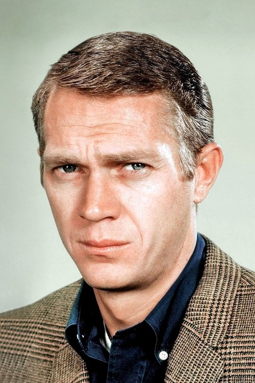
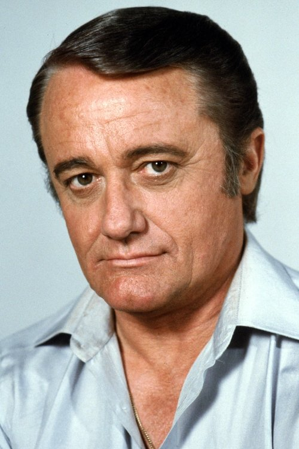
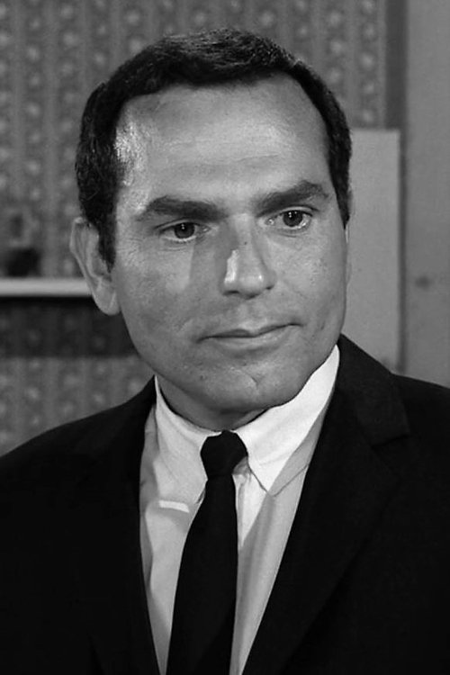
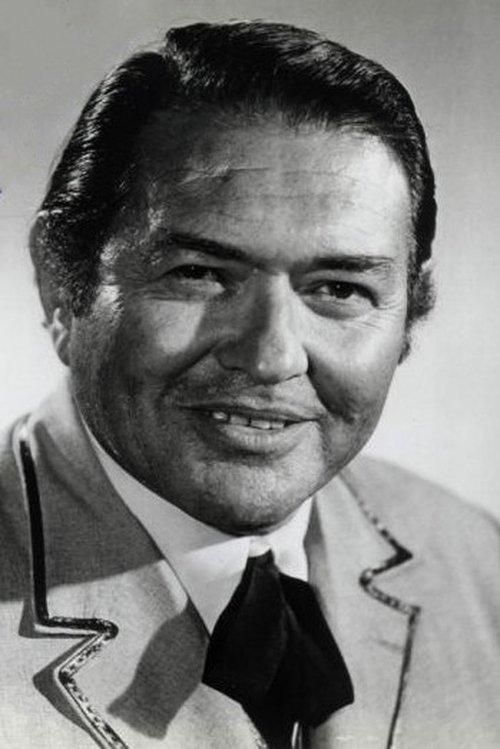
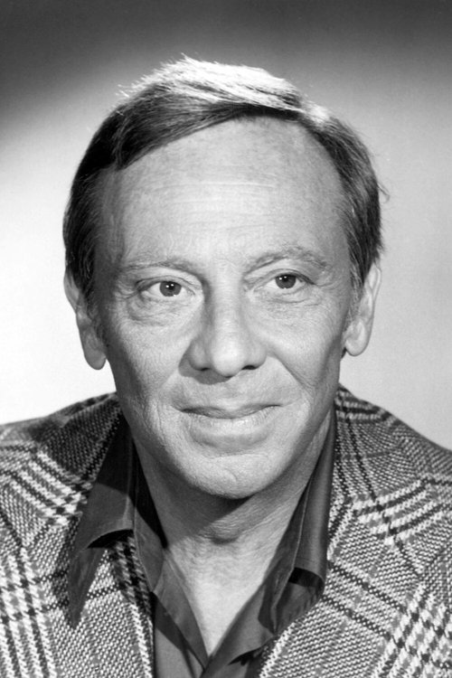
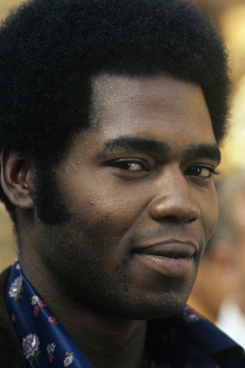
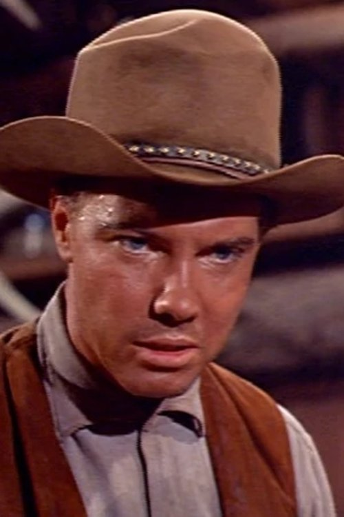
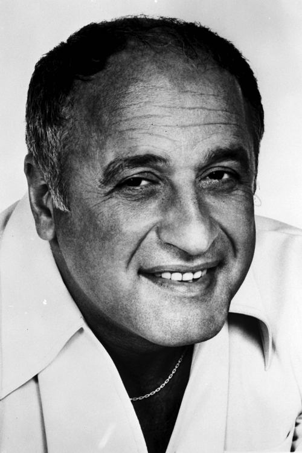



<nav class="films">
  

    <a href="../2001-a-space-odyssey-1968"><i class="fa-solid fa-chevron-left fa-xs"></i> Previous</a>
  

  

    <a class="simple" href="../">9 / 100</a>
  

  

    <a href="../once-upon-a-time-in-the-west-1968">Next <i class="fa-solid fa-chevron-right fa-xs"></i></a>
  

  

    
      Previous film:
      2001: A Space Odyssey
    
    
      Next film:
      Once Upon a Time in the West
    
  

</nav>

<article class="film slug-bullitt-1968">
  

    
    
  

  <h1>{{ film.title }} ({{ film | filmYear }})</h1>

  

    Language: {{ film.language }}.
    
  

  

    Directed by <strong>{{ film | directors }}</strong>
  

  
    <blockquote>
      {{ films.reviews[slug] | safe }} <em>—&nbsp;<a href="/bill">Bill</a></em>
    </blockquote>
  

  <section class="cast-grid">
  

    

  
  

    Steve McQueen
    Lt. Frank Bullitt
  

    

  
  

    Robert Vaughn
    Walter Chalmers
  

    

  
  

    Jacqueline Bisset
    Cathy
  

    

  
  

    Don Gordon
    Lt. Delgetti
  

    

  
  

    Robert Duvall
    Cabbie Weissberg
  

    

  
  

    Simon Oakland
    Captain Sam Bennett
  

    

  
  

    Norman Fell
    Captain Baker
  

    

  
  

    Georg Stanford Brown
    Dr. Willard
  

    

  
  

    Justin Tarr
    Eddy
  

    

  
  

    Carl Reindel
    Detective Stanton
  

    

  
  

    Felice Orlandi
    Albert E. Renick
  

    

  
  

    Vic Tayback
    Pete Ross
  

  

</section>

  <section class="film-detail">
    

      

        

          <i class="fa-solid fa-masks-theater"></i>
          Cast
        

        <ul>
          
            <li>
              {{ cast.name }} as <em>{{ cast.character }}</em>
            </li>
          
        </ul>
      

      

        

          <i class="fa-solid fa-clapperboard"></i>
          Crew
        

        <ul>
          
            <li>
              {{ crew.name }} &mdash; <em>{{ crew.job }}</em>
            </li>
          
        </ul>
      

    

  </section>

  <section class="related-films">
  <h2>Related films</h2>
  <ul>
    <li><a href="../day-for-night-1973">Day for Night</a> because of Jacqueline Bisset</li>
<li><a href="../apocalypse-now-1979">Apocalypse Now</a> because of Robert Duvall</li>
  </ul>
</section>

</article>
