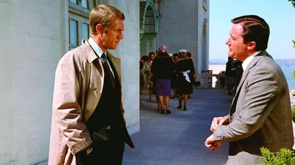

<nav class="films">
  <a class="prev" href="../2001-a-space-odyssey">Previous</a>
  <a href="../">Film list</a>
  <a class="next" href="../once-upon-a-time-in-the-west">Next</a>
</nav>

12 / 100

<article class="film">
  
  

  <h1>Bullitt (1968)</h1>

  

    Directed by <strong>Peter Yates</strong>
  

  <h2>
    Cast
  </h2>
  <ul>
    <li><strong>Steve McQueen</strong> as <em>Lt. Frank Bullitt</em></li>
<li><strong>Robert Vaughn</strong> as <em>Walter Chalmers</em></li>
<li><strong>Jacqueline Bisset</strong> as <em>Cathy</em></li>
<li><strong>Don Gordon</strong> as <em>Lt. Delgetti</em></li>
<li><strong>Robert Duvall</strong> as <em>Cabbie Weissberg</em></li>
<li><strong>Simon Oakland</strong> as <em>Captain Sam Bennett</em></li>
<li><strong>Norman Fell</strong> as <em>Captain Baker</em></li>
<li><strong>Georg Stanford Brown</strong> as <em>Dr. Willard</em></li>
<li><strong>Justin Tarr</strong> as <em>Eddy</em></li>
<li><strong>Carl Reindel</strong> as <em>Detective Stanton</em></li>
<li><strong>Felice Orlandi</strong> as <em>Albert E. Renick</em></li>
<li><strong>Vic Tayback</strong> as <em>Pete Ross</em></li>
<li><strong>Robert Lipton</strong> as <em>1st Aide</em></li>
<li><strong>Ed Peck</strong> as <em>Westcott</em></li>
<li><strong>Pat Renella</strong> as <em>Johnny Ross</em></li>
<li><strong>Paul Genge</strong> as <em>The Hitman</em></li>
<li><strong>John Aprea</strong> as <em>Killer</em></li>
<li><strong>Al Checco</strong> as <em>Desk Clerk</em></li>
<li><strong>Bill Hickman</strong> as <em>Phil</em></li>
<li><strong>Robert Cleaves</strong> as <em>Uniformed Courtesy Officer (uncredited)</em></li>
  </ul>
</article>
<footer>
  <a href="../about">About this list</a>
</footer>
