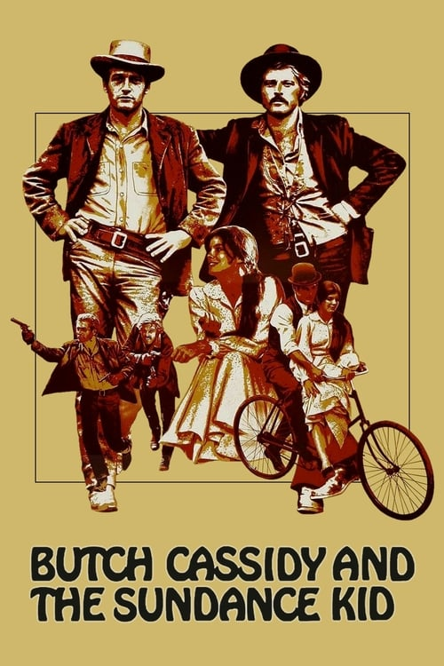

<a href="../">Back to all films</a>

<article class="film">
  <h1>Butch Cassidy and the Sundance Kid (1969)</h1>

  

    Directed by <strong>George Roy Hill</strong>
  

  

  <h2>
    Cast
  </h2>
  <ul>
    <li><strong>Paul Newman</strong> as <em>Butch Cassidy</em></li>
<li><strong>Robert Redford</strong> as <em>Sundance Kid</em></li>
<li><strong>Katharine Ross</strong> as <em>Etta Place</em></li>
<li><strong>Strother Martin</strong> as <em>Percy Garris</em></li>
<li><strong>Henry Jones</strong> as <em>Bike Salesman</em></li>
<li><strong>Jeff Corey</strong> as <em>Sheriff Ray Bledsoe</em></li>
<li><strong>George Furth</strong> as <em>Woodcock</em></li>
<li><strong>Cloris Leachman</strong> as <em>Agnes</em></li>
<li><strong>Ted Cassidy</strong> as <em>Harvey Logan</em></li>
<li><strong>Kenneth Mars</strong> as <em>Marshal</em></li>
<li><strong>Donnelly Rhodes</strong> as <em>Macon</em></li>
<li><strong>Jody Gilbert</strong> as <em>Large Woman</em></li>
<li><strong>Timothy Scott</strong> as <em>News Carver</em></li>
<li><strong>Don Keefer</strong> as <em>Fireman</em></li>
<li><strong>Charles Dierkop</strong> as <em>Flat Nose Curry</em></li>
<li><strong>Pancho Córdova</strong> as <em>Bank Manager</em></li>
<li><strong>Nelson Olmsted</strong> as <em>Photographer</em></li>
<li><strong>Paul Bryar</strong> as <em>Card Player #1</em></li>
<li><strong>Sam Elliott</strong> as <em>Card Player #2</em></li>
<li><strong>Charles Akins</strong> as <em>Bank Teller</em></li>
<li><strong>Eric Sinclair</strong> as <em>Tiffany's Salesman</em></li>
<li><strong>Douglas Bank</strong> as <em>Citizen (uncredited)</em></li>
<li><strong>Percy Helton</strong> as <em>Sweetface (uncredited)</em></li>
  </ul>
</article>
