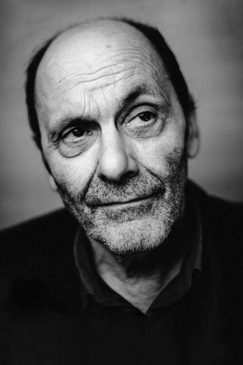
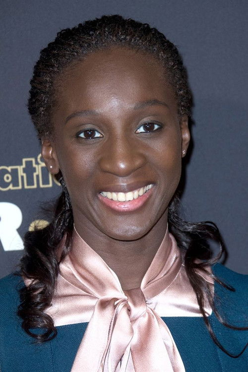
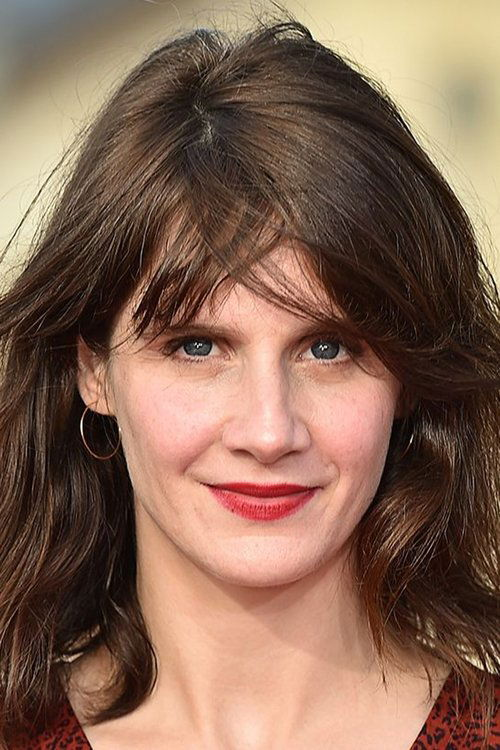



<nav class="films">
  

    <a href="../the-handmaiden-2016"><i class="fa-solid fa-chevron-left fa-xs"></i> Previous</a>
  

  

    <a class="simple" href="../">60 / 100</a>
  

  

    <a href="../lady-bird-2017">Next <i class="fa-solid fa-chevron-right fa-xs"></i></a>
  

  

    
      Previous film:
      The Handmaiden
    
    
      Next film:
      Lady Bird
    
  

</nav>

<article class="film slug-cest-la-vie-2017">
  

    
    
  

  <h1>{{ film.title }} ({{ film | filmYear }})</h1>

  

    Language: {{ film.language }}.
    Also known as Le Sens de la fête.
  

  

    Directed by <strong>{{ film | directors }}</strong>
  

  
    <blockquote>
      {{ films.reviews[slug] | safe }} <em>—&nbsp;<a href="/bill">Bill</a></em>
    </blockquote>
  

  <section class="cast-grid">
  

    

  
  

    Jean-Pierre Bacri
    Max
  

    

  
  

    Gilles Lellouche
    James
  

    

  
  

    Jean-Paul Rouve
    Guy
  

    

  
  

    Vincent Macaigne
    Julien
  

    

  
  

    Alban Ivanov
    Samy
  

    

  
  

    Eye Haïdara
    Adèle
  

    

  
  

    Suzanne Clément
    Josiane
  

    

  
  

    Hélène Vincent
    Pierre's Mother
  

    

  
  

    Benjamin Lavernhe
    Pierre
  

    

  
  

    Judith Chemla
    Héléna
  

    

  
  

    William Lebghil
    Seb
  

    

  
  

    Kévin Azaïs
    Patrice
  

  

</section>

  <section class="film-detail">
    

      

        

          <i class="fa-solid fa-masks-theater"></i>
          Cast
        

        <ul>
          
            <li>
              {{ cast.name }} as <em>{{ cast.character }}</em>
            </li>
          
        </ul>
      

      

        

          <i class="fa-solid fa-clapperboard"></i>
          Crew
        

        <ul>
          
            <li>
              {{ crew.name }} &mdash; <em>{{ crew.job }}</em>
            </li>
          
        </ul>
      

    

  </section>

  <section class="related-films">
  <h2>Related films</h2>
  <ul>
    <li><a href="../sink-or-swim-2018">Sink or Swim</a> because of Gilles Lellouche and Alban Ivanov</li>
<li><a href="../the-french-dispatch-2021">The French Dispatch</a> because of Benjamin Lavernhe</li>
  </ul>
</section>

</article>
