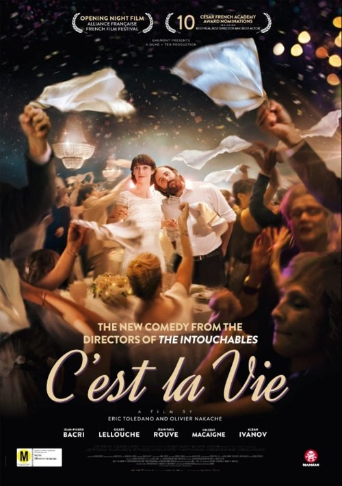

<nav class="films">
  <a class="prev" href="../lucky">Previous</a>
  <a href="../">Film list</a>
  <a class="next" href="../woman-at-war">Next</a>
</nav>

69 / 100

<article class="film">
  <h1>C'est la vie! (2017)</h1>

  

    Directed by <strong>Éric Toledano, Olivier Nakache</strong>
  

  

  <h2>
    Cast
  </h2>
  <ul>
    <li><strong>Jean-Pierre Bacri</strong> as <em>Max</em></li>
<li><strong>Gilles Lellouche</strong> as <em>James</em></li>
<li><strong>Jean-Paul Rouve</strong> as <em>Guy</em></li>
<li><strong>Vincent Macaigne</strong> as <em>Julien</em></li>
<li><strong>Alban Ivanov</strong> as <em>Samy</em></li>
<li><strong>Eye Haïdara</strong> as <em>Adèle</em></li>
<li><strong>Suzanne Clément</strong> as <em>Josiane</em></li>
<li><strong>Hélène Vincent</strong> as <em>Pierre's Mother</em></li>
<li><strong>Benjamin Lavernhe</strong> as <em>Pierre</em></li>
<li><strong>Judith Chemla</strong> as <em>Héléna</em></li>
<li><strong>William Lebghil</strong> as <em>Seb</em></li>
<li><strong>Kévin Azaïs</strong> as <em>Patrice</em></li>
<li><strong>Antoine Chappey</strong> as <em>Henri</em></li>
<li><strong>Manmathan Basky</strong> as <em>Roshan</em></li>
<li><strong>Khereddine Ennasri</strong> as <em>Nabil</em></li>
<li><strong>Gabriel Naccache</strong> as <em>Bastien</em></li>
<li><strong>Nicky Marbot</strong> as <em>Bernard</em></li>
<li><strong>Grégoire Bonnet</strong> as <em>Valery Laprade</em></li>
<li><strong>Sam Karmann</strong> as <em>The Friend Who Saves the Dinner</em></li>
<li><strong>Pauline Clément</strong> as <em>Future Bride at the Hotel</em></li>
<li><strong>Sébastien Pouderoux</strong> as <em>Future Groom at the Hotel</em></li>
<li><strong>Anouchka Csernakova</strong> as <em>Guest Victim of a Misunderstanding</em></li>
  </ul>
</article>
<footer>
  <a href="../about">About this list</a>
</footer>
