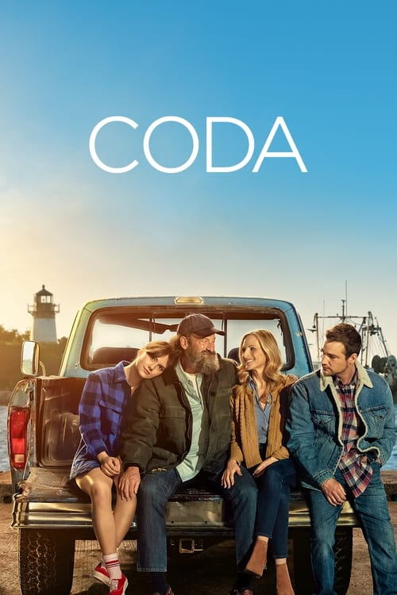



<nav class="films">
  <a class="prev" href="../petite-maman-2021">Previous</a>
  <a href="../">Film list</a>
  <a class="next" href="../dune-2021">Next</a>
</nav>

82 / 100

<article class="film">
  

    
    
  

  <h1>CODA ({{ film | filmYear }})</h1>

  

  

    Directed by <strong>{{ film | directors }}</strong>
  

  <h2>
    Cast
  </h2>
  <ul>
            <li><strong>Emilia Jones</strong> as <em>Ruby Rossi</em></li>
        <li><strong>Marlee Matlin</strong> as <em>Jackie Rossi</em></li>
        <li><strong>Troy Kotsur</strong> as <em>Frank Rossi</em></li>
        <li><strong>Eugenio Derbez</strong> as <em>Bernardo Villalobos</em></li>
        <li><strong>Ferdia Walsh-Peelo</strong> as <em>Miles</em></li>
        <li><strong>Daniel Durant</strong> as <em>Leo Rossi</em></li>
        <li><strong>Amy Forsyth</strong> as <em>Gertie</em></li>
        <li><strong>Kevin Chapman</strong> as <em>Brady</em></li>
        <li><strong>John Fiore</strong> as <em>Tony Salgado</em></li>
        <li><strong>Lonnie Farmer</strong> as <em>Arthur</em></li>
        <li><strong>Courtland Jones</strong> as <em>Ms. Simon</em></li>
        <li><strong>Molly Beth Thomas</strong> as <em>Audra</em></li>
        <li><strong>Ayana Brown</strong> as <em>Guidance Counselor</em></li>
        <li><strong>Jason Pugatch</strong> as <em>Doctor</em></li>
        <li><strong>Kyana Fanene</strong> as <em>Riff Girl</em></li>
        <li><strong>Anilee List</strong> as <em>Adele Girl</em></li>
        <li><strong>Stone Martin</strong> as <em>Harry Potter Boy</em></li>
        <li><strong>Maeve Chapman</strong> as <em>Shaker Girl</em></li>
        <li><strong>Stephen Caliskan</strong> as <em>Tall Boy</em></li>
        <li><strong>Amanda Bradshaw</strong> as <em>Shy Girl</em></li>
        <li><strong>Bryan Sabbag</strong> as <em>Broadway Boy</em></li>
        <li><strong>Kayla Caulfield</strong> as <em>Off Key Girl</em></li>
        <li><strong>Samidio DePina</strong> as <em>Suave Boy</em></li>
        <li><strong>Dominic Andersen</strong> as <em>Bass Boy</em></li>
        <li><strong>Jose Guns Alves</strong> as <em>Mondo</em></li>
        <li><strong>Owen Burke</strong> as <em>Jimmy</em></li>
        <li><strong>Lance Norris</strong> as <em>Chubs</em></li>
        <li><strong>Mark Pettograsso</strong> as <em>Bar Bully</em></li>
        <li><strong>Tony Viveiros</strong> as <em>Bartender</em></li>
        <li><strong>Armen Garo</strong> as <em>Gio Salgado</em></li>
        <li><strong>Jared Voss</strong> as <em>John Kaufman</em></li>
        <li><strong>Emilia Faucher</strong> as <em>Misha</em></li>
        <li><strong>Marilyn Busch</strong> as <em>Nina</em></li>
        <li><strong>Melissa McMeekin</strong> as <em>Barb</em></li>
        <li><strong>Erica McDermott</strong> as <em>Angela</em></li>
        <li><strong>Garrett McKechnie</strong> as <em>Chet Turner</em></li>
        <li><strong>Rebecca Gibel</strong> as <em>Joanne Biles</em></li>
        <li><strong>TJ Ciarametaro</strong> as <em>Coast Guard Boarding Officer</em></li>
        <li><strong>Gary Galone</strong> as <em>Coast Guard Officer</em></li>
        <li><strong>Nikki Kim</strong> as <em>Monitor #1</em></li>
        <li><strong>Mary Ann Schaub</strong> as <em>Monitor #2</em></li>
        <li><strong>Cassandra Berta</strong> as <em>Vocalist</em></li>
        <li><strong>Sarah Clarke</strong> as <em>Tanya</em></li>
        <li><strong>Rena Maliszewski</strong> as <em>Female Jury Member</em></li>
        <li><strong>David Newsom</strong> as <em>Male Jury Member</em></li>
        <li><strong>Kiara Pichardo</strong> as <em>Cashier (uncredited)</em></li>
        <li><strong>Pamela Jayne Morgan</strong> as <em>Shopper Woman (uncredited)</em></li>
        <li><strong>Elbert Kim</strong> as <em>Jackie Rossi's Attorney (uncredited)</em></li>
        <li><strong>Dominic Cannarella-Andersen</strong> as <em>Bass Boy</em></li>
  </ul>
</article>
<footer>
  <a href="../about">About this list</a>
</footer>
