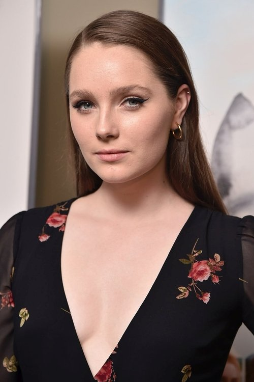



<nav class="films">
  

    <a href="../belfast-2021"><i class="fa-solid fa-chevron-left fa-xs"></i> Previous</a>
  

  

    <a class="simple" href="../">77 / 100</a>
  

  

    <a href="../dune-2021">Next <i class="fa-solid fa-chevron-right fa-xs"></i></a>
  

  

    
      Previous film:
      Belfast
    
    
      Next film:
      Dune
    
  

</nav>

<article class="film slug-coda-2021">
  

    
    
  

  <h1>{{ film.title }} ({{ film | filmYear }})</h1>

  

    Language: {{ film.language }}.
    
  

  

    Directed by <strong>{{ film | directors }}</strong>
  

  
    <blockquote>
      {{ films.reviews[slug] | safe }} <em>—&nbsp;<a href="/bill">Bill</a></em>
    </blockquote>
  

  <section class="cast-grid">
  

    

  
  

    Emilia Jones
    Ruby Rossi
  

    

  
  

    Marlee Matlin
    Jackie Rossi
  

    

  
  

    Troy Kotsur
    Frank Rossi
  

    

  
  

    Eugenio Derbez
    Bernardo Villalobos
  

    

  
  

    Ferdia Walsh-Peelo
    Miles
  

    

  
  

    Daniel Durant
    Leo Rossi
  

    

  
  

    Amy Forsyth
    Gertie
  

    

  
  

    Kevin Chapman
    Brady
  

    

  
  

    John Fiore
    Tony Salgado
  

    

  
  

    Lonnie Farmer
    Arthur
  

    

  
  

    Courtland Jones
    Ms. Simon
  

    

  
  

    Molly Beth Thomas
    Audra
  

  

</section>

  <section class="film-detail">
    

      

        

          <i class="fa-solid fa-masks-theater"></i>
          Cast
        

        <ul>
          
            <li>
              {{ cast.name }} as <em>{{ cast.character }}</em>
            </li>
          
        </ul>
      

      

        

          <i class="fa-solid fa-clapperboard"></i>
          Crew
        

        <ul>
          
            <li>
              {{ crew.name }} &mdash; <em>{{ crew.job }}</em>
            </li>
          
        </ul>
      

    

  </section>

  <section class="related-films">
  <h2>Related films</h2>
  <ul>
    <li><a href="../little-women-2019">Little Women</a> because of Lonnie Farmer</li>
  </ul>
</section>

</article>
