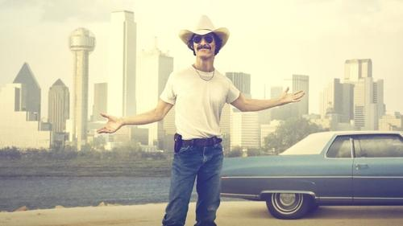

<nav class="films">
  <a class="prev" href="../all-is-lost">Previous</a>
  <a href="../">Film list</a>
  <a class="next" href="../the-grand-budapest-hotel">Next</a>
</nav>

62 / 100

<article class="film">
  

    
    
  

  <h1>Dallas Buyers Club (2013)</h1>

  

    Directed by <strong>Jean-Marc Vallée</strong>
  

  <h2>
    Cast
  </h2>
  <ul>
    <li><strong>Matthew McConaughey</strong> as <em>Ron Woodroof</em></li>
<li><strong>Jennifer Garner</strong> as <em>Eve</em></li>
<li><strong>Jared Leto</strong> as <em>Rayon</em></li>
<li><strong>Denis O'Hare</strong> as <em>Dr. Sevard</em></li>
<li><strong>Steve Zahn</strong> as <em>Tucker</em></li>
<li><strong>Michael O'Neill</strong> as <em>Richard Barkley</em></li>
<li><strong>Dallas Roberts</strong> as <em>David Wayne</em></li>
<li><strong>Griffin Dunne</strong> as <em>Dr. Vass</em></li>
<li><strong>Kevin Rankin</strong> as <em>T.J.</em></li>
<li><strong>Donna DuPlantier</strong> as <em>Nurse Frazin</em></li>
<li><strong>Deneen Tyler</strong> as <em>Denise</em></li>
<li><strong>J.D. Evermore</strong> as <em>Clint</em></li>
<li><strong>Ian Casselberry</strong> as <em>Hispanic Orderly</em></li>
<li><strong>Noelle Wilcox</strong> as <em>Kelly</em></li>
<li><strong>Bradford Cox</strong> as <em>Sunny</em></li>
<li><strong>Rick Espaillat</strong> as <em>Michael</em></li>
<li><strong>Lawrence Turner</strong> as <em>Foreman</em></li>
<li><strong>Lucius Falick</strong> as <em>Freddie</em></li>
<li><strong>James DuMont</strong> as <em>Rayon's Father</em></li>
<li><strong>Jane McNeill</strong> as <em>Francine Suskind</em></li>
<li><strong>Don Brady</strong> as <em>Tucker's Father</em></li>
<li><strong>Matthew Thompson</strong> as <em>Effeminate Man</em></li>
<li><strong>Tony Bentley</strong> as <em>Judge</em></li>
<li><strong>Sean Boyd</strong> as <em>Border Agent</em></li>
<li><strong>Rachel Wulff</strong> as <em>News Anchor</em></li>
<li><strong>Neeona Neal</strong> as <em>Stripper</em></li>
<li><strong>Scott Takeda</strong> as <em>Mr. Yamata</em></li>
<li><strong>Jonathan Tabler</strong> as <em>Rick Ferris</em></li>
<li><strong>Joji Yoshida</strong> as <em>Dr. Hiroshi</em></li>
<li><strong>Carl Palmer</strong> as <em>FDA Customs Agent</em></li>
<li><strong>Martin Covert</strong> as <em>Ian</em></li>
<li><strong>Douglas M. Griffin</strong> as <em>Rog</em></li>
<li><strong>David Lichtenstein</strong> as <em>Cop</em></li>
<li><strong>Craig Borten</strong> as <em>Quicksilver Cowboy</em></li>
<li><strong>Henry Frost</strong> as <em>Gay Cowboy</em></li>
<li><strong>Arthur Smith</strong> as <em>Rodeo Announcer</em></li>
<li><strong>Adam Dunn</strong> as <em>Neddie Jay (uncredited)</em></li>
<li><strong>Juliet Reeves London</strong> as <em>Rodeo Girl (uncredited)</em></li>
<li><strong>Jeanine Hill</strong> as <em>Rodeo Girl (uncredited)</em></li>
<li><strong>Sarah Eilts</strong> as <em>Ron's Hooker (uncredited)</em></li>
<li><strong>Lily Virginia Filson</strong> as <em>Dancer (uncredited)</em></li>
<li><strong>Steffie Grote</strong> as <em>The Girl With The Snake Tattoo (uncredited)</em></li>
  </ul>
</article>
<footer>
  <a href="../about">About this list</a>
</footer>
