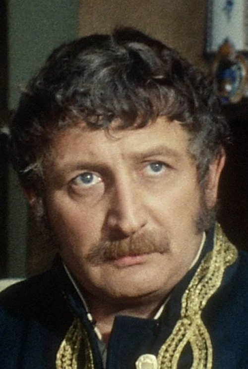



<nav class="films">
  

    <a href="../apocalypse-now-1979"><i class="fa-solid fa-chevron-left fa-xs"></i> Previous</a>
  

  

    <a class="simple" href="../">18 / 100</a>
  

  

    <a href="../blade-runner-1982">Next <i class="fa-solid fa-chevron-right fa-xs"></i></a>
  

  

    
      Previous film:
      Apocalypse Now
    
    
      Next film:
      Blade Runner
    
  

</nav>

<article class="film slug-diva-1981">
  

    
    
  

  <h1>{{ film.title }} ({{ film | filmYear }})</h1>

  

    Language: {{ film.language }}.
    
  

  

    Directed by <strong>{{ film | directors }}</strong>
  

  
    <blockquote>
      {{ films.reviews[slug] | safe }} <em>—&nbsp;<a href="/bill">Bill</a></em>
    </blockquote>
  

  <section class="cast-grid">
  

    

  
  

    Frédéric Andréi
    Jules
  

    

  
  

    Richard Bohringer
    Gorodish
  

    

  
  

    Roland Bertin
    Weinstadt
  

    

  
  

    Wilhelmenia Fernandez
    Cynthia Hawkins
  

    

  
<i class="fa-solid fa-user"></i>

  

    Thuy An Luu
    Alba
  

    

  
  

    Chantal Deruaz
    Nadia
  

    

  
  

    Anny Romand
    Paula
  

    

  
  

    Dominique Pinon
    Le curé
  

    

  
  

    Brigitte Lahaie
    La fille dont la jupe s'envole
  

    

  
  

    Gérard Darmon
    L'Antillais
  

    

  
  

    Jacques Fabbri
    Commissaire Jean Saporta
  

    

  
  

    Patrick Floersheim
    Zatopek
  

  

</section>

  <section class="film-detail">
    

      

        

          <i class="fa-solid fa-masks-theater"></i>
          Cast
        

        <ul>
          
            <li>
              {{ cast.name }} as <em>{{ cast.character }}</em>
            </li>
          
        </ul>
      

      

        

          <i class="fa-solid fa-clapperboard"></i>
          Crew
        

        <ul>
          
            <li>
              {{ crew.name }} &mdash; <em>{{ crew.job }}</em>
            </li>
          
        </ul>
      

    

  </section>

  <section class="related-films">
  <h2>Related films</h2>
  <ul>
    <li><a href="../delicatessen-1991">Delicatessen</a>, <a href="../amlie-2001">Amélie</a> and <a href="../micmacs-2009">Micmacs</a> because of Dominique Pinon</li>
  </ul>
</section>

</article>
