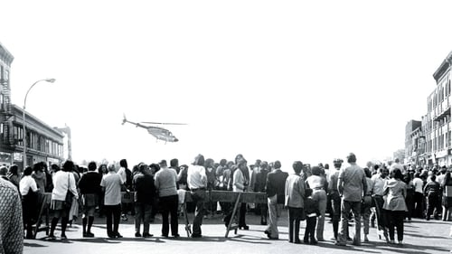



<nav class="films">
  <a class="prev" href="../the-sting-1973">Previous</a>
  <a href="../">Film list</a>
  <a class="next" href="../three-days-of-the-condor-1975">Next</a>
</nav>

17 / 100

<article class="film">
  

    
    
  

  <h1>Dog Day Afternoon ({{ film | filmYear }})</h1>

  

  

    Directed by <strong>{{ film | directors }}</strong>
  

  <h2>
    Cast
  </h2>
  <ul>
            <li><strong>Al Pacino</strong> as <em>Sonny</em></li>
        <li><strong>John Cazale</strong> as <em>Sal</em></li>
        <li><strong>Charles Durning</strong> as <em>Moretti</em></li>
        <li><strong>Chris Sarandon</strong> as <em>Leon</em></li>
        <li><strong>James Broderick</strong> as <em>Sheldon</em></li>
        <li><strong>Penelope Allen</strong> as <em>Sylvia</em></li>
        <li><strong>Sully Boyar</strong> as <em>Mulvaney</em></li>
        <li><strong>Beulah Garrick</strong> as <em>Margaret</em></li>
        <li><strong>Carol Kane</strong> as <em>Jenny</em></li>
        <li><strong>Sandra Kazan</strong> as <em>Deborah</em></li>
        <li><strong>Marcia Jean Kurtz</strong> as <em>Miriam</em></li>
        <li><strong>Amy Levitt</strong> as <em>Maria</em></li>
        <li><strong>John Marriott</strong> as <em>Howard</em></li>
        <li><strong>Estelle Omens</strong> as <em>Edna</em></li>
        <li><strong>Gary Springer</strong> as <em>Stevie</em></li>
        <li><strong>Carmine Foresta</strong> as <em>Carmine</em></li>
        <li><strong>Lance Henriksen</strong> as <em>Murphy</em></li>
        <li><strong>Floyd Levine</strong> as <em>Phone Cop</em></li>
        <li><strong>Dick Anthony Williams</strong> as <em>Limo Driver</em></li>
        <li><strong>Dominic Chianese</strong> as <em>Father</em></li>
        <li><strong>Marcia Haufrecht</strong> as <em>Neighbor</em></li>
        <li><strong>Judith Malina</strong> as <em>Mother</em></li>
        <li><strong>Susan Peretz</strong> as <em>Angie</em></li>
        <li><strong>William Bogert</strong> as <em>TV Anchorman</em></li>
        <li><strong>Ron Cummins</strong> as <em>TV Reporter</em></li>
        <li><strong>Jay Gerber</strong> as <em>Sam</em></li>
        <li><strong>Philip Charles MacKenzie</strong> as <em>Doctor</em></li>
        <li><strong>Chu Chu Malave</strong> as <em>Maria's Boyfriend</em></li>
        <li><strong>Lionel Pina</strong> as <em>Pizza Boy</em></li>
        <li><strong>Robert Costanzo</strong> as <em>New York Policeman (uncredited)</em></li>
        <li><strong>Ron Gilbert</strong> as <em>Detective (uncredited)</em></li>
        <li><strong>Kenneth McMillan</strong> as <em>Commissioner (uncredited)</em></li>
        <li><strong>Ed Metzger</strong> as <em>Sgt. Murray (uncredited)</em></li>
        <li><strong>Lynette Sheldon</strong> as <em>Sadie (uncredited)</em></li>
        <li><strong>Alan Berger</strong> as <em>Lout (uncredited)</em></li>
        <li><strong>James Bulleit</strong> as <em>Sgt. Gillis (uncredited)</em></li>
        <li><strong>Todd Everett</strong> as <em>Cop (uncredited)</em></li>
        <li><strong>Raymond Serra</strong> as <em>New York Plainclothes Cop (uncredited)</em></li>
        <li><strong>Tom Towles</strong> as <em>Cop (uncredited)</em></li>
        <li><strong>ofri gafri</strong> as <em>Observer (Uncredited)</em></li>
  </ul>
</article>
<footer>
  <a href="../about">About this list</a>
</footer>
