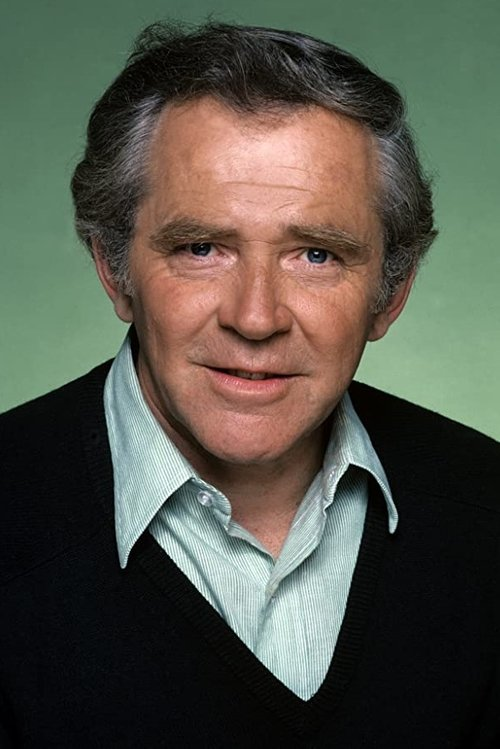
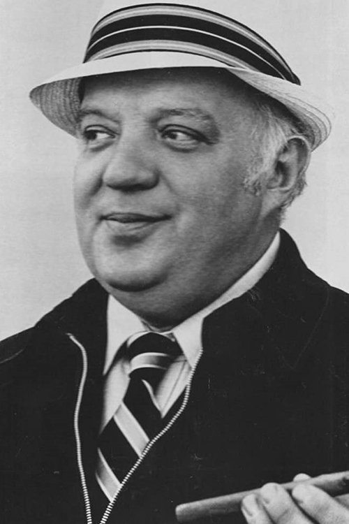



<nav class="films">
  

    <a href="../day-for-night-1973"><i class="fa-solid fa-chevron-left fa-xs"></i> Previous</a>
  

  

    <a class="simple" href="../">13 / 100</a>
  

  

    <a href="../three-days-of-the-condor-1975">Next <i class="fa-solid fa-chevron-right fa-xs"></i></a>
  

  

    
      Previous film:
      Day for Night
    
    
      Next film:
      Three Days of the Condor
    
  

</nav>

<article class="film slug-dog-day-afternoon-1975">
  

    
    
  

  <h1>{{ film.title }} ({{ film | filmYear }})</h1>

  

    Language: {{ film.language }}.
    
  

  

    Directed by <strong>{{ film | directors }}</strong>
  

  
    <blockquote>
      {{ films.reviews[slug] | safe }} <em>—&nbsp;<a href="/bill">Bill</a></em>
    </blockquote>
  

  <section class="cast-grid">
  

    

  
  

    Al Pacino
    Sonny
  

    

  
  

    John Cazale
    Sal
  

    

  
  

    Charles Durning
    Moretti
  

    

  
  

    Chris Sarandon
    Leon
  

    

  
  

    James Broderick
    Sheldon
  

    

  
  

    Penelope Allen
    Sylvia
  

    

  
  

    Sully Boyar
    Mulvaney
  

    

  
<i class="fa-solid fa-user"></i>

  

    Beulah Garrick
    Margaret
  

    

  
  

    Carol Kane
    Jenny
  

    

  
<i class="fa-solid fa-user"></i>

  

    Sandra Kazan
    Deborah
  

    

  
  

    Marcia Jean Kurtz
    Miriam
  

    

  
<i class="fa-solid fa-user"></i>

  

    Amy Levitt
    Maria
  

  

</section>

  <section class="film-detail">
    

      

        

          <i class="fa-solid fa-masks-theater"></i>
          Cast
        

        <ul>
          
            <li>
              {{ cast.name }} as <em>{{ cast.character }}</em>
            </li>
          
        </ul>
      

      

        

          <i class="fa-solid fa-clapperboard"></i>
          Crew
        

        <ul>
          
            <li>
              {{ crew.name }} &mdash; <em>{{ crew.job }}</em>
            </li>
          
        </ul>
      

    

  </section>

  <section class="related-films">
  <h2>Related films</h2>
  <ul>
    <li><a href="../the-sting-1973">The Sting</a> because of Charles Durning</li>
<li><a href="../house-of-gucci-2021">House of Gucci</a> because of Al Pacino</li>
<li><a href="../the-deer-hunter-1978">The Deer Hunter</a> because of John Cazale</li>
  </ul>
</section>

</article>
