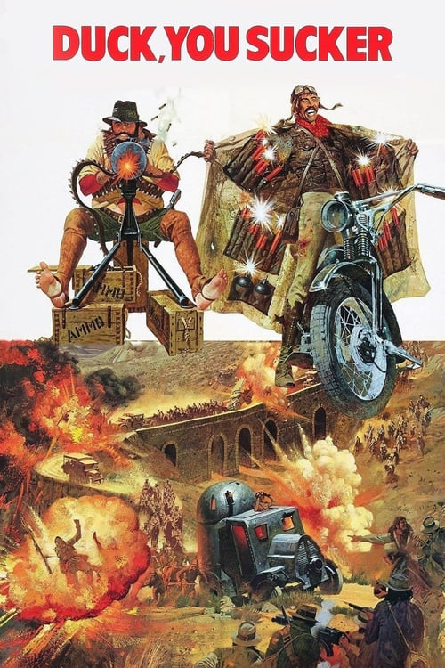
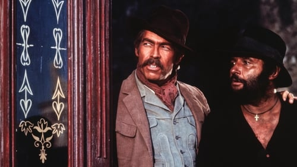

<nav class="films">
  <a class="prev" href="../butch-cassidy-and-the-sundance-kid">Previous</a>
  <a href="../">Film list</a>
  <a class="next" href="../the-sting">Next</a>
</nav>

15 / 100

<article class="film">
  
  

  <h1>Duck, You Sucker (1971)</h1>

  

    Directed by <strong>Sergio Leone</strong>
  

  <h2>
    Cast
  </h2>
  <ul>
    <li><strong>Rod Steiger</strong> as <em>Juan Miranda</em></li>
<li><strong>James Coburn</strong> as <em>John H. Mallory</em></li>
<li><strong>Romolo Valli</strong> as <em>Dr. Villega</em></li>
<li><strong>Maria Monti</strong> as <em>Woman on Stagecoach</em></li>
<li><strong>Rik Battaglia</strong> as <em>Santerna</em></li>
<li><strong>Franco Graziosi</strong> as <em>Governor Jaime</em></li>
<li><strong>Antoine Saint-John</strong> as <em>Col. Günther Reza</em></li>
<li><strong>Vivienne Chandler</strong> as <em>John's Girlfriend</em></li>
<li><strong>David Warbeck</strong> as <em>Sean Nolan</em></li>
<li><strong>Giulio Battiferri</strong> as <em>Miguel</em></li>
<li><strong>Poldo Bendandi</strong> as <em>Revolutionary</em></li>
<li><strong>Omar Bonaro</strong> as <em>Revolutionary</em></li>
<li><strong>Roy Bosier</strong> as <em>Landowner on Stagecoach</em></li>
<li><strong>John Frederick</strong> as <em>American on Stagecoach</em></li>
<li><strong>Amato Garbini</strong> as <em>Policeman on Train</em></li>
<li><strong>Michael Harvey</strong> as <em>Coachman</em></li>
<li><strong>Biagio La Rocca</strong> as <em></em></li>
<li><strong>Furio Meniconi</strong> as <em>Innkeeper</em></li>
<li><strong>Nazzareno Natale</strong> as <em></em></li>
<li><strong>Vincenzo Norvese</strong> as <em>Miranda Gang Member</em></li>
<li><strong>Stefano Oppedisano</strong> as <em>Revolutionary</em></li>
<li><strong>Memè Perlini</strong> as <em>Miranda's Son</em></li>
<li><strong>Goffredo Pistoni</strong> as <em>Miranda's Father</em></li>
<li><strong>Renato Pontecchi</strong> as <em>Pepe Miranda</em></li>
<li><strong>Jean Rougeul</strong> as <em>Priest on Stagecoach</em></li>
<li><strong>Corrado Solari</strong> as <em>Napoleon Miranda</em></li>
<li><strong>Antonio Casale</strong> as <em>Notary on Stagecoach</em></li>
<li><strong>Benito Stefanelli</strong> as <em></em></li>
<li><strong>Franco Tocci</strong> as <em></em></li>
<li><strong>Rosita Torosh</strong> as <em></em></li>
<li><strong>Aldo Sambrell</strong> as <em>Mexican Officer (uncredited)</em></li>
<li><strong>Florencio Amarilla</strong> as <em>Revolutionary (uncredited)</em></li>
<li><strong>Sergio Calderón</strong> as <em>Revolutionary (uncredited)</em></li>
<li><strong>Simon van Collem</strong> as <em>Conductor (uncredited)</em></li>
<li><strong>Paolo Figlia</strong> as <em>Soldier in Mesa Verde Bank (uncredited)</em></li>
<li><strong>Alberigo Donadeo</strong> as <em>Santerna's Man (uncredited)</em></li>
<li><strong>Tony Casale</strong> as <em>Mesa Verde Bank Prisoner (uncredited)</em></li>
<li><strong>Romano Milani</strong> as <em>Mesa Verde Bank Prisoner (uncredited)</em></li>
<li><strong>Luigi Tripodi</strong> as <em>Revolutionary (uncredited)</em></li>
<li><strong>Claudio Mancini</strong> as <em>Mexican Army Captain (uncredited)</em></li>
<li><strong>Riccardo Pizzuti</strong> as <em>Santerna's Man (uncredited)</em></li>
<li><strong>Franco Ukmar</strong> as <em>Soldier in Mesa Verde Bank (uncredited)</em></li>
<li><strong>Antonio Montoya</strong> as <em>Miranda Gang Member (uncredited)</em></li>
<li><strong>Rafael Cortes</strong> as <em>Miranda Gang Member (uncredited)</em></li>
  </ul>
</article>
<footer>
  <a href="../about">About this list</a>
</footer>
