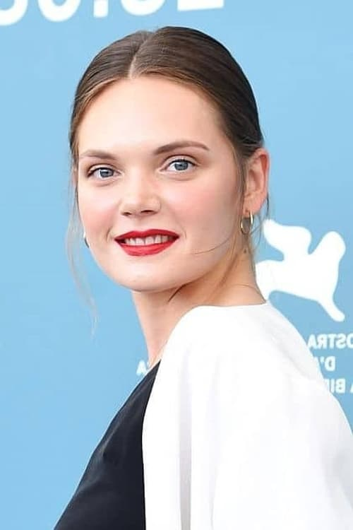
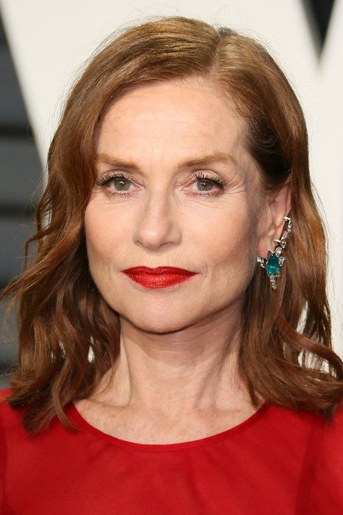
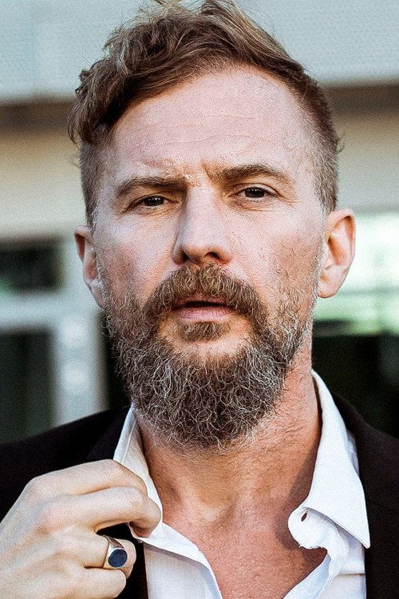



<nav class="films">
  

    <a href="../between-two-worlds-2022"><i class="fa-solid fa-chevron-left fa-xs"></i> Previous</a>
  

  

    <a class="simple" href="../">88 / 100</a>
  

  

    <a href="../empire-of-light-2022">Next <i class="fa-solid fa-chevron-right fa-xs"></i></a>
  

  

    
      Previous film:
      Between Two Worlds
    
    
      Next film:
      Empire of Light
    
  

</nav>

<article class="film slug-eo-2022">
  

    
    
  

  <h1>{{ film.title }} ({{ film | filmYear }})</h1>

  

    Language: {{ film.language }}.
    Also known as IO.
  

  

    Directed by <strong>{{ film | directors }}</strong>
  

  
    <blockquote>
      {{ films.reviews[slug] | safe }} <em>—&nbsp;<a href="/bill">Bill</a></em>
    </blockquote>
  

  <section class="cast-grid">
  

    

  
  

    Sandra Drzymalska
    Kasandra
  

    

  
  

    Isabelle Huppert
    The Countess
  

    

  
  

    Lorenzo Zurzolo
    Vito
  

    

  
  

    Mateusz Kościukiewicz
    Mateo
  

    

  
  

    Tomasz Organek
    Ziom
  

    

  
  

    Lolita Chammah
    Dora
  

    

  
  

    Agata Sasinowska
    Kaja
  

    

  
  

    Anna Rokita
    Dorota
  

    

  
  

    Michał Przybysławski
    Zenek
  

    

  
<i class="fa-solid fa-user"></i>

  

    Gloria Iradukunda
    Zea
  

    

  
<i class="fa-solid fa-user"></i>

  

    Piotr Szaja
    Horse-boy
  

    

  
  

    Aleksander Janiszewski
    Bailiff
  

  

</section>

  <section class="film-detail">
    

      

        

          <i class="fa-solid fa-masks-theater"></i>
          Cast
        

        <ul>
          
            <li>
              {{ cast.name }} as <em>{{ cast.character }}</em>
            </li>
          
        </ul>
      

      

        

          <i class="fa-solid fa-clapperboard"></i>
          Crew
        

        <ul>
          
            <li>
              {{ crew.name }} &mdash; <em>{{ crew.job }}</em>
            </li>
          
        </ul>
      

    

  </section>

  
</article>
