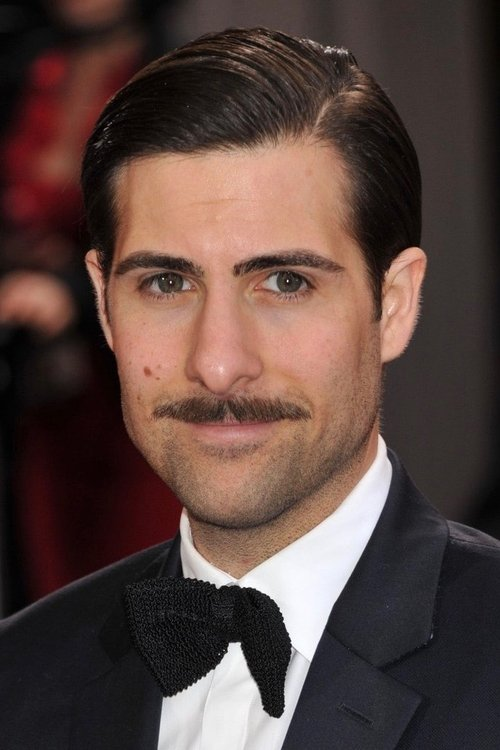
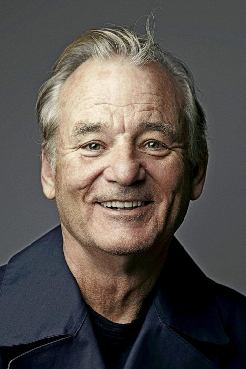
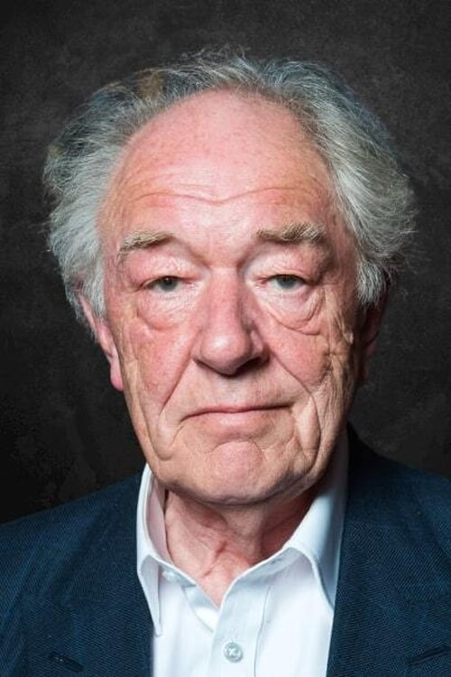
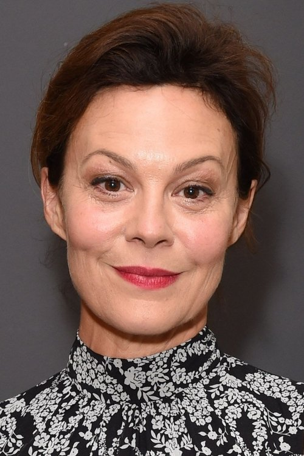



<nav class="films">
  

    <a href="../in-bruges-2008"><i class="fa-solid fa-chevron-left fa-xs"></i> Previous</a>
  

  

    <a class="simple" href="../">48 / 100</a>
  

  

    <a href="../micmacs-2009">Next <i class="fa-solid fa-chevron-right fa-xs"></i></a>
  

  

    
      Previous film:
      In Bruges
    
    
      Next film:
      Micmacs
    
  

</nav>

<article class="film slug-fantastic-mr-fox-2009">
  

    
    
  

  <h1>{{ film.title }} ({{ film | filmYear }})</h1>

  

    Language: {{ film.language }}.
    
  

  

    Directed by <strong>{{ film | directors }}</strong>
  

  
    <blockquote>
      {{ films.reviews[slug] | safe }} <em>—&nbsp;<a href="/bill">Bill</a></em>
    </blockquote>
  

  <section class="cast-grid">
  

    

  
  

    George Clooney
    Mr. Fox (voice)
  

    

  
  

    Meryl Streep
    Felicity Fox (voice)
  

    

  
  

    Jason Schwartzman
    Ash Fox (voice)
  

    

  
  

    Wallace Wolodarsky
    Kylie (voice)
  

    

  
  

    Eric Chase Anderson
    Kristofferson Silverfox (voice)
  

    

  
  

    Willem Dafoe
    Rat (voice)
  

    

  
  

    Bill Murray
    Clive Badger (voice)
  

    

  
  

    Robin Hurlstone
    Walter Boggis (voice)
  

    

  
  

    Hugo Guinness
    Nathan Bunce (voice)
  

    

  
  

    Michael Gambon
    Franklin Bean (voice)
  

    

  
  

    Helen McCrory
    Mrs. Bean (voice)
  

    

  
  

    Wes Anderson
    Stan Weasel (voice)
  

  

</section>

  <section class="film-detail">
    

      

        

          <i class="fa-solid fa-masks-theater"></i>
          Cast
        

        <ul>
          
            <li>
              {{ cast.name }} as <em>{{ cast.character }}</em>
            </li>
          
        </ul>
      

      

        

          <i class="fa-solid fa-clapperboard"></i>
          Crew
        

        <ul>
          
            <li>
              {{ crew.name }} &mdash; <em>{{ crew.job }}</em>
            </li>
          
        </ul>
      

    

  </section>

  <section class="related-films">
  <h2>Related films</h2>
  <ul>
    <li><a href="../the-deer-hunter-1978">The Deer Hunter</a> and <a href="../little-women-2019">Little Women</a> because of Meryl Streep</li>
<li><a href="../the-bourne-identity-2002">The Bourne Identity</a> because of Brian Cox</li>
<li><a href="../hot-fuzz-2007">Hot Fuzz</a> because of Garth Jennings</li>
<li><a href="../the-grand-budapest-hotel-2014">The Grand Budapest Hotel</a> because of Jason Schwartzman, Wallace Wolodarsky, Willem Dafoe, Bill Murray, Robin Hurlstone, Wes Anderson, Owen Wilson and Adrien Brody</li>
<li><a href="../the-french-dispatch-2021">The French Dispatch</a> because of Jason Schwartzman, Wallace Wolodarsky, Willem Dafoe, Bill Murray, Wes Anderson, Jarvis Cocker, Owen Wilson and Adrien Brody</li>
<li><a href="../asteroid-city-2023">Asteroid City</a> because of Jason Schwartzman, Willem Dafoe, Wes Anderson, Jarvis Cocker and Adrien Brody</li>
<li><a href="../the-lighthouse-2019">The Lighthouse</a> because of Willem Dafoe</li>
  </ul>
</section>

</article>
