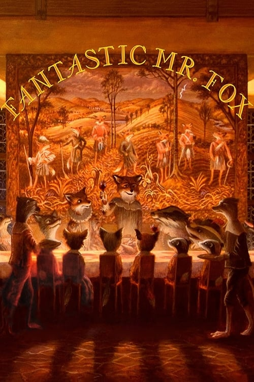
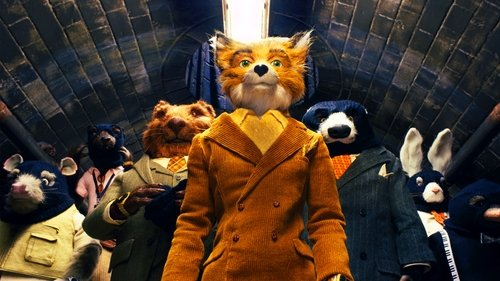

<nav class="films">
  <a class="prev" href="../district-9">Previous</a>
  <a href="../">Film list</a>
  <a class="next" href="../micmacs">Next</a>
</nav>

57 / 100

<article class="film">
  
  

  <h1>Fantastic Mr. Fox (2009)</h1>

  

    Directed by <strong>Wes Anderson</strong>
  

  <h2>
    Cast
  </h2>
  <ul>
    <li><strong>George Clooney</strong> as <em>Mr. Fox (voice)</em></li>
<li><strong>Meryl Streep</strong> as <em>Felicity Fox (voice)</em></li>
<li><strong>Jason Schwartzman</strong> as <em>Ash Fox (voice)</em></li>
<li><strong>Wallace Wolodarsky</strong> as <em>Kylie (voice)</em></li>
<li><strong>Eric Chase Anderson</strong> as <em>Kristofferson Silverfox (voice)</em></li>
<li><strong>Willem Dafoe</strong> as <em>Rat (voice)</em></li>
<li><strong>Bill Murray</strong> as <em>Clive Badger (voice)</em></li>
<li><strong>Robin Hurlstone</strong> as <em>Walter Boggis (voice)</em></li>
<li><strong>Hugo Guinness</strong> as <em>Nathan Bunce (voice)</em></li>
<li><strong>Michael Gambon</strong> as <em>Franklin Bean (voice)</em></li>
<li><strong>Helen McCrory</strong> as <em>Mrs. Bean (voice)</em></li>
<li><strong>Wes Anderson</strong> as <em>Stan Weasel (voice)</em></li>
<li><strong>Jarvis Cocker</strong> as <em>Petey (voice)</em></li>
<li><strong>Owen Wilson</strong> as <em>Coach Skip (voice)</em></li>
<li><strong>Juman Malouf</strong> as <em>Agnes (voice)</em></li>
<li><strong>Karen Duffy</strong> as <em>Linda Otter (voice)</em></li>
<li><strong>Roman Coppola</strong> as <em>Squirrel Contractor (voice)</em></li>
<li><strong>Jeremy Dawson</strong> as <em>Beaver's Son (voice)</em></li>
<li><strong>Garth Jennings</strong> as <em>Bean's Son (voice)</em></li>
<li><strong>Brian Cox</strong> as <em>Action 12 Reporter (voice)</em></li>
<li><strong>Tristan Oliver</strong> as <em>Explosives Man (voice)</em></li>
<li><strong>James Hamilton</strong> as <em>Mole (voice)</em></li>
<li><strong>Steven M. Rales</strong> as <em>Beaver (voice)</em></li>
<li><strong>Rob Hersov</strong> as <em>Pilot (voice)</em></li>
<li><strong>Jennifer Furches</strong> as <em>Dr. Badger (voice)</em></li>
<li><strong>Mario Batali</strong> as <em>Rabbit (voice)</em></li>
<li><strong>Allison Abbate</strong> as <em>Rabbit's Ex-Girlfriend (voice)</em></li>
<li><strong>Molly Cooper</strong> as <em>Rabbit Girl (voice)</em></li>
<li><strong>Adrien Brody</strong> as <em>Field Mouse (voice)</em></li>
<li><strong>Martin Ballard</strong> as <em>Fire Chief (voice)</em></li>
  </ul>
</article>
<footer>
  <a href="../about">About this list</a>
</footer>
