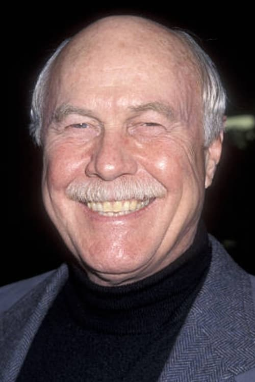



<nav class="films">
  

    <a href="../shallow-grave-1994"><i class="fa-solid fa-chevron-left fa-xs"></i> Previous</a>
  

  

    <a class="simple" href="../">28 / 100</a>
  

  

    <a href="../trainspotting-1996">Next <i class="fa-solid fa-chevron-right fa-xs"></i></a>
  

  

    
      Previous film:
      Shallow Grave
    
    
      Next film:
      Trainspotting
    
  

</nav>

<article class="film slug-fargo-1996">
  

    
    
  

  <h1>{{ film.title }} ({{ film | filmYear }})</h1>

  

    Language: {{ film.language }}.
    
  

  

    Directed by <strong>{{ film | directors }}</strong>
  

  
    <blockquote>
      {{ films.reviews[slug] | safe }} <em>—&nbsp;<a href="/bill">Bill</a></em>
    </blockquote>
  

  <section class="cast-grid">
  

    

  
  

    Frances McDormand
    Marge Gunderson
  

    

  
  

    William H. Macy
    Jerry Lundegaard
  

    

  
  

    Steve Buscemi
    Carl Showalter
  

    

  
  

    Peter Stormare
    Gaear Grimsrud
  

    

  
  

    Harve Presnell
    Wade Gustafson
  

    

  
  

    John Carroll Lynch
    Norm Gunderson
  

    

  
  

    Kristin Rudrüd
    Jean Lundegaard
  

    

  
  

    Bruce Bohne
    Lou
  

    

  
  

    Steve Reevis
    Shep Proudfoot
  

    

  
  

    Steve Park
    Mike Yanagita
  

    

  
  

    Gary Houston
    Irate Customer
  

    

  
  

    Sally Wingert
    Irate Customer's Wife
  

  

</section>

  <section class="film-detail">
    

      

        

          <i class="fa-solid fa-masks-theater"></i>
          Cast
        

        <ul>
          
            <li>
              {{ cast.name }} as <em>{{ cast.character }}</em>
            </li>
          
        </ul>
      

      

        

          <i class="fa-solid fa-clapperboard"></i>
          Crew
        

        <ul>
          
            <li>
              {{ crew.name }} &mdash; <em>{{ crew.job }}</em>
            </li>
          
        </ul>
      

    

  </section>

  <section class="related-films">
  <h2>Related films</h2>
  <ul>
    <li><a href="../nomadland-2021">Nomadland</a> because of Frances McDormand and Warren Keith</li>
<li><a href="../the-french-dispatch-2021">The French Dispatch</a> because of Frances McDormand and Steve Park</li>
<li><a href="../the-tragedy-of-macbeth-2021">The Tragedy of Macbeth</a> because of Frances McDormand and Joel Coen</li>
<li><a href="../magnolia-1999">Magnolia</a> because of William H. Macy</li>
<li><a href="../the-big-lebowski-1998">The Big Lebowski</a> because of Steve Buscemi, Peter Stormare, Warren Keith and Joel Coen</li>
<li><a href="../lucky-2017">Lucky</a> because of John Carroll Lynch</li>
<li><a href="../asteroid-city-2023">Asteroid City</a> because of Steve Park</li>
<li><a href="../the-straight-story-1999">The Straight Story</a> because of Sally Wingert</li>
<li><a href="../no-country-for-old-men-2007">No Country for Old Men</a> because of Joel Coen</li>
  </ul>
</section>

</article>
