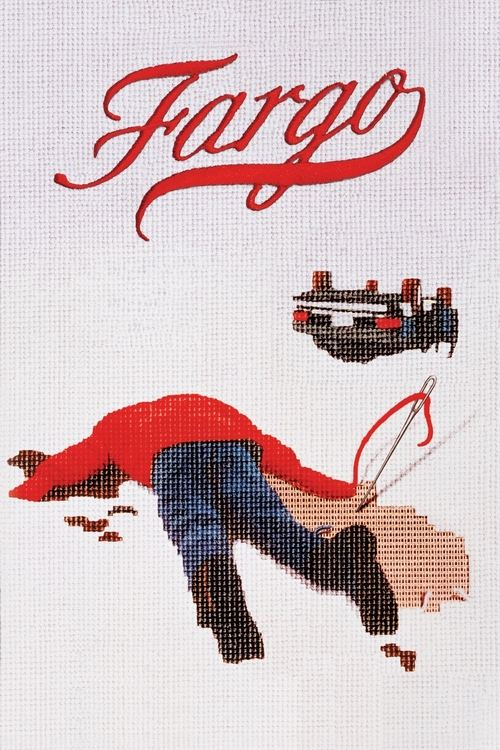
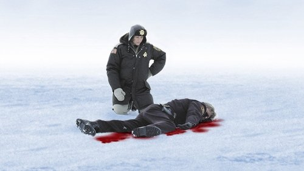

<nav class="films">
  <a class="prev" href="../lon-the-professional">Previous</a>
  <a href="../">Film list</a>
  <a class="next" href="../good-will-hunting">Next</a>
</nav>

36 / 100

<article class="film">
  

    
    
  

  <h1>Fargo (1996)</h1>

  

    Directed by <strong>Joel Coen</strong>
  

  <h2>
    Cast
  </h2>
  <ul>
    <li><strong>Frances McDormand</strong> as <em>Marge Gunderson</em></li>
<li><strong>William H. Macy</strong> as <em>Jerry Lundegaard</em></li>
<li><strong>Steve Buscemi</strong> as <em>Carl Showalter</em></li>
<li><strong>Peter Stormare</strong> as <em>Gaear Grimsrud</em></li>
<li><strong>Harve Presnell</strong> as <em>Wade Gustafson</em></li>
<li><strong>John Carroll Lynch</strong> as <em>Norm Gunderson</em></li>
<li><strong>Kristin Rudrüd</strong> as <em>Jean Lundegaard</em></li>
<li><strong>Bruce Bohne</strong> as <em>Lou</em></li>
<li><strong>Steve Reevis</strong> as <em>Shep Proudfoot</em></li>
<li><strong>Steve Park</strong> as <em>Mike Yanagita</em></li>
<li><strong>Gary Houston</strong> as <em>Irate Customer</em></li>
<li><strong>Sally Wingert</strong> as <em>Irate Customer's Wife</em></li>
<li><strong>Larissa Kokernot</strong> as <em>Hooker #1</em></li>
<li><strong>Melissa Peterman</strong> as <em>Hooker #2</em></li>
<li><strong>Tony Denman</strong> as <em>Scotty Lundegaard</em></li>
<li><strong>Larry Brandenburg</strong> as <em>Stan Grossman</em></li>
<li><strong>Michelle Hutchison</strong> as <em>Escort</em></li>
<li><strong>Bain Boehlke</strong> as <em>Mr. Mohra</em></li>
<li><strong>Warren Keith</strong> as <em>Reilly Diefenbach (voice)</em></li>
<li><strong>Michelle LeDoux</strong> as <em>Victim In Car</em></li>
<li><strong>Steve Edelman</strong> as <em>Morning Show Host</em></li>
<li><strong>Sharon Anderson</strong> as <em>Morning Show Hostess</em></li>
<li><strong>Kurt Schweickhardt</strong> as <em>Car Salesman</em></li>
<li><strong>James Gaulke</strong> as <em>State Trooper</em></li>
<li><strong>J. Todd Anderson</strong> as <em>Victim in the Field</em></li>
<li><strong>Michelle Suzanne LeDoux</strong> as <em>Victim in Car</em></li>
<li><strong>Petra Boden</strong> as <em>Cashier</em></li>
<li><strong>Wayne A. Evenson</strong> as <em>Customer</em></li>
<li><strong>Cliff Rakerd</strong> as <em>Officer Olson</em></li>
<li><strong>Jessica Shepherd</strong> as <em>Hotel Clerk</em></li>
<li><strong>Peter Schmitz</strong> as <em>Airport Lot Attendant</em></li>
<li><strong>Steven I. Schafer</strong> as <em>Mechanic</em></li>
<li><strong>David S. Lomax</strong> as <em>Man in Hallway</em></li>
<li><strong>José Feliciano</strong> as <em>José Feliciano</em></li>
<li><strong>Bix Skahill</strong> as <em>Night Parking Attendant</em></li>
<li><strong>Rose Stockton</strong> as <em>Valerie (voice)</em></li>
<li><strong>Robert Ozasky</strong> as <em>Bismarck Cop #1</em></li>
<li><strong>John Bandemer</strong> as <em>Bismarck Cop #2</em></li>
<li><strong>Don Wescott</strong> as <em>Bark Beetle Narrator (voice)</em></li>
<li><strong>Bruce Campbell</strong> as <em>Soap Opera Actor on TV (uncredited)</em></li>
  </ul>
</article>
<footer>
  <a href="../about">About this list</a>
</footer>
