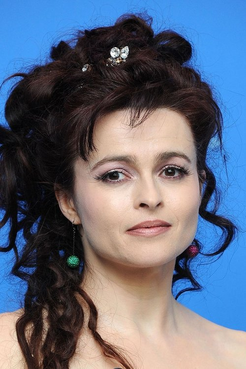
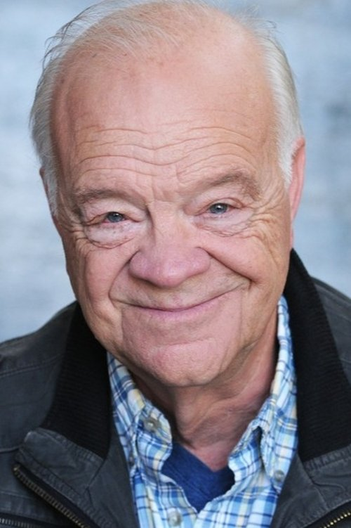



<nav class="films">
  

    <a href="../the-big-lebowski-1998"><i class="fa-solid fa-chevron-left fa-xs"></i> Previous</a>
  

  

    <a class="simple" href="../">32 / 100</a>
  

  

    <a href="../ghost-dog-the-way-of-the-samurai-1999">Next <i class="fa-solid fa-chevron-right fa-xs"></i></a>
  

  

    
      Previous film:
      The Big Lebowski
    
    
      Next film:
      Ghost Dog: The Way of the Samurai
    
  

</nav>

<article class="film slug-fight-club-1999">
  

    
    
  

  <h1>{{ film.title }} ({{ film | filmYear }})</h1>

  

    Language: {{ film.language }}.
    
  

  

    Directed by <strong>{{ film | directors }}</strong>
  

  
    <blockquote>
      {{ films.reviews[slug] | safe }} <em>—&nbsp;<a href="/bill">Bill</a></em>
    </blockquote>
  

  <section class="cast-grid">
  

    

  
  

    Edward Norton
    Narrator
  

    

  
  

    Brad Pitt
    Tyler Durden
  

    

  
  

    Helena Bonham Carter
    Marla Singer
  

    

  
  

    Meat Loaf
    Robert Paulson
  

    

  
  

    Jared Leto
    Angel Face
  

    

  
  

    Zach Grenier
    Richard Chesler (Regional Manager)
  

    

  
  

    Holt McCallany
    The Mechanic
  

    

  
  

    Eion Bailey
    Ricky
  

    

  
  

    Richmond Arquette
    Intern at Hospital
  

    

  
  

    David Andrews
    Thomas at Remaining Men Together
  

    

  
  

    George Maguire
    Group Leader at Remaining Men Together
  

    

  
  

    Eugenie Bondurant
    Weeping Woman - Onward and Upward
  

  

</section>

  <section class="film-detail">
    

      

        

          <i class="fa-solid fa-masks-theater"></i>
          Cast
        

        <ul>
          
            <li>
              {{ cast.name }} as <em>{{ cast.character }}</em>
            </li>
          
        </ul>
      

      

        

          <i class="fa-solid fa-clapperboard"></i>
          Crew
        

        <ul>
          
            <li>
              {{ crew.name }} &mdash; <em>{{ crew.job }}</em>
            </li>
          
        </ul>
      

    

  </section>

  <section class="related-films">
  <h2>Related films</h2>
  <ul>
    <li><a href="../the-grand-budapest-hotel-2014">The Grand Budapest Hotel</a>, <a href="../the-french-dispatch-2021">The French Dispatch</a> and <a href="../asteroid-city-2023">Asteroid City</a> because of Edward Norton</li>
<li><a href="../phone-booth-2003">Phone Booth</a>, <a href="../dallas-buyers-club-2013">Dallas Buyers Club</a> and <a href="../house-of-gucci-2021">House of Gucci</a> because of Jared Leto</li>
<li><a href="../magnolia-1999">Magnolia</a> because of Ezra Buzzington, Michael Shamus Wiles, Greg Bronson and Phil Hawn</li>
<li><a href="../the-fabelmans-2022">The Fabelmans</a> because of Ezra Buzzington</li>
<li><a href="../lady-bird-2017">Lady Bird</a> because of Bob Stephenson</li>
  </ul>
</section>

</article>
