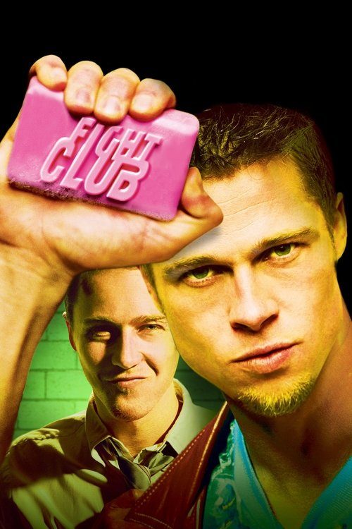
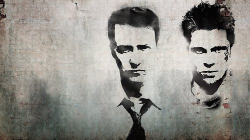

<nav class="films">
  <a class="prev" href="../ghost-dog-the-way-of-the-samurai">Previous</a>
  <a href="../">Film list</a>
  <a class="next" href="../the-straight-story">Next</a>
</nav>

40 / 100

<article class="film">
  
  

  <h1>Fight Club (1999)</h1>

  

    Directed by <strong>David Fincher</strong>
  

  <h2>
    Cast
  </h2>
  <ul>
    <li><strong>Edward Norton</strong> as <em>Narrator</em></li>
<li><strong>Brad Pitt</strong> as <em>Tyler Durden</em></li>
<li><strong>Helena Bonham Carter</strong> as <em>Marla Singer</em></li>
<li><strong>Meat Loaf</strong> as <em>Robert Paulson</em></li>
<li><strong>Jared Leto</strong> as <em>Angel Face</em></li>
<li><strong>Zach Grenier</strong> as <em>Richard Chesler (Regional Manager)</em></li>
<li><strong>Holt McCallany</strong> as <em>The Mechanic</em></li>
<li><strong>Eion Bailey</strong> as <em>Ricky</em></li>
<li><strong>Richmond Arquette</strong> as <em>Intern at Hospital</em></li>
<li><strong>David Andrews</strong> as <em>Thomas at Remaining Men Together</em></li>
<li><strong>George Maguire</strong> as <em>Group Leader at Remaining Men Together</em></li>
<li><strong>Eugenie Bondurant</strong> as <em>Weeping Woman - Onward and Upward</em></li>
<li><strong>Christina Cabot</strong> as <em>Group Leader - Partners in Positivity</em></li>
<li><strong>Sydney 'Big Dawg' Colston</strong> as <em>Speaker - Free and Clear</em></li>
<li><strong>Rachel Singer</strong> as <em>Chloe</em></li>
<li><strong>Christie Cronenweth</strong> as <em>Airline Check-In Attendant</em></li>
<li><strong>Tim DeZarn</strong> as <em>Federated Motor Co. - Inspector Bird</em></li>
<li><strong>Ezra Buzzington</strong> as <em>Federated Motor Co. - Inspector Dent</em></li>
<li><strong>Dierdre Downing-Jackson</strong> as <em>Business Woman on Plane</em></li>
<li><strong>Bob Stephenson</strong> as <em>Airport Security Officer</em></li>
<li><strong>Charlie Dell</strong> as <em>Doorman at Person Towers</em></li>
<li><strong>Rob Lanza</strong> as <em>Man in Suit</em></li>
<li><strong>David Lee Smith</strong> as <em>Walter</em></li>
<li><strong>Joel Bissonnette</strong> as <em>Food Court Maitre d'</em></li>
<li><strong>Evan Mirand</strong> as <em>'Steph'</em></li>
<li><strong>Robby Robinson</strong> as <em>Next Month's Opponent</em></li>
<li><strong>Lou Beatty Jr.</strong> as <em>Cop at Marla's Building</em></li>
<li><strong>Thom Gossom Jr.</strong> as <em>Detective Stern</em></li>
<li><strong>Valerie Bickford</strong> as <em>Cosmetics Buyer</em></li>
<li><strong>Peter Iacangelo</strong> as <em>Lou</em></li>
<li><strong>Carl Ciarfalio</strong> as <em>Lou's Body Guard</em></li>
<li><strong>Stuart Blumberg</strong> as <em>Car Salesman</em></li>
<li><strong>Todd Peirce</strong> as <em>First Man at Auto Shop</em></li>
<li><strong>Mark Fite</strong> as <em>Second Man at Auto Shop</em></li>
<li><strong>Matt Winston</strong> as <em>Seminary Student</em></li>
<li><strong>Joon Kim</strong> as <em>Raymond K. Hessel</em></li>
<li><strong>Bennie Moore</strong> as <em>Bus Driver with Broken Nose</em></li>
<li><strong>Lauren Sánchez</strong> as <em>Channel 4 Reporter</em></li>
<li><strong>Pat McNamara</strong> as <em>Commissioner Jacobs</em></li>
<li><strong>Tyrone R. Livingston</strong> as <em>Banquet Speaker</em></li>
<li><strong>Owen Masterson</strong> as <em>Airport Valet</em></li>
<li><strong>David Jean Thomas</strong> as <em>Policeman</em></li>
<li><strong>Paul Carafotes</strong> as <em>Salvator - Winking Bartender</em></li>
<li><strong>Christopher John Fields</strong> as <em>Proprietor of Dry Cleaners</em></li>
<li><strong>Anderson Bourell</strong> as <em>Bruised Bar Patron #1</em></li>
<li><strong>Scotch Ellis Loring</strong> as <em>Bruised Bar Patron #2</em></li>
<li><strong>Michael Shamus Wiles</strong> as <em>Bartender in Halo</em></li>
<li><strong>Andi Carnick</strong> as <em>Hotel Desk Clerk</em></li>
<li><strong>Ed Kowalczyk</strong> as <em>Waiter at Clifton's</em></li>
<li><strong>Leonard Termo</strong> as <em>Desk Sergeant</em></li>
<li><strong>Van Quattro</strong> as <em>Detective Andrew</em></li>
<li><strong>Markus Redmond</strong> as <em>Detective Kevin</em></li>
<li><strong>Michael Girardin</strong> as <em>Detective Walker</em></li>
<li><strong>Michael Arturo</strong> as <em>BMW Salesman. (uncredited)</em></li>
<li><strong>Greg Bronson</strong> as <em>Fight Spectator (uncredited)</em></li>
<li><strong>Matt Cinquanta</strong> as <em>Fighter (uncredited)</em></li>
<li><strong>Paul Dillon</strong> as <em>Irvin (uncredited)</em></li>
<li><strong>Eddie Hargitay</strong> as <em>Chanting Fighter (uncredited)</em></li>
<li><strong>Phil Hawn</strong> as <em>Banquet Guest (uncredited)</em></li>
<li><strong>Bruce Holman</strong> as <em>Waiter in Bridgeworth Suites Corporate Video (uncredited)</em></li>
<li><strong>Jawara</strong> as <em>Fight Patron Saying 'I don't know. What's going on?' (uncredited)</em></li>
<li><strong>Baron Jay</strong> as <em>Waiter (uncredited)</em></li>
<li><strong>Jim Jenkins</strong> as <em>Restaurant Maitre D' (uncredited)</em></li>
<li><strong>Kevin Scott Mack</strong> as <em>Passenger Clutching Armrest (uncredited)</em></li>
<li><strong>Trey Ore</strong> as <em>Fight Club Patron / Guy #2 in Video Store (uncredited)</em></li>
<li><strong>Louis Ortiz</strong> as <em>Fight Spectator (uncredited)</em></li>
<li><strong>Hugh Peddy</strong> as <em>Fight Club Man (uncredited)</em></li>
<li><strong>J.T. Pontino</strong> as <em>Fight Club Man (uncredited)</em></li>
<li><strong>Chad Randau</strong> as <em>Waiter (uncredited)</em></li>
<li><strong>Marcio Rosario</strong> as <em>Fighter (uncredited)</em></li>
<li><strong>Gregory Silva</strong> as <em>Riley Wilde - Fighter (uncredited)</em></li>
<li><strong>Brian Tochi</strong> as <em>Fight Bully (uncredited)</em></li>
<li><strong>Michael Zagst</strong> as <em>Support Group Member (uncredited)</em></li>
<li><strong>Marc Cinquanta</strong> as <em>Space Monkey (uncredited)</em></li>
<li><strong>Summer Moore</strong> as <em>Marla's Neighbor (uncredited)</em></li>
  </ul>
</article>
<footer>
  <a href="../about">About this list</a>
</footer>
