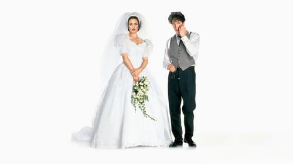



<nav class="films">
  <a class="prev" href="../whats-eating-gilbert-grape-1993">Previous</a>
  <a href="../">Film list</a>
  <a class="next" href="../lon-the-professional-1994">Next</a>
</nav>

34 / 100

<article class="film">
  

    
    
  

  <h1>Four Weddings and a Funeral ({{ film | filmYear }})</h1>

  

  

    Directed by <strong>{{ film | directors }}</strong>
  

  <h2>
    Cast
  </h2>
  <ul>
            <li><strong>Hugh Grant</strong> as <em>Charles</em></li>
        <li><strong>Andie MacDowell</strong> as <em>Carrie</em></li>
        <li><strong>Kristin Scott Thomas</strong> as <em>Fiona</em></li>
        <li><strong>Simon Callow</strong> as <em>Gareth</em></li>
        <li><strong>James Fleet</strong> as <em>Tom</em></li>
        <li><strong>John Hannah</strong> as <em>Matthew</em></li>
        <li><strong>Charlotte Coleman</strong> as <em>Scarlett</em></li>
        <li><strong>David Bower</strong> as <em>David</em></li>
        <li><strong>Corin Redgrave</strong> as <em>Hamish</em></li>
        <li><strong>Rowan Atkinson</strong> as <em>Father Gerald</em></li>
        <li><strong>Anna Chancellor</strong> as <em>Henrietta</em></li>
        <li><strong>Timothy Walker</strong> as <em>Angus the Groom - Wedding One</em></li>
        <li><strong>Sara Crowe</strong> as <em>Laura the Bride - Wedding One</em></li>
        <li><strong>Ronald Herdman</strong> as <em>Vicar - Wedding One</em></li>
        <li><strong>Elspet Gray</strong> as <em>Laura's Mother - Wedding One</em></li>
        <li><strong>Philip Voss</strong> as <em>Laura's Father - Wedding One</em></li>
        <li><strong>Kenneth Griffith</strong> as <em>Mad Old Man - Wedding One</em></li>
        <li><strong>Rupert Vansittart</strong> as <em>George the Boor at The Boatman - Wedding One</em></li>
        <li><strong>Nicola Walker</strong> as <em>Frightful Folk Duo - Wedding One</em></li>
        <li><strong>Paul Stacey</strong> as <em>Frightful Folk Duo - Wedding One</em></li>
        <li><strong>Simon Kunz</strong> as <em>John  with the Unfaithful Wife - Wedding One</em></li>
        <li><strong>Robin McCaffrey</strong> as <em>Serena - Wedding One</em></li>
        <li><strong>Michael Mears</strong> as <em>Waiter at the Boatman - Wedding One</em></li>
        <li><strong>David Haig</strong> as <em>Bernard the Groom - Wedding Two</em></li>
        <li><strong>Sophie Thompson</strong> as <em>Lydia the Bride - Wedding Two</em></li>
        <li><strong>Donald Weedon</strong> as <em>Master of Ceremonies - Wedding Two</em></li>
        <li><strong>Robert Lang</strong> as <em>Lord Hibbott - Wedding Two</em></li>
        <li><strong>Jeremy Kemp</strong> as <em>Sir John Delaney - Wedding Two</em></li>
        <li><strong>Nigel Hastings</strong> as <em>Tea-Tasting Alistair - Wedding Two</em></li>
        <li><strong>Emily Morgan</strong> as <em>Vomiting Veronica - Wedding Two</em></li>
        <li><strong>Amanda Mealing</strong> as <em>Naughty Nicki - Wedding Two</em></li>
        <li><strong>Polly Kemp</strong> as <em>Miss Piggy - Wedding Two</em></li>
        <li><strong>Melissa Knatchbull</strong> as <em>Mocking Martha - Wedding Two</em></li>
        <li><strong>Rosalie Crutchley</strong> as <em>Mrs. Beaumont - Wedding Two</em></li>
        <li><strong>Hannah Taylor-Gordon</strong> as <em>Young Bridesmaid - Wedding Two</em></li>
        <li><strong>Bernice Stegers</strong> as <em>Shop Assistant - Wedding Three</em></li>
        <li><strong>Ken Drury</strong> as <em>Vicar - Wedding Three</em></li>
        <li><strong>Struan Rodger</strong> as <em>Best Man - Wedding Three</em></li>
        <li><strong>Lucy Hornak</strong> as <em>Married Woman - Wedding Three</em></li>
        <li><strong>Randall Paul</strong> as <em>Chester  - Wedding Three</em></li>
        <li><strong>Pat Starr</strong> as <em>Gareth's Dancing Partner  - Wedding Three</em></li>
        <li><strong>Tim Thomas</strong> as <em>Doctor  - Wedding Three</em></li>
        <li><strong>Neville Phillips</strong> as <em>Vicar - Funeral</em></li>
        <li><strong>Susanna Hamnett</strong> as <em>Deirdre - Wedding Four</em></li>
        <li><strong>John Abbott</strong> as <em>Polite Verger - Wedding Four</em></li>
        <li><strong>Richard Butler</strong> as <em>Vicar - Wedding Four</em></li>
        <li><strong>Duncan Kenworthy</strong> as <em>Matthew's Gorgeous New Boyfriend (uncredited)</em></li>
        <li><strong>Mark Chapman</strong> as <em>Wedding Guest (uncredited)</em></li>
        <li><strong>Philip Stone</strong> as <em>Wedding Guest - Wedding Three (uncredited)</em></li>
  </ul>
</article>
<footer>
  <a href="../about">About this list</a>
</footer>
