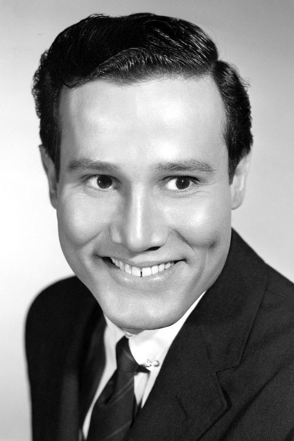
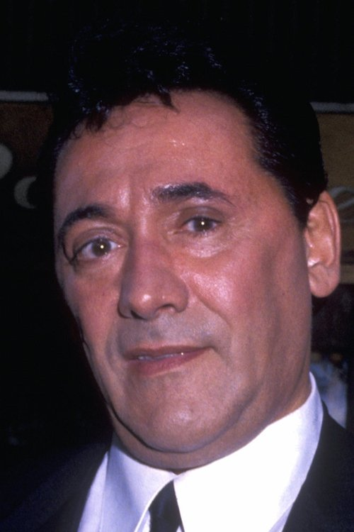



<nav class="films">
  

    <a href="../fight-club-1999"><i class="fa-solid fa-chevron-left fa-xs"></i> Previous</a>
  

  

    <a class="simple" href="../">33 / 100</a>
  

  

    <a href="../magnolia-1999">Next <i class="fa-solid fa-chevron-right fa-xs"></i></a>
  

  

    
      Previous film:
      Fight Club
    
    
      Next film:
      Magnolia
    
  

</nav>

<article class="film slug-ghost-dog-the-way-of-the-samurai-1999">
  

    
    
  

  <h1>{{ film.title }} ({{ film | filmYear }})</h1>

  

    Language: {{ film.language }}.
    
  

  

    Directed by <strong>{{ film | directors }}</strong>
  

  
    <blockquote>
      {{ films.reviews[slug] | safe }} <em>—&nbsp;<a href="/bill">Bill</a></em>
    </blockquote>
  

  <section class="cast-grid">
  

    

  
  

    Forest Whitaker
    Ghost Dog
  

    

  
  

    John Tormey
    Louie
  

    

  
  

    Cliff Gorman
    Sonny Valerio
  

    

  
  

    Frank Minucci
    Big Angie
  

    

  
  

    Richard Portnow
    Handsome Frank
  

    

  
  

    Tricia Vessey
    Louise Vargo
  

    

  
  

    Henry Silva
    Ray Vargo
  

    

  
  

    Gene Ruffini
    Old Consigliere
  

    

  
  

    Frank Adonis
    Valerio's Bodyguard
  

    

  
  

    Victor Argo
    Vinny
  

    

  
  

    Isaach de Bankolé
    Raymond
  

    

  
  

    Camille Winbush
    Pearline
  

  

</section>

  <section class="film-detail">
    

      

        

          <i class="fa-solid fa-masks-theater"></i>
          Cast
        

        <ul>
          
            <li>
              {{ cast.name }} as <em>{{ cast.character }}</em>
            </li>
          
        </ul>
      

      

        

          <i class="fa-solid fa-clapperboard"></i>
          Crew
        

        <ul>
          
            <li>
              {{ crew.name }} &mdash; <em>{{ crew.job }}</em>
            </li>
          
        </ul>
      

    

  </section>

  <section class="related-films">
  <h2>Related films</h2>
  <ul>
    <li><a href="../night-on-earth-1991">Night on Earth</a> because of Isaach de Bankolé and Jim Jarmusch</li>
<li><a href="../phone-booth-2003">Phone Booth</a> because of Forest Whitaker</li>
  </ul>
</section>

</article>
