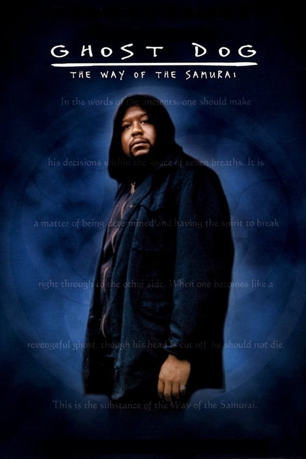

<nav class="films">
  <a class="prev" href="../the-big-lebowski">Previous</a>
  <a href="../">Film list</a>
  <a class="next" href="../fight-club">Next</a>
</nav>

39 / 100

<article class="film">
  <h1>Ghost Dog: The Way of the Samurai (1999)</h1>

  

    Directed by <strong>Jim Jarmusch</strong>
  

  

  <h2>
    Cast
  </h2>
  <ul>
    <li><strong>Forest Whitaker</strong> as <em>Ghost Dog</em></li>
<li><strong>John Tormey</strong> as <em>Louie</em></li>
<li><strong>Cliff Gorman</strong> as <em>Sonny Valerio</em></li>
<li><strong>Frank Minucci</strong> as <em>Big Angie</em></li>
<li><strong>Richard Portnow</strong> as <em>Handsome Frank</em></li>
<li><strong>Tricia Vessey</strong> as <em>Louise Vargo</em></li>
<li><strong>Henry Silva</strong> as <em>Ray Vargo</em></li>
<li><strong>Gene Ruffini</strong> as <em>Old Consigliere</em></li>
<li><strong>Frank Adonis</strong> as <em>Valerio's Bodyguard</em></li>
<li><strong>Victor Argo</strong> as <em>Vinny</em></li>
<li><strong>Isaach de Bankolé</strong> as <em>Raymond</em></li>
<li><strong>Camille Winbush</strong> as <em>Pearline</em></li>
<li><strong>Damon Whitaker</strong> as <em>Young Ghost Dog</em></li>
<li><strong>Vince Viverito</strong> as <em>Johnny Morini</em></li>
<li><strong>Chuck Jeffreys</strong> as <em>Mugger</em></li>
<li><strong>Dennis Liu</strong> as <em>Chinese Restaurant Owner</em></li>
<li><strong>Kenny Guay</strong> as <em>Boy in Window</em></li>
<li><strong>Gano Grills</strong> as <em>Gangsta in Red</em></li>
<li><strong>Touché Cornel</strong> as <em>Gangsta in Red</em></li>
<li><strong>Jamie Hector</strong> as <em>Gangsta in Red</em></li>
<li><strong>Yan Ming Shi</strong> as <em>Kung Fu Master</em></li>
<li><strong>Vinny Vella</strong> as <em>Sammy the Snake</em></li>
<li><strong>Joseph Rigano</strong> as <em>Joe Rags</em></li>
<li><strong>Roberto Lopez</strong> as <em>Punk in Alley</em></li>
<li><strong>Salvatore Alagna</strong> as <em>Punk in Alley</em></li>
<li><strong>Jerry Todisco</strong> as <em>Punk in Alley</em></li>
<li><strong>Dreddy Kruger</strong> as <em>MC in Blue</em></li>
<li><strong>Timbo King</strong> as <em>MC in Blue</em></li>
<li><strong>Clay Da Raider</strong> as <em>MC in Blue</em></li>
<li><strong>Dead and Stinking</strong> as <em>MC in Blue</em></li>
<li><strong>Deflon Sallahr</strong> as <em>MC in Blue</em></li>
<li><strong>Gary Farmer</strong> as <em>Nobody</em></li>
<li><strong>Clebert Ford</strong> as <em>Pigeonkeeper</em></li>
<li><strong>José Rabelo</strong> as <em>Rooftop Boatbuilder</em></li>
<li><strong>Jerry Sturiano</strong> as <em>Lefty</em></li>
<li><strong>Tony Rigo</strong> as <em>Tony</em></li>
<li><strong>Alfred Nittoli</strong> as <em>Al</em></li>
<li><strong>Angel Caban</strong> as <em>Social Club Landlord</em></li>
<li><strong>Luz Valentin</strong> as <em>Girl in Silver</em></li>
<li><strong>Renee Bluestone</strong> as <em>Club Couple</em></li>
<li><strong>Jordan Peck</strong> as <em>Club Couple</em></li>
<li><strong>Jonathan Teague Cook</strong> as <em>Bear Hunter</em></li>
<li><strong>Tracy Howe</strong> as <em>Bear Hunter</em></li>
<li><strong>Harry Shearer</strong> as <em>Voice of Scratchy (voice) (archive footage)</em></li>
<li><strong>Vanessa Hollingshead</strong> as <em>Female Sheriff</em></li>
<li><strong>Sharon Angela</strong> as <em>Blonde with Jaguar</em></li>
<li><strong>RZA</strong> as <em>Samurai in Camouflage</em></li>
<li><strong>Scott Bryce</strong> as <em>Accountant (scenes deleted)</em></li>
<li><strong>Paul Diomede</strong> as <em>Young Gangster (uncredited)</em></li>
  </ul>
</article>
<footer>
  <a href="../about">About this list</a>
</footer>
