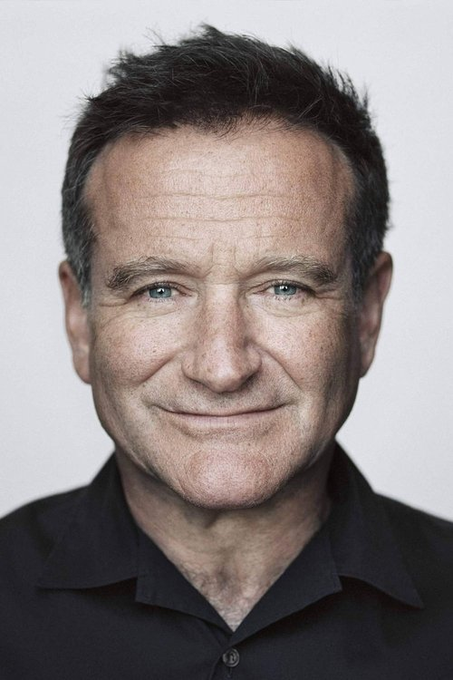



<nav class="films">
  

    <a href="../trainspotting-1996"><i class="fa-solid fa-chevron-left fa-xs"></i> Previous</a>
  

  

    <a class="simple" href="../">30 / 100</a>
  

  

    <a href="../the-big-lebowski-1998">Next <i class="fa-solid fa-chevron-right fa-xs"></i></a>
  

  

    
      Previous film:
      Trainspotting
    
    
      Next film:
      The Big Lebowski
    
  

</nav>

<article class="film slug-good-will-hunting-1997">
  

    
    
  

  <h1>{{ film.title }} ({{ film | filmYear }})</h1>

  

    Language: {{ film.language }}.
    
  

  

    Directed by <strong>{{ film | directors }}</strong>
  

  
    <blockquote>
      {{ films.reviews[slug] | safe }} <em>—&nbsp;<a href="/bill">Bill</a></em>
    </blockquote>
  

  <section class="cast-grid">
  

    

  
  

    Matt Damon
    Will Hunting
  

    

  
  

    Robin Williams
    Sean Maguire
  

    

  
  

    Ben Affleck
    Chuckie Sullivan
  

    

  
  

    Stellan Skarsgård
    Gerald Lambeau
  

    

  
  

    Minnie Driver
    Skylar
  

    

  
  

    Casey Affleck
    Morgan O'Mally
  

    

  
  

    Cole Hauser
    Billy McBride
  

    

  
  

    Vik Sahay
    MIT Student
  

    

  
  

    John Mighton
    Tom
  

    

  
<i class="fa-solid fa-user"></i>

  

    Rachel Majorowski
    Krystyn
  

    

  
<i class="fa-solid fa-user"></i>

  

    Colleen McCauley
    Cathy
  

    

  
<i class="fa-solid fa-user"></i>

  

    Matt Mercier
    Barbershop Quartet #1
  

  

</section>

  <section class="film-detail">
    

      

        

          <i class="fa-solid fa-masks-theater"></i>
          Cast
        

        <ul>
          
            <li>
              {{ cast.name }} as <em>{{ cast.character }}</em>
            </li>
          
        </ul>
      

      

        

          <i class="fa-solid fa-clapperboard"></i>
          Crew
        

        <ul>
          
            <li>
              {{ crew.name }} &mdash; <em>{{ crew.job }}</em>
            </li>
          
        </ul>
      

    

  </section>

  <section class="related-films">
  <h2>Related films</h2>
  <ul>
    <li><a href="../the-talented-mr-ripley-1999">The Talented Mr. Ripley</a> and <a href="../the-bourne-identity-2002">The Bourne Identity</a> because of Matt Damon</li>
<li><a href="../dune-2021">Dune</a> because of Stellan Skarsgård</li>
  </ul>
</section>

</article>
