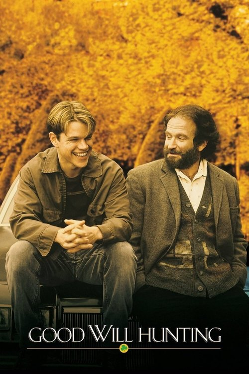

<a href="../">Back to all films</a>

<article class="film">
  <h1>Good Will Hunting (1997)</h1>

  

    Directed by <strong>Gus Van Sant</strong>
  

  

  <h2>
    Cast
  </h2>
  <ul>
    <li><strong>Matt Damon</strong> as <em>Will Hunting</em></li>
<li><strong>Robin Williams</strong> as <em>Sean Maguire</em></li>
<li><strong>Ben Affleck</strong> as <em>Chuckie Sullivan</em></li>
<li><strong>Stellan Skarsgård</strong> as <em>Gerald Lambeau</em></li>
<li><strong>Minnie Driver</strong> as <em>Skylar</em></li>
<li><strong>Casey Affleck</strong> as <em>Morgan O'Mally</em></li>
<li><strong>Cole Hauser</strong> as <em>Billy McBride</em></li>
<li><strong>Vik Sahay</strong> as <em>MIT Student</em></li>
<li><strong>John Mighton</strong> as <em>Tom</em></li>
<li><strong>Rachel Majorowski</strong> as <em>Krystyn</em></li>
<li><strong>Colleen McCauley</strong> as <em>Cathy</em></li>
<li><strong>Matt Mercier</strong> as <em>Barbershop Quartet #1</em></li>
<li><strong>Ralph St. George</strong> as <em>Barbershop Quartet #2</em></li>
<li><strong>Rob Lynds</strong> as <em>Barbershop Quartet #3</em></li>
<li><strong>Dan Washington</strong> as <em>Barbershop Quartet #4</em></li>
<li><strong>Alison Folland</strong> as <em>MIT Student</em></li>
<li><strong>Derrick Bridgeman</strong> as <em>MIT Student</em></li>
<li><strong>Shannon Egleson</strong> as <em>Girl on Street</em></li>
<li><strong>Rob Lyons</strong> as <em>Carmine Scarpaglia</em></li>
<li><strong>Steven Kozlowski</strong> as <em>Carmine Friend #1</em></li>
<li><strong>Jennifer Deathe</strong> as <em>Lydia</em></li>
<li><strong>Scott William Winters</strong> as <em>Clark</em></li>
<li><strong>Philip Williams</strong> as <em>Head Custodian</em></li>
<li><strong>Patrick O'Donnell</strong> as <em>Assistant Custodian</em></li>
<li><strong>Kevin Rushton</strong> as <em>Courtroom Guard</em></li>
<li><strong>Jimmy Flynn</strong> as <em>Judge Malone</em></li>
<li><strong>Joe Cannon</strong> as <em>Prosecutor</em></li>
<li><strong>Ann Matacunas</strong> as <em>Court Officer</em></li>
<li><strong>George Plimpton</strong> as <em>Psychologist</em></li>
<li><strong>Francesco Clemente</strong> as <em>Hypnotist</em></li>
<li><strong>Jessica Morton</strong> as <em>Bunker Hill Student</em></li>
<li><strong>Barna Moricz</strong> as <em>Bunker Hill Student</em></li>
<li><strong>Libby Geller</strong> as <em>Toy Store Cashier</em></li>
<li><strong>Chas Lawther</strong> as <em>MIT Professor</em></li>
<li><strong>Richard Fitzpatrick</strong> as <em>Timmy</em></li>
<li><strong>Frank Nakashima</strong> as <em>Executive #1</em></li>
<li><strong>Chris Britton</strong> as <em>Executive #2</em></li>
<li><strong>David Eisner</strong> as <em>Executive #3</em></li>
<li><strong>Bruce Hunter</strong> as <em>NSA Agent</em></li>
<li><strong>Robert Talvano</strong> as <em>NSA Agent #2</em></li>
<li><strong>James Allodi</strong> as <em>Security Guard</em></li>
<li><strong>Michael Arthur</strong> as <em>Reunion Guest (uncredited)</em></li>
<li><strong>Christian Harmony</strong> as <em>Student (uncredited)</em></li>
<li><strong>Riva Di Paola</strong> as <em>MIT Student (uncredited)</em></li>
<li><strong>Harmony Korine</strong> as <em>Hervé (uncredited)</em></li>
<li><strong>Thomas Lundy</strong> as <em>Waiter (uncredited)</em></li>
<li><strong>Paul McGillicuddy</strong> as <em>Race Track Fan (uncredited)</em></li>
<li><strong>Daniel Olsen</strong> as <em>MIT Student (uncredited)</em></li>
<li><strong>Stephen L'Heureux</strong> as <em>Bartender (uncredited)</em></li>
  </ul>
</article>
