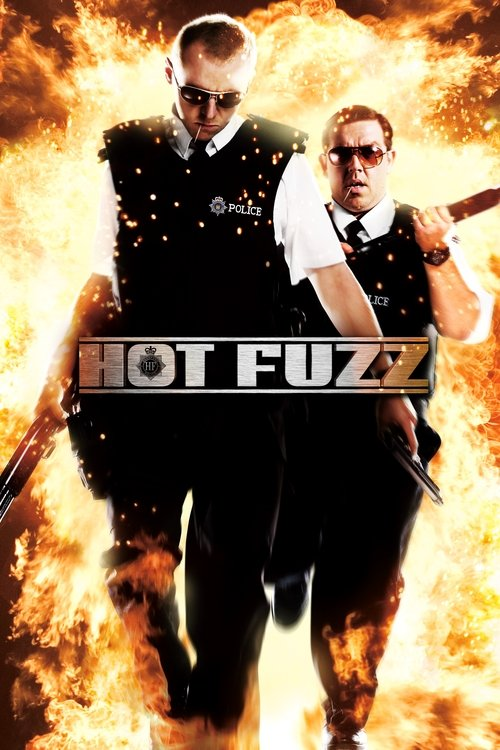
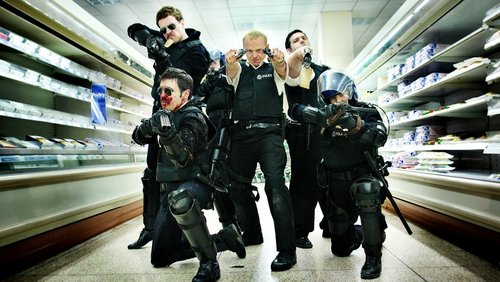



<nav class="films">
  <a class="prev" href="../the-motorcycle-diaries-2004">Previous</a>
  <a href="../">Film list</a>
  <a class="next" href="../no-country-for-old-men-2007">Next</a>
</nav>

52 / 100

<article class="film">
  

    
    
  

  <h1>Hot Fuzz ({{ film | filmYear }})</h1>

  

  

    Directed by <strong>{{ film | directors }}</strong>
  

  <h2>
    Cast
  </h2>
  <ul>
            <li><strong>Simon Pegg</strong> as <em>Nicholas Angel</em></li>
        <li><strong>Nick Frost</strong> as <em>PC Danny Butterman</em></li>
        <li><strong>Jim Broadbent</strong> as <em>Inspector Frank Butterman</em></li>
        <li><strong>Paddy Considine</strong> as <em>DS Andy Wainwright</em></li>
        <li><strong>Rafe Spall</strong> as <em>DC Andy Cartwright</em></li>
        <li><strong>Kevin Eldon</strong> as <em>Sergeant Tony Fisher</em></li>
        <li><strong>Olivia Colman</strong> as <em>PC Doris Thatcher</em></li>
        <li><strong>Bill Bailey</strong> as <em>Sergeant Turner</em></li>
        <li><strong>Karl Johnson</strong> as <em>PC Bob Walker</em></li>
        <li><strong>Timothy Dalton</strong> as <em>Simon Skinner</em></li>
        <li><strong>Edward Woodward</strong> as <em>Tom Weaver</em></li>
        <li><strong>Billie Whitelaw</strong> as <em>Joyce Cooper</em></li>
        <li><strong>Stuart Wilson</strong> as <em>Dr. Robin Hatcher</em></li>
        <li><strong>Paul Freeman</strong> as <em>Rev. Philip Shooter</em></li>
        <li><strong>Rory McCann</strong> as <em>Michael Armstrong</em></li>
        <li><strong>Kenneth Cranham</strong> as <em>James Reaper</em></li>
        <li><strong>Maria Charles</strong> as <em>Mrs. Reaper</em></li>
        <li><strong>Peter Wight</strong> as <em>Roy Porter</em></li>
        <li><strong>Julia Deakin</strong> as <em>Mary Porter</em></li>
        <li><strong>Eric Mason</strong> as <em>Bernard Cooper</em></li>
        <li><strong>Trevor Nichols</strong> as <em>Greg Prosser</em></li>
        <li><strong>Elizabeth Elvin</strong> as <em>Sheree Prosser</em></li>
        <li><strong>Patricia Franklin</strong> as <em>Annette Roper</em></li>
        <li><strong>Lorraine Hilton</strong> as <em>Amanda Paver</em></li>
        <li><strong>Tim Barlow</strong> as <em>Mr. Treacher</em></li>
        <li><strong>Anne Reid</strong> as <em>Leslie Tiller</em></li>
        <li><strong>Adam Buxton</strong> as <em>Tim Messenger</em></li>
        <li><strong>David Threlfall</strong> as <em>Martin Blower</em></li>
        <li><strong>Lucy Punch</strong> as <em>Eve Draper</em></li>
        <li><strong>David Bradley</strong> as <em>Arthur Webley</em></li>
        <li><strong>Ron Cook</strong> as <em>George Merchant</em></li>
        <li><strong>Alice Lowe</strong> as <em>Tina</em></li>
        <li><strong>Martin Freeman</strong> as <em>Met Sergeant</em></li>
        <li><strong>Bill Nighy</strong> as <em>Met Chief Inspector</em></li>
        <li><strong>Stephen Merchant</strong> as <em>Peter Ian Staker</em></li>
        <li><strong>Ben McKay</strong> as <em>Peter Cocker</em></li>
        <li><strong>Robert Popper</strong> as <em>'Not' Janine</em></li>
        <li><strong>Joe Cornish</strong> as <em>Bob</em></li>
        <li><strong>Chris Waitt</strong> as <em>Dave</em></li>
        <li><strong>Colin Michael Carmichael</strong> as <em>Heston Services Clerk</em></li>
        <li><strong>Tom Strode Walton</strong> as <em>Underage Drinker #1</em></li>
        <li><strong>Troy Woollan</strong> as <em>Underage Drinker #2</em></li>
        <li><strong>Rory Lowings</strong> as <em>Underage Drinker #3</em></li>
        <li><strong>Nicholas Wilson</strong> as <em>Butcher Brother</em></li>
        <li><strong>Kevin Wilson</strong> as <em>Butcher Brother</em></li>
        <li><strong>Graham Low</strong> as <em>The Living Statue</em></li>
        <li><strong>Alexander King</strong> as <em>Aaron A. Aaronson</em></li>
        <li><strong>Cate Blanchett</strong> as <em>Janine (uncredited)</em></li>
        <li><strong>Steve Coogan</strong> as <em>Metropolitan Police Inspector (uncredited)</em></li>
        <li><strong>Peter Jackson</strong> as <em>Thief Dressed as Father Christmas (uncredited)</em></li>
        <li><strong>Garth Jennings</strong> as <em>Crack Addict (uncredited)</em></li>
        <li><strong>Edgar Wright</strong> as <em>Shelf Stacker / Voice of Dave (uncredited)</em></li>
        <li><strong>Lesley Wright</strong> as <em>Village of The Year Judge (uncredited)</em></li>
        <li><strong>Peter Wild</strong> as <em>Village of The Year Judge (uncredited)</em></li>
        <li><strong>Gillian Rosemary Smith</strong> as <em>Village of The Year Judge (uncredited)</em></li>
  </ul>
</article>
<footer>
  <a href="../about">About this list</a>
</footer>
