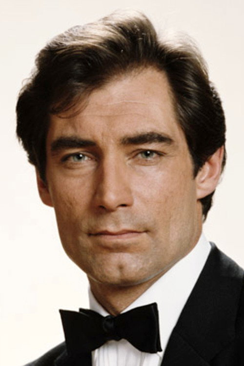
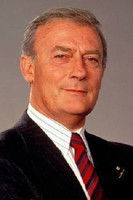



<nav class="films">
  

    <a href="../the-motorcycle-diaries-2004"><i class="fa-solid fa-chevron-left fa-xs"></i> Previous</a>
  

  

    <a class="simple" href="../">45 / 100</a>
  

  

    <a href="../no-country-for-old-men-2007">Next <i class="fa-solid fa-chevron-right fa-xs"></i></a>
  

  

    
      Previous film:
      The Motorcycle Diaries
    
    
      Next film:
      No Country for Old Men
    
  

</nav>

<article class="film slug-hot-fuzz-2007">
  

    
    
  

  <h1>{{ film.title }} ({{ film | filmYear }})</h1>

  

    Language: {{ film.language }}.
    
  

  

    Directed by <strong>{{ film | directors }}</strong>
  

  
    <blockquote>
      {{ films.reviews[slug] | safe }} <em>—&nbsp;<a href="/bill">Bill</a></em>
    </blockquote>
  

  <section class="cast-grid">
  

    

  
  

    Simon Pegg
    Nicholas Angel
  

    

  
  

    Nick Frost
    PC Danny Butterman
  

    

  
  

    Jim Broadbent
    Inspector Frank Butterman
  

    

  
  

    Paddy Considine
    DS Andy Wainwright
  

    

  
  

    Rafe Spall
    DC Andy Cartwright
  

    

  
  

    Kevin Eldon
    Sergeant Tony Fisher
  

    

  
  

    Olivia Colman
    PC Doris Thatcher
  

    

  
  

    Bill Bailey
    Sergeant Turner
  

    

  
  

    Karl Johnson
    PC Bob Walker
  

    

  
  

    Timothy Dalton
    Simon Skinner
  

    

  
  

    Edward Woodward
    Tom Weaver
  

    

  
  

    Billie Whitelaw
    Joyce Cooper
  

  

</section>

  <section class="film-detail">
    

      

        

          <i class="fa-solid fa-masks-theater"></i>
          Cast
        

        <ul>
          
            <li>
              {{ cast.name }} as <em>{{ cast.character }}</em>
            </li>
          
        </ul>
      

      

        

          <i class="fa-solid fa-clapperboard"></i>
          Crew
        

        <ul>
          
            <li>
              {{ crew.name }} &mdash; <em>{{ crew.job }}</em>
            </li>
          
        </ul>
      

    

  </section>

  <section class="related-films">
  <h2>Related films</h2>
  <ul>
    <li><a href="../brazil-1985">Brazil</a> because of Jim Broadbent</li>
<li><a href="../the-talented-mr-ripley-1999">The Talented Mr. Ripley</a> because of Cate Blanchett</li>
<li><a href="../24-hour-party-people-2002">24 Hour Party People</a> because of Steve Coogan, Paddy Considine, Simon Pegg and Ron Cook</li>
<li><a href="../empire-of-light-2022">Empire of Light</a> because of Ron Cook and Olivia Colman</li>
<li><a href="../mr-turner-2014">Mr. Turner</a> because of Karl Johnson and Peter Wight</li>
<li><a href="../eternal-beauty-2020">Eternal Beauty</a> because of Alice Lowe</li>
<li><a href="../fantastic-mr-fox-2009">Fantastic Mr. Fox</a> because of Garth Jennings</li>
  </ul>
</section>

</article>
