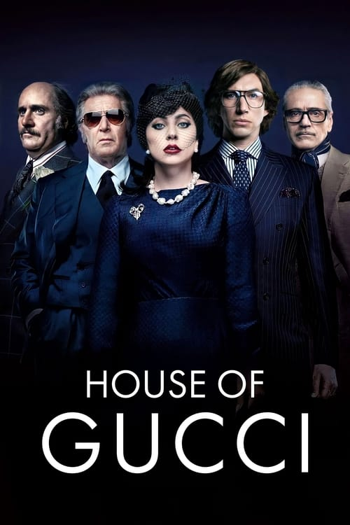

<nav class="films">
  <a class="prev" href="../belfast">Previous</a>
  <a href="../">Film list</a>
  <a class="next" href="../licorice-pizza">Next</a>
</nav>

87 / 100

<article class="film">
  <h1>House of Gucci (2021)</h1>

  

    Directed by <strong>Ridley Scott</strong>
  

  

  <h2>
    Cast
  </h2>
  <ul>
    <li><strong>Lady Gaga</strong> as <em>Patrizia Reggiani</em></li>
<li><strong>Adam Driver</strong> as <em>Maurizio Gucci</em></li>
<li><strong>Al Pacino</strong> as <em>Aldo Gucci</em></li>
<li><strong>Jeremy Irons</strong> as <em>Rodolfo Gucci</em></li>
<li><strong>Jared Leto</strong> as <em>Paolo Gucci</em></li>
<li><strong>Jack Huston</strong> as <em>Domenico De Sole</em></li>
<li><strong>Salma Hayek Pinault</strong> as <em>Pina Auriemma</em></li>
<li><strong>Alexia Murray</strong> as <em>Silvana Reggiani</em></li>
<li><strong>Vincent Riotta</strong> as <em>Fernando Reggiani</em></li>
<li><strong>Gaetano Bruno</strong> as <em>Franco</em></li>
<li><strong>Camille Cottin</strong> as <em>Paola Franchi</em></li>
<li><strong>Youssef Kerkour</strong> as <em>Nemir Kirdar</em></li>
<li><strong>Reeve Carney</strong> as <em>Tom Ford</em></li>
<li><strong>Florence Andrews</strong> as <em>Jenny Gucci</em></li>
<li><strong>Mehdi Nebbou</strong> as <em>Saïd</em></li>
<li><strong>Miloud Mourad Benamara</strong> as <em>Omar</em></li>
<li><strong>Andrea Piedimonte Bodini</strong> as <em>Ivano Savioni</em></li>
<li><strong>Vincenzo Tanassi</strong> as <em>Benedetto Ceraulo</em></li>
<li><strong>Mauro Lamantia</strong> as <em>Max</em></li>
<li><strong>Nicole Bani Sarkute</strong> as <em>Alessandra (3 Years Old)</em></li>
<li><strong>Mia McGovern Zaini</strong> as <em>Alessandra (9 Years Old)</em></li>
<li><strong>Clelia Rossi Marcelli</strong> as <em>Alessandra (Teenager)</em></li>
<li><strong>Pietro Ragusa</strong> as <em>Count Sarzana</em></li>
<li><strong>Alessandro Pess</strong> as <em>Reggiani Trucker</em></li>
<li><strong>Al Mariotti</strong> as <em>Reggiani Trucker</em></li>
<li><strong>Monica Nappo</strong> as <em>Reggiani Trucker Secretary</em></li>
<li><strong>Alessandro Piavani</strong> as <em>Upper Crust Stiff</em></li>
<li><strong>Marina Occhionero</strong> as <em>Upper Crust Stiff</em></li>
<li><strong>Pierpaolo Palladino</strong> as <em>Priest at Wedding</em></li>
<li><strong>Jun Ichikawa</strong> as <em>Masseuse</em></li>
<li><strong>Daphne Morelli</strong> as <em>Aldo's French Model</em></li>
<li><strong>Mădălina Ghenea</strong> as <em>Sophia Loren</em></li>
<li><strong>Gjergj Lala</strong> as <em>Chief Tanner</em></li>
<li><strong>Alessandra Borgia</strong> as <em>Elderly Female Worker</em></li>
<li><strong>Havana Alfarano</strong> as <em>Pretty Young Worker at Tannery</em></li>
<li><strong>Philippe Boa</strong> as <em>Bobby Short</em></li>
<li><strong>Ira Fronten</strong> as <em>Maybeline</em></li>
<li><strong>Marika De Chiara</strong> as <em>Maternity Ward Nurse</em></li>
<li><strong>Antonello Annunziata</strong> as <em>Karl Lagerfield</em></li>
<li><strong>Edouard Philipponnat</strong> as <em>Walter</em></li>
<li><strong>Nicola Garofalo</strong> as <em>IRS Man</em></li>
<li><strong>Daniele De Martino</strong> as <em>IRS Man</em></li>
<li><strong>Beatrice Pelliccia</strong> as <em>Paolo's Assistant</em></li>
<li><strong>Beppe Rosso</strong> as <em>Aldo's Lawyer</em></li>
<li><strong>Jay Natelle</strong> as <em>Federal Court Judge</em></li>
<li><strong>Johanna Santos</strong> as <em>Paolo's Model</em></li>
<li><strong>Larry Kapust</strong> as <em>Aldo's Squash Opponent</em></li>
<li><strong>Livio Beshir</strong> as <em>Stall Street Holder NYC</em></li>
<li><strong>Pietro Pace</strong> as <em>Waiter at Aldo's Party</em></li>
<li><strong>Bianca Nappi</strong> as <em>Clerk</em></li>
<li><strong>Paolo De Giorgio</strong> as <em>Judge Milan Court</em></li>
<li><strong>Mario Opinato</strong> as <em>Patrizia's Father</em></li>
<li><strong>Gianpiero Pumo</strong> as <em>Waiter (Boeucc)</em></li>
<li><strong>Stefano Moretti</strong> as <em>Fashion Show Director</em></li>
<li><strong>Catherine Walker</strong> as <em>Anna Wintour</em></li>
<li><strong>Martino Palmisano</strong> as <em>Richard Avedon</em></li>
<li><strong>Eva Moore</strong> as <em>Chalet Guest</em></li>
<li><strong>Filippo De Carli</strong> as <em>Chalet Guest</em></li>
<li><strong>Marco Sincini</strong> as <em>Handwriting Specialist</em></li>
<li><strong>Daniele Monterosi</strong> as <em>Tax Cop</em></li>
<li><strong>Daniela Macaluso</strong> as <em>St. Moritz Housekeeper</em></li>
<li><strong>Alfredo Pea</strong> as <em>St. Moritz Housekeeper</em></li>
<li><strong>Dirk Plönissen</strong> as <em>Swiss Border Guard</em></li>
<li><strong>Mimmo Mancini</strong> as <em>Galleria Porter</em></li>
<li><strong>Eric Alexander</strong> as <em>Cop</em></li>
<li><strong>Beniamino Marcone</strong> as <em>Paolo's Accountant</em></li>
<li><strong>Simone Spinazzè</strong> as <em>Chief Police Officer</em></li>
<li><strong>Fausto Caroli</strong> as <em>Anna Wintour's Assistant</em></li>
<li><strong>Bruce McGuire</strong> as <em>Judge</em></li>
<li><strong>Loris Loddi</strong> as <em>Judge</em></li>
<li><strong>Luke Chikovani</strong> as <em>Fashionista</em></li>
<li><strong>Alessandro Egger</strong> as <em>Fashionista</em></li>
<li><strong>Roger Garth</strong> as <em>Fashionista</em></li>
<li><strong>Andrea Bruschi</strong> as <em>Porter (uncredited)</em></li>
<li><strong>Dante Alba</strong> as <em>Fashionista (uncredited)</em></li>
<li><strong>Marta Marenco</strong> as <em>Gucci Store Shop Assistant</em></li>
<li><strong>Marco Stefanelli</strong> as <em>Aldo Gucci's Chaffeur (uncredited)</em></li>
<li><strong>Paolo Sena</strong> as <em>Undertaker (uncredited)</em></li>
  </ul>
</article>
<footer>
  <a href="../about">About this list</a>
</footer>
