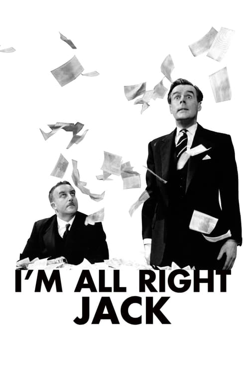

<nav class="films">
  <a class="prev" href="../north-by-northwest">Previous</a>
  <a href="../">Film list</a>
  <a class="next" href="../la-dolce-vita">Next</a>
</nav>

5 / 100

<article class="film">
  <h1>I'm All Right Jack (1959)</h1>

  

    Directed by <strong>John Boulting</strong>
  

  

  <h2>
    Cast
  </h2>
  <ul>
    <li><strong>Peter Sellers</strong> as <em>Fred Kite</em></li>
<li><strong>Ian Carmichael</strong> as <em>Stanley Windrush</em></li>
<li><strong>Terry-Thomas</strong> as <em>Major Hitchcock</em></li>
<li><strong>Richard Attenborough</strong> as <em>Sidney De Vere Cox</em></li>
<li><strong>Dennis Price</strong> as <em>Bertram Tracepurcel</em></li>
<li><strong>Margaret Rutherford</strong> as <em>Aunt Dolly</em></li>
<li><strong>Irene Handl</strong> as <em>Mrs. Kite</em></li>
<li><strong>Liz Fraser</strong> as <em>Cynthia Kite</em></li>
<li><strong>Miles Malleson</strong> as <em>Windrush Snr.</em></li>
<li><strong>Marne Maitland</strong> as <em>Mr. Mohammed</em></li>
<li><strong>John Le Mesurier</strong> as <em>Waters</em></li>
<li><strong>Raymond Huntley</strong> as <em>Magistrate</em></li>
<li><strong>Victor Maddern</strong> as <em>Knowles</em></li>
<li><strong>Kenneth Griffith</strong> as <em>Dai</em></li>
<li><strong>Fred Griffiths</strong> as <em>Charlie</em></li>
<li><strong>Donal Donnelly</strong> as <em>Perce Carter</em></li>
<li><strong>Sam Kydd</strong> as <em>Shop Steward</em></li>
<li><strong>John Comer</strong> as <em>Shop Steward</em></li>
<li><strong>Tony Comer</strong> as <em>Shop Steward</em></li>
<li><strong>Cardew Robinson</strong> as <em>Shop Steward</em></li>
<li><strong>Bruce Wightman</strong> as <em>Shop Steward</em></li>
<li><strong>Bill Rayment</strong> as <em>Shop Steward</em></li>
<li><strong>Marianne Stone</strong> as <em>TV Receptionist</em></li>
<li><strong>Terry Scott</strong> as <em>Crawley</em></li>
<li><strong>Ronnie Stevens</strong> as <em>Hooper</em></li>
<li><strong>Martin Boddey</strong> as <em>Num Yu's Executive</em></li>
<li><strong>Brian Oulton</strong> as <em>Appts. Board Examiner</em></li>
<li><strong>Malcolm Muggeridge</strong> as <em>TV Panel Chairman</em></li>
<li><strong>John Glyn-Jones</strong> as <em>Detto Executive</em></li>
<li><strong>Pauline Winter</strong> as <em>Miss Forsydke</em></li>
<li><strong>Maurice Colbourne</strong> as <em>Missiles Director</em></li>
<li><strong>Jeremy White</strong> as <em>Young Chemist</em></li>
<li><strong>Robin Ray</strong> as <em>Young Chemist</em></li>
<li><strong>Michael Bates</strong> as <em>Bootle</em></li>
<li><strong>John Van Eyssen</strong> as <em>Reporter</em></li>
<li><strong>Robert Bruce</strong> as <em>Reporter</em></li>
<li><strong>Michael Ward</strong> as <em>Reporter</em></li>
<li><strong>Stringer Davis</strong> as <em>Reporter</em></li>
<li><strong>Tony Spear</strong> as <em>Reporter</em></li>
<li><strong>Arthur Skinner</strong> as <em>Photographer</em></li>
<li><strong>William Dexter</strong> as <em>Photographer</em></li>
<li><strong>Eynon Evans</strong> as <em>Truscott</em></li>
<li><strong>Esma Cannon</strong> as <em>Spencer</em></li>
<li><strong>Robert S. Young</strong> as <em>Owens</em></li>
<li><strong>Roy Purcell</strong> as <em>Police Inspector</em></li>
<li><strong>Marion Shaw</strong> as <em>Tea Girl</em></li>
<li><strong>Wally Patch</strong> as <em>Workman</em></li>
<li><strong>Alun Owen</strong> as <em>TV Producer</em></li>
<li><strong>Muriel Young</strong> as <em>TV Announcer</em></li>
<li><strong>Frank Phillips</strong> as <em>TV Announcer</em></li>
<li><strong>Ian Wilson</strong> as <em>Evangelist</em></li>
<li><strong>Margaret Lacey</strong> as <em>Empire Loyalist</em></li>
<li><strong>George Selway</strong> as <em>Union Jack Workman</em></li>
<li><strong>David Lodge</strong> as <em>Card Player</em></li>
<li><strong>Keith Smith</strong> as <em>Card Player</em></li>
<li><strong>Kenneth J. Warren</strong> as <em>Card Player</em></li>
<li><strong>Basil Dignam</strong> as <em>Minister of Labour</em></li>
<li><strong>Harry Locke</strong> as <em>Trade Union Official</em></li>
<li><strong>John Adams</strong> as <em>Constable (uncredited)</em></li>
<li><strong>Chris Adcock</strong> as <em>Actor (uncredited)</em></li>
<li><strong>Jack Armstrong</strong> as <em>Man in Court (uncredited)</em></li>
<li><strong>Joe Beckett</strong> as <em>Trade Union Official (uncredited)</em></li>
<li><strong>Jack Berg</strong> as <em>Factory Worker (uncredited)</em></li>
<li><strong>Nigel Bernard</strong> as <em>Studio Floor Manager (uncredited)</em></li>
<li><strong>Jim Brady</strong> as <em>Missiles Worker (uncredited)</em></li>
<li><strong>Fay Bura</strong> as <em>Audience Member (uncredited)</em></li>
<li><strong>Alf Casha</strong> as <em>Man in Court (uncredited)</em></li>
<li><strong>Jimmy Charters</strong> as <em>Missiles Worker (uncredited)</em></li>
<li><strong>E. V. H. Emmett</strong> as <em>Narrator (voice) (uncredited)</em></li>
<li><strong>Mabel Etherington</strong> as <em>Empire Loyalist (uncredited)</em></li>
<li><strong>Chick Fowles</strong> as <em>Solicitor (uncredited)</em></li>
<li><strong>Tex Fuller</strong> as <em>Factory Worker (uncredited)</em></li>
<li><strong>Bob Grant</strong> as <em>Card Player (uncredited)</em></li>
<li><strong>Hilda Green</strong> as <em>Nudist (uncredited)</em></li>
<li><strong>Dave Griffiths</strong> as <em>Factory Worker (uncredited)</em></li>
<li><strong>Victor Harrington</strong> as <em>Reporter (uncredited)</em></li>
<li><strong>George Hilsdon</strong> as <em>Reporter (uncredited)</em></li>
<li><strong>Lindsay Hooper</strong> as <em>Downing Street Butler (uncredited)</em></li>
<li><strong>Billy John</strong> as <em>Factoy Worker (uncredited)</em></li>
<li><strong>Gertrude Kaye</strong> as <em>Empire Loyalist (uncredited)</em></li>
<li><strong>Frederick Kelsey</strong> as <em>Clerk of Court (uncredited)</em></li>
<li><strong>Juba Kennerley</strong> as <em>Empire Loyalist (uncredited)</em></li>
<li><strong>Julie La Rousse</strong> as <em>Tennis Player (uncredited)</em></li>
<li><strong>Aileen Lewis</strong> as <em>Reporter (uncredited)</em></li>
<li><strong>John Leyton</strong> as <em>Recruit to Detto (uncredited)</em></li>
<li><strong>Dickey Luck</strong> as <em>Factory Worker/Lorry Driver (uncredited)</em></li>
<li><strong>Jack Mandeville</strong> as <em>Solicitor (uncredited)</em></li>
<li><strong>Vicky Marshall</strong> as <em>Tea Girl (uncredited)</em></li>
<li><strong>Colin McKenzie</strong> as <em>Reporter (uncredited)</em></li>
<li><strong>Jimmy Millar</strong> as <em>Missiles Worker (uncredited)</em></li>
<li><strong>Cecil Paul</strong> as <em>Reporter (uncredited)</em></li>
<li><strong>Geremy Phillips</strong> as <em>Youth (uncredited)</em></li>
<li><strong>Harry Phipps</strong> as <em>Missiles Worker (uncredited)</em></li>
<li><strong>Bob Raymond</strong> as <em>Factory Worker (uncredited)</em></li>
<li><strong>Ernie Rice</strong> as <em>Missiles Worker (uncredited)</em></li>
<li><strong>Johnny Rossi</strong> as <em>Actor (uncredited)</em></li>
<li><strong>Pat Ryan</strong> as <em>Reporter (uncredited)</em></li>
<li><strong>Jack Sharp</strong> as <em>Official (uncredited)</em></li>
<li><strong>Sheila Sim</strong> as <em>Visitor (uncredited)</em></li>
<li><strong>Stan Simmonds</strong> as <em>Factory Worker (uncredited)</em></li>
<li><strong>Tony Spears</strong> as <em>Reporter (uncredited)</em></li>
<li><strong>George Spence</strong> as <em>Missiles Worker (uncredited)</em></li>
<li><strong>Philip Stewart</strong> as <em>Solicitor (uncredited)</em></li>
<li><strong>Fred Stroud</strong> as <em>Reporter (uncredited)</em></li>
<li><strong>Joseph Tregonino</strong> as <em>Empire Loyalist (uncredited)</em></li>
<li><strong>Robert Vossler</strong> as <em>Policeman (uncredited)</em></li>
<li><strong>Billy Wilmot</strong> as <em>Missiles Worker (uncredited)</em></li>
<li><strong>Bob Wright</strong> as <em>Reporter (uncredited)</em></li>
<li><strong>Paula Wright</strong> as <em>Nudist (uncredited)</em></li>
  </ul>
</article>
<footer>
  <a href="../about">About this list</a>
</footer>
