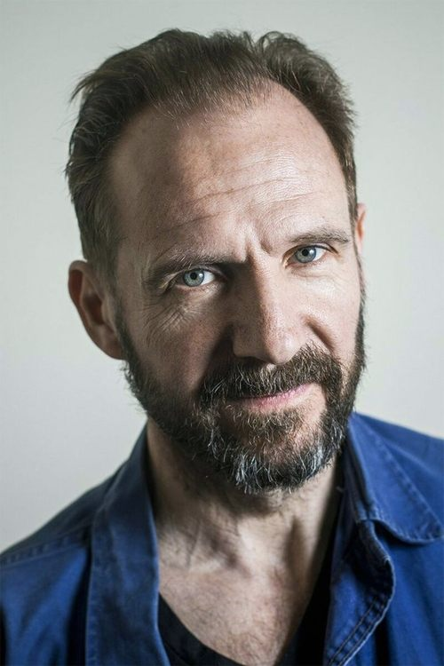
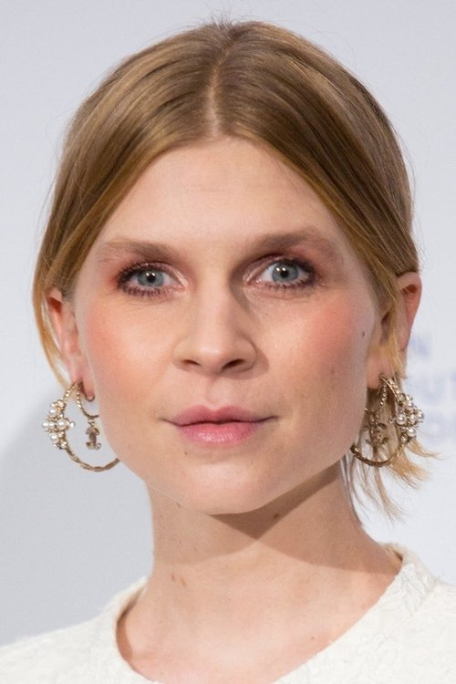
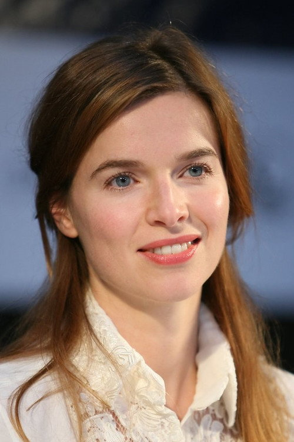
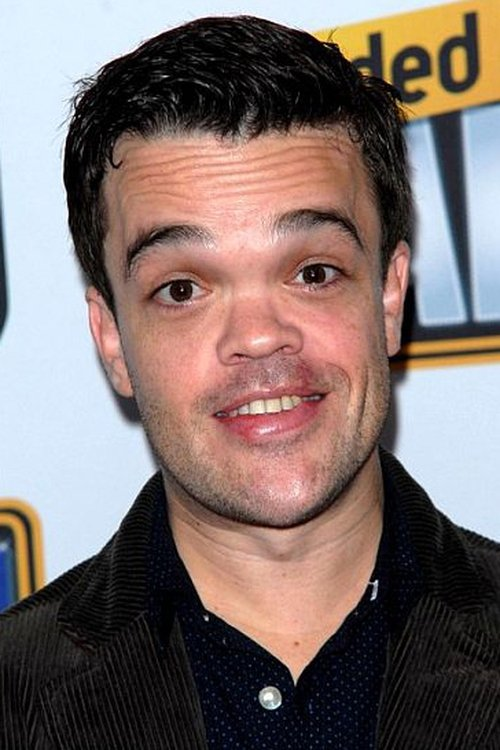
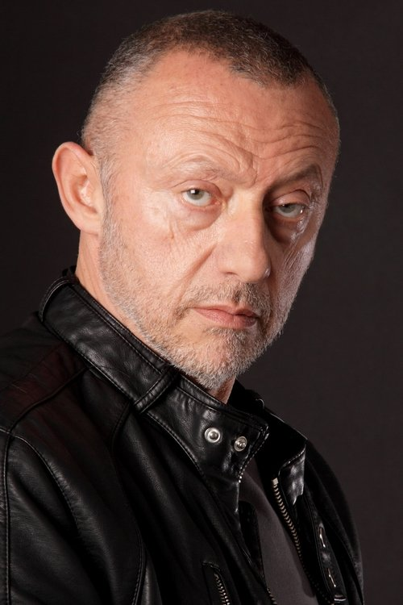



<nav class="films">
  

    <a href="../no-country-for-old-men-2007"><i class="fa-solid fa-chevron-left fa-xs"></i> Previous</a>
  

  

    <a class="simple" href="../">47 / 100</a>
  

  

    <a href="../fantastic-mr-fox-2009">Next <i class="fa-solid fa-chevron-right fa-xs"></i></a>
  

  

    
      Previous film:
      No Country for Old Men
    
    
      Next film:
      Fantastic Mr. Fox
    
  

</nav>

<article class="film slug-in-bruges-2008">
  

    
    
  

  <h1>{{ film.title }} ({{ film | filmYear }})</h1>

  

    Language: {{ film.language }}.
    
  

  

    Directed by <strong>{{ film | directors }}</strong>
  

  
    <blockquote>
      {{ films.reviews[slug] | safe }} <em>—&nbsp;<a href="/bill">Bill</a></em>
    </blockquote>
  

  <section class="cast-grid">
  

    

  
  

    Colin Farrell
    Ray
  

    

  
  

    Brendan Gleeson
    Ken
  

    

  
  

    Ralph Fiennes
    Harry
  

    

  
  

    Clémence Poésy
    Chloë
  

    

  
  

    Thekla Reuten
    Marie
  

    

  
  

    Jordan Prentice
    Jimmy
  

    

  
  

    Elizabeth Berrington
    Natalie
  

    

  
  

    Jérémie Renier
    Eirik
  

    

  
  

    Mark Donovan
    Overweight Man
  

    

  
  

    Éric Godon
    Yuri
  

    

  
  

    Anna Madeley
    Denise
  

    

  
  

    Theo Stevenson
    Boy in Church
  

  

</section>

  <section class="film-detail">
    

      

        

          <i class="fa-solid fa-masks-theater"></i>
          Cast
        

        <ul>
          
            <li>
              {{ cast.name }} as <em>{{ cast.character }}</em>
            </li>
          
        </ul>
      

      

        

          <i class="fa-solid fa-clapperboard"></i>
          Crew
        

        <ul>
          
            <li>
              {{ crew.name }} &mdash; <em>{{ crew.job }}</em>
            </li>
          
        </ul>
      

    

  </section>

  <section class="related-films">
  <h2>Related films</h2>
  <ul>
    <li><a href="../black-hawk-down-2001">Black Hawk Down</a> because of Zeljko Ivanek</li>
<li><a href="../phone-booth-2003">Phone Booth</a> because of Colin Farrell</li>
<li><a href="../the-banshees-of-inisherin-2022">The Banshees of Inisherin</a> because of Colin Farrell, Brendan Gleeson and Martin McDonagh</li>
<li><a href="../the-tragedy-of-macbeth-2021">The Tragedy of Macbeth</a> because of Brendan Gleeson</li>
<li><a href="../the-grand-budapest-hotel-2014">The Grand Budapest Hotel</a> because of Ralph Fiennes</li>
<li><a href="../mr-turner-2014">Mr. Turner</a> because of Elizabeth Berrington</li>
<li><a href="../belfast-2021">Belfast</a> because of Ciarán Hinds</li>
  </ul>
</section>

</article>
