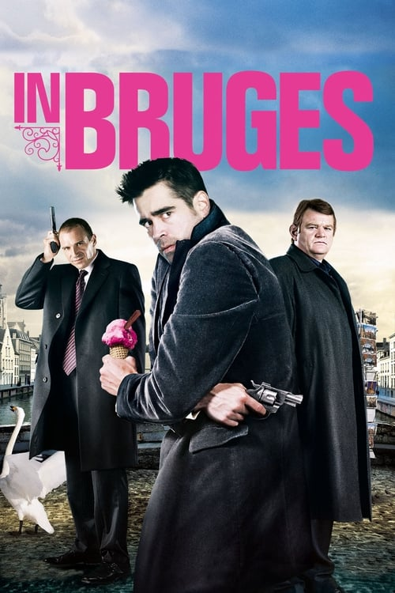

<a href="../">Back to all films</a>

<article class="film">
  <h1>In Bruges (2008)</h1>

  

    Directed by <strong>Martin McDonagh</strong>
  

  

  <h2>
    Cast
  </h2>
  <ul>
    <li><strong>Colin Farrell</strong> as <em>Ray</em></li>
<li><strong>Brendan Gleeson</strong> as <em>Ken</em></li>
<li><strong>Ralph Fiennes</strong> as <em>Harry</em></li>
<li><strong>Clémence Poésy</strong> as <em>Chloë</em></li>
<li><strong>Thekla Reuten</strong> as <em>Marie</em></li>
<li><strong>Jordan Prentice</strong> as <em>Jimmy</em></li>
<li><strong>Elizabeth Berrington</strong> as <em>Natalie</em></li>
<li><strong>Jérémie Renier</strong> as <em>Eirik</em></li>
<li><strong>Mark Donovan</strong> as <em>Overweight Man</em></li>
<li><strong>Éric Godon</strong> as <em>Yuri</em></li>
<li><strong>Anna Madeley</strong> as <em>Denise</em></li>
<li><strong>Theo Stevenson</strong> as <em>Boy in Church</em></li>
<li><strong>Olivier Bonjour</strong> as <em>Film Director</em></li>
<li><strong>Zeljko Ivanek</strong> as <em>Canadian Guy</em></li>
<li><strong>Rudy Blomme</strong> as <em>Ticket Seller</em></li>
<li><strong>Jamie Edgell</strong> as <em>Boat Driver</em></li>
<li><strong>Sachi Kimura</strong> as <em>Imamoto</em></li>
<li><strong>Jean-Marc Favorin</strong> as <em>Policeman</em></li>
<li><strong>Emily Thorling</strong> as <em>Overweight Woman</em></li>
<li><strong>Ann Elsley</strong> as <em>Overweight Woman #2</em></li>
<li><strong>Inez Stinton</strong> as <em>Kelli</em></li>
<li><strong>Ran Yaniv</strong> as <em>Barman</em></li>
<li><strong>Stephanie Carey</strong> as <em>Canadian Girl</em></li>
<li><strong>Bonnie Witney</strong> as <em>Harry's Child #1</em></li>
<li><strong>Angel Witney</strong> as <em>Harry's Child #2</em></li>
<li><strong>Louis Nummy</strong> as <em>Harry's Child #3</em></li>
<li><strong>Ciarán Hinds</strong> as <em>Priest (uncredited)</em></li>
<li><strong>Susan Ateh</strong> as <em>Ken's Wife (uncredited)</em></li>
  </ul>
</article>
